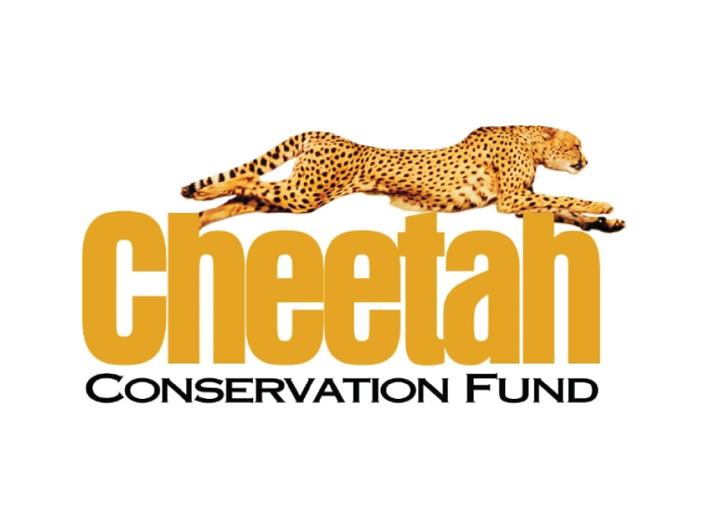
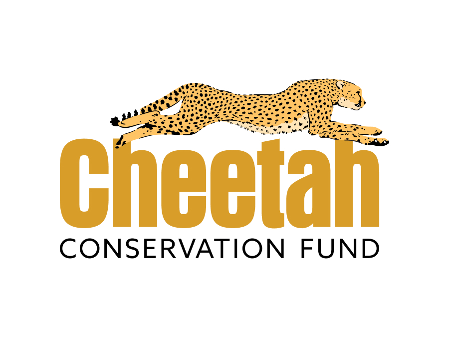
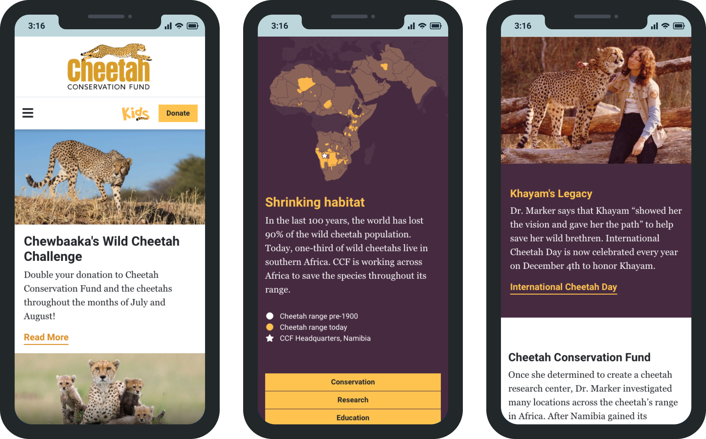
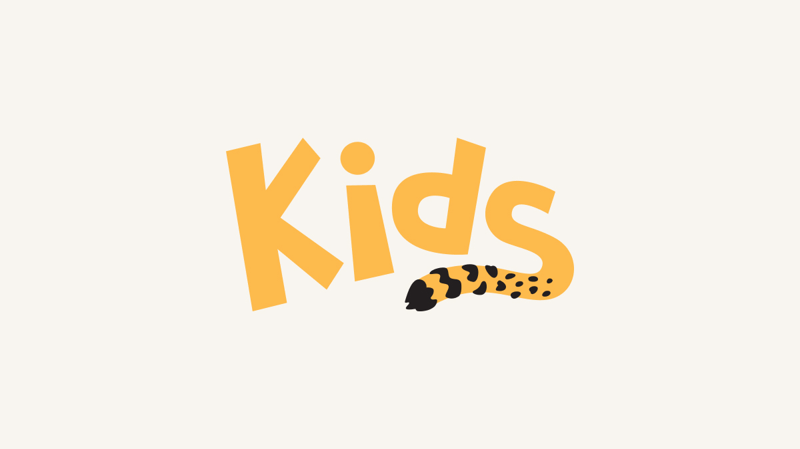
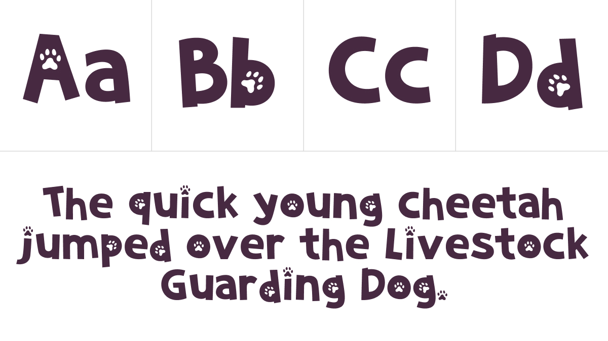

import CaseStudyScreens from '../../components/CaseStudyScreens/index.astro';
import homepage from '../../images/cheetah-conservation-fund/screens/cheetah-conservation-fund-screen-homepage.webp';
import conservation from '../../images/cheetah-conservation-fund/screens/cheetah-conservation-fund-screen-conservation.webp';
import laurieMarker from '../../images/cheetah-conservation-fund/screens/cheetah-conservation-fund-screen-laurie-marker.webp';
import kidsCheetahFacts from '../../images/cheetah-conservation-fund/screens/cheetah-conservation-fund-screen-kids-cheetah-facts.webp';
import kidsArtists from '../../images/cheetah-conservation-fund/screens/cheetah-conservation-fund-screen-kids-artists.webp';
import kidsArtCompetition from '../../images/cheetah-conservation-fund/screens/cheetah-conservation-fund-screen-kids-art-competition.webp';

<CaseStudyOverview caseStudy={frontmatter.caseStudy}>

## Challenge

Cheetah Conservation Fund (CCF) is based in Namibia, southern Africa, with a network of chapters around the world. They work together to save the cheetah in the wild. Their efforts include conservation, research, and education.

CCF's website was difficult to use on mobile, and the content structure made information hard to find. Chapter websites were hosted and managed separately by volunteers. Reposting content from CCF's team in Namibia duplicated work, while branding varied across sites. CCF needed a web presence that staff could maintain easily while still keeping its recognizable identity.

## Solution

Through Avidano Digital, I led the redesign of <LinkOpenNew LinkUrl="https://cheetah.org/" LinkText="cheetah.org" />. We moved the sites to WordPress Multisite. This resulted in a shared platform for the main website and international chapter sites. We used ACF Flexible Content to create reusable modules for pages and templates. This gave staff the tools to publish and manage their own content.

I worked with CCF’s Digital Media and Graphic Design Manager to reorganize the site’s content and navigation. We made CCF’s conservation, research, and education work easier to understand. We connected those programs and stories with relevant ways to give.

I designed responsive page layouts and refreshed CCF’s logo. For CCF Kids, I created a separate logo and custom typeface to support its educational content.

## Results

In June 2019, cheetah.org launched as a more flexible and engaging platform for supporters worldwide. It made donation links easier to find and content easier to understand. CCF could use the visual system across web, email, and print.

</CaseStudyOverview>

<TextBlock>

## Logo refresh

CCF's running cheetah was already recognizable, so I kept the familiar image and wordmark arrangement. The photo-based artwork was difficult to scale and couldn't work in a single color.

I created a vector version of the cheetah and updated the typography. This kept the familiar identity while making the logo easy to use in various sizes, both in full color and one color.

</TextBlock>

<FigureSideBySide>

<FigureSingle caption="The Old CCF Logo" isContained={false} margin='margin-y-0'>

</FigureSingle>

<FigureSingle caption="The New CCF Logo" isContained={false} margin='margin-y-0'>

</FigureSingle>

</FigureSideBySide>

<ThemeWrapper>
<TextBlock>

## Website design and development

The homepage needed to introduce CCF's work while making room for fundraising campaigns and current news. I organized it around editable feature blocks, recent articles, and selected videos. Donation links appeared in the header and alongside relevant content.

Inside the site, section navigation kept related pages together. Conservation information and Dr. Laurie Marker’s biography shared the same page layout, but each was tailored to its story.

</TextBlock>

<CaseStudyScreens
  columns={3}
  lightbox={true}
  showLabels={false}
  screens={[
    { src: homepage, label: 'Cheetah.org homepage', alt: 'Cheetah.org homepage with a fundraising feature, news, videos, cheetah facts, and a habitat map.' },
    { src: conservation, label: 'Conservation page', alt: 'Cheetah.org conservation page with section navigation, livestock guarding dogs, and conservation program information.' },
    { src: laurieMarker, label: 'Dr. Laurie Marker biography', alt: 'Cheetah.org biography of Dr. Laurie Marker with photographs, a quotation, and the story of her conservation work.' }
  ]}
  caption="Cheetah.org homepage, conservation information, and founder biography."
/>

<TextBlock>

I built reusable content elements into WordPress so staff could assemble pages within a consistent design. These included text blocks, photographs, quotations, and video. The layouts let editors share various stories. They kept typography, spacing, and image sizes consistent.

</TextBlock>
</ThemeWrapper>

<TextBlock>

## Mobile optimization

I changed the navigation and page layouts. This helped visitors read longer articles, find conservation information, and access donation links on their phones.

The mobile header kept Donate outside the collapsed menu. Images, maps, and text stacked into a single column, with spacing and type sized for smaller screens.

</TextBlock>

<FigureSingle width='medium'>

    
</FigureSingle>

<TextBlock>

## CCF Kids section

I created a dedicated area for children and parents to learn about cheetahs and take part in CCF's mission. I designed a separate CCF Kids logo and created Cheetah Tracks, a custom font made with Fontself.

The spotted tail in the logo and paw prints in the letterforms carried the cheetah theme into the new identity. CCF also uses the font across email and print communications.

</TextBlock>

<FigureSideBySide>

<FigureSingle caption="The logo for the Kids pages" isContained={false} margin='margin-y-0'>

</FigureSingle>

<FigureSingle caption="Example of the Cheetah Tracks font" isContained={false} margin='margin-y-0'>

</FigureSingle>

</FigureSideBySide>

<ThemeWrapper>
<TextBlock>

The Kids pages bring together short facts, photographs, video, and illustrations. A companion area features children's artwork and stories, giving CCF a place to share how young supporters take part.

</TextBlock>

<CaseStudyScreens
  columns={3}
  lightbox={true}
  showLabels={false}
  screens={[
    { src: kidsCheetahFacts, label: 'CCF Kids cheetah facts', alt: 'CCF Kids page explaining cheetah traits through illustrations, photographs, videos, and the Cheetah Tracks font.' },
    { src: kidsArtists, label: 'CCF Kids artwork and stories', alt: 'CCF Kids page featuring helping-cheetah stories, artists of the month, children’s artwork, and ways to participate.' },
    { src: kidsArtCompetition, label: 'CCF Kids art competition story', alt: 'CCF Kids article presenting an art competition, young artists’ cheetah drawings, and the winning entries.' }
  ]}
  caption="CCF Kids facts, artwork, and an art competition story."
/>
</ThemeWrapper>

<TextBlock>

## Looking back

This project brought together my love for wildlife conservation and my focus on user experience and digital strategy. My work with Cheetah Conservation Fund has been uniquely meaningful from the start.

What began as a website redesign grew into a long-term partnership built on trust, collaboration, and shared goals. While I'm proud of the results we achieved together, what I value most is the relationship we built along the way.

That partnership continues. In 2026, I began working with CCF on its next website redesign.

I'm grateful for the opportunity to support CCF and its mission to change the world to save the cheetah.

</TextBlock>
