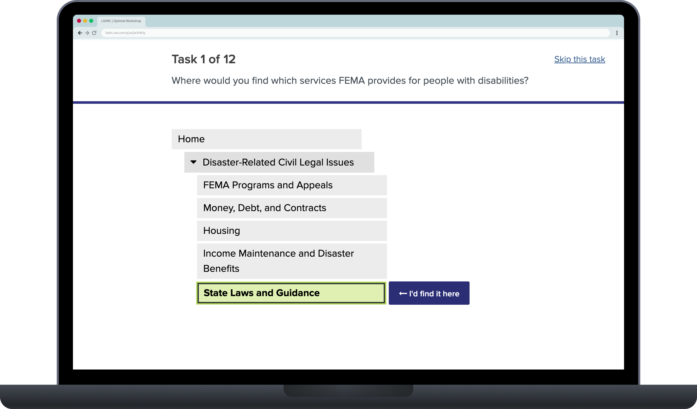
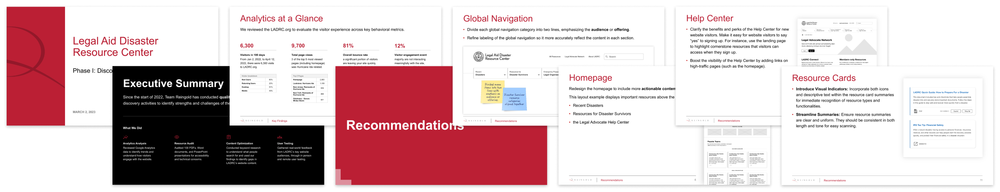
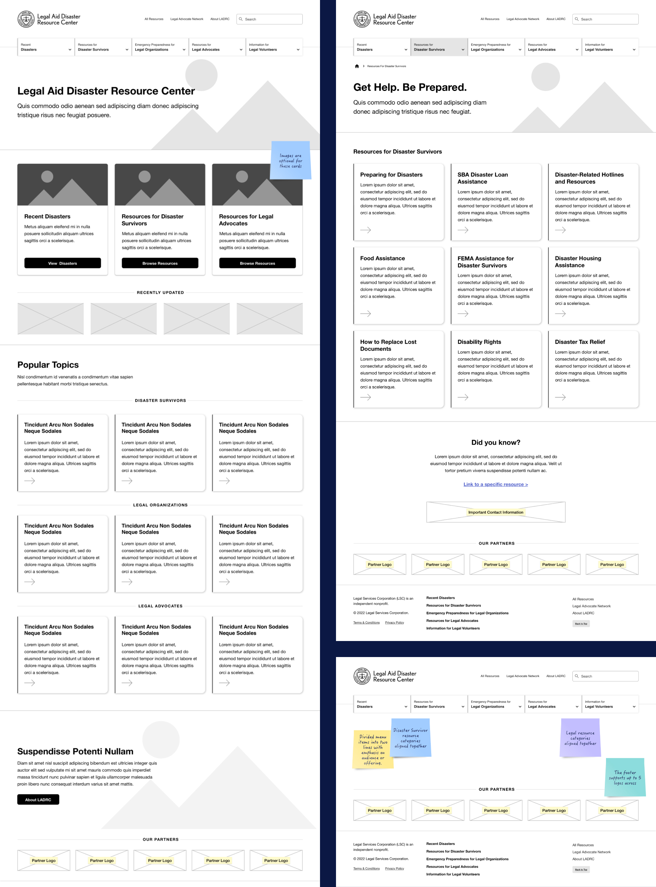
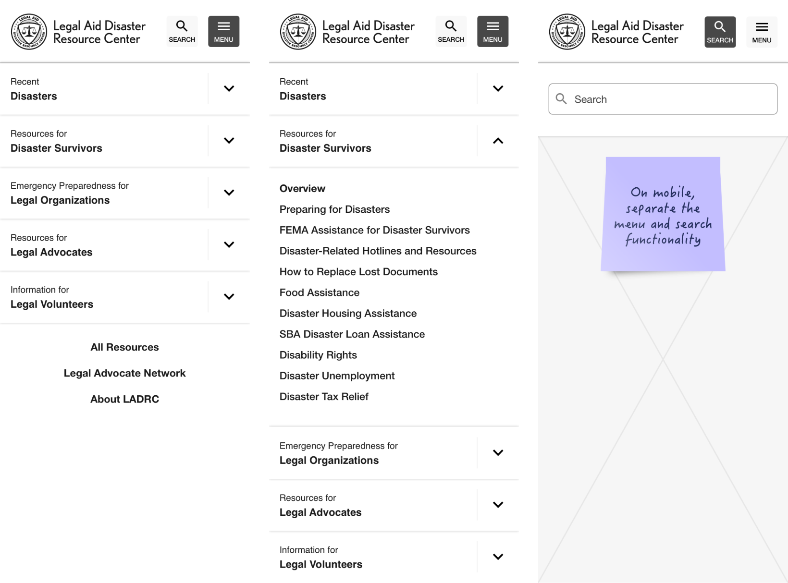
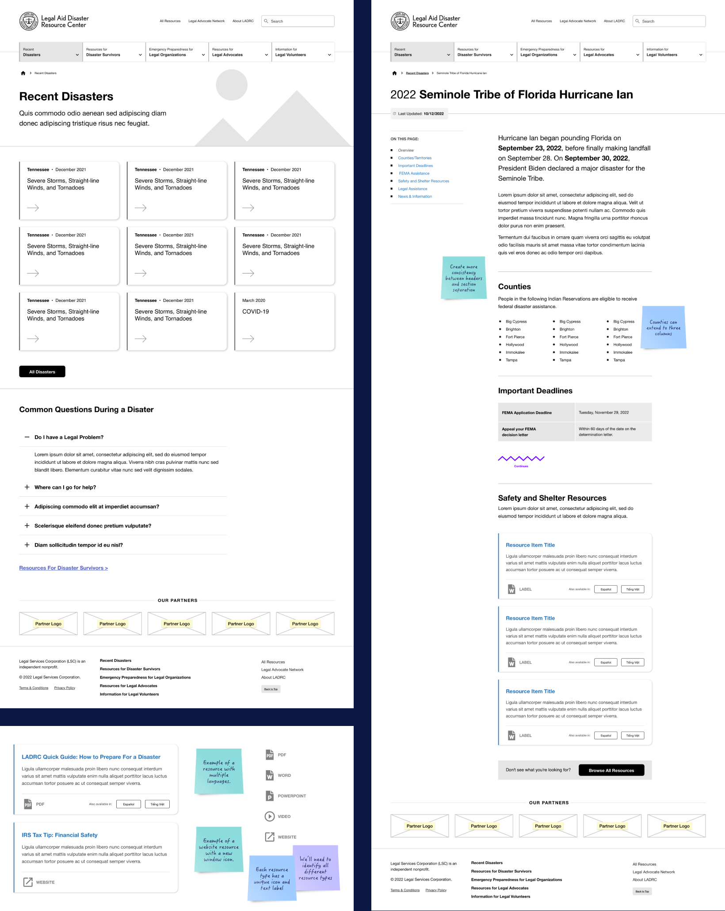

<CaseStudyOverview caseStudy={frontmatter.caseStudy}>

## Challenge

The Legal Aid Disaster Resource Center (LADRC), part of the Legal Services Corporation, needed to improve engagement and make disaster recovery legal resources easier to find for people seeking help during stressful, high-stakes moments.

## Solution

As UX Director at Reingold, I planned and conducted remote user interviews, usability testing, and tree testing to understand where users struggled with the existing navigation. I translated those findings into recommendations and low-fidelity wireframes focused on clearer search, navigation, and resource access.

## Results

The research gave LADRC specific recommendations for helping people find and use legal resources. I translated those recommendations into wireframes for the homepage, audience landing pages, mobile navigation, and disaster pages, with clearer search access and resource labels.

</CaseStudyOverview>

<TextBlock>

## Research and discovery

This was my first project at Reingold, and discovery was already underway. I worked with the team to understand how people found legal help and where the existing site made that difficult.

- **Remote interviews and usability testing:** I planned and conducted Zoom sessions with disaster survivors, combining interviews with tasks on the existing site.
- **In-person usability testing:** We conducted four days of testing at an LSC conference in Des Moines, Iowa.
- **Tree testing:** We used <LinkOpenNew LinkUrl='https://www.optimalworkshop.com' LinkText='Optimal Workshop' /> to test whether people could find resources through the navigation labels and groupings, without the page design influencing their choices.

</TextBlock>

<FigureSingle width='medium'>

</FigureSingle>

<TextBlock>

### Findings and recommendations

I worked with the UX and analytics teams to develop the recommendations. We combined what people said and did in testing with analytics showing how visitors used the site. The content and technical leads contributed an audit of 100 resources, keyword research, and an evaluation of search.

Together, these findings shaped recommendations for navigation, content, and resource access. I created the findings and recommendations presentation and translated our recommendations into low-fidelity wireframes.

</TextBlock>

<FigureSingle width='wide'>

</FigureSingle>

<ThemeWrapper>
<TextBlock>

### Low-fidelity wireframes

Usability and tree testing revealed confusion about navigation categories. In the wireframes, I clarified the labels to emphasize each section's audience and grouped related categories together. New landing pages explained the resources within each section, while the homepage gave Recent Disasters and resources for survivors and legal advocates more prominent entry points.

</TextBlock>

<FigureSingle width='wide'>

</FigureSingle>
</ThemeWrapper>

<TextBlock>

### Making search visible on mobile

Remote testing revealed that disaster survivors had difficulty locating search on mobile, where it was hidden within the menu. I separated Search and Menu into distinct controls. The proposed interaction gave people direct access to search without first opening and exploring the navigation.

</TextBlock>

<FigureSingle width='wide'>

</FigureSingle>

<ThemeWrapper>
<TextBlock>

### Making disaster information easier to use

Analytics showed that many visitors arrived directly on Recent Disasters pages and did not explore elsewhere. I organized these pages around affected locations, deadlines, and available help, retaining the On This Page links that legal professionals found useful.

Testing also revealed unexpected behavior when people opened resource links. I added format labels and icons so people could anticipate whether a link opened a PDF, webpage, or another resource. The wireframes show these changes alongside language options on resource cards.

</TextBlock>

<FigureSingle width='wide'>

</FigureSingle>
</ThemeWrapper>

<TextBlock>

## Looking back

The research we conducted with LADRC reinforced an often-overlooked UX principle: listen first.

By conducting research with real users in different settings, both in person and remotely, we identified barriers, validated recommendations, and uncovered opportunities that may have otherwise been missed. The experience also showed how consistent user feedback can be across different research methods when you take the time to ask the right questions.

I'm grateful that Reingold values evidence-based research and for the opportunity to work on projects where real users are central to the process. Helping shape a resource based directly on the needs and experiences of the people it was created to serve was especially rewarding.

</TextBlock>
