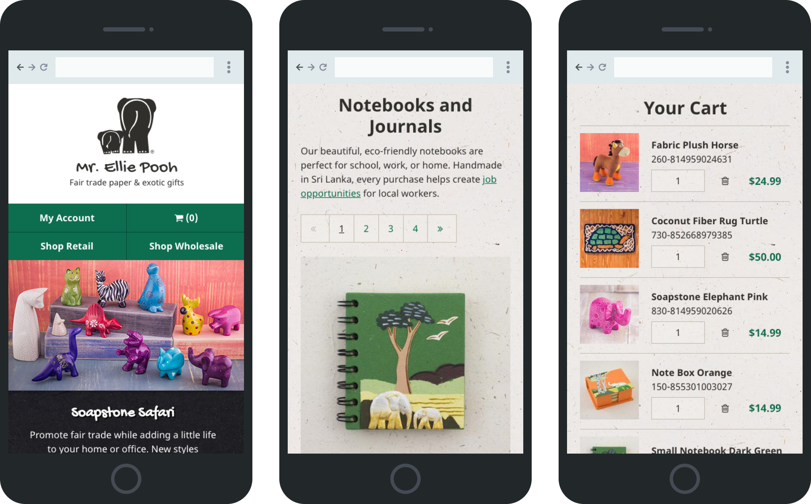
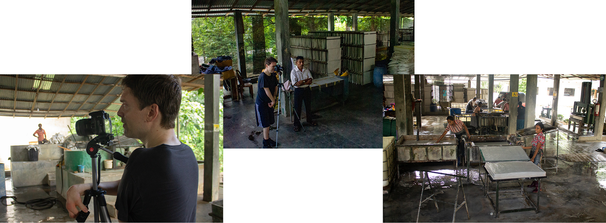
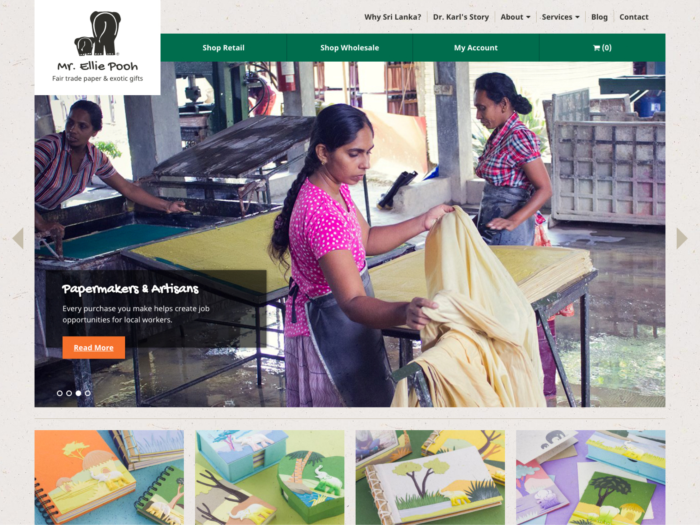
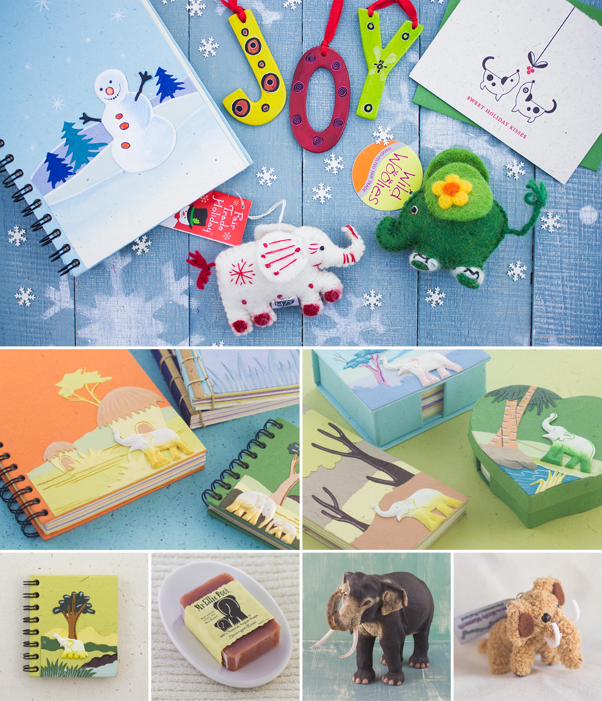

import CaseStudyScreens from '../../components/CaseStudyScreens/index.astro';
import homepage from '../../images/mr-ellie-pooh/screens/mr-ellie-pooh-screen-homepage.webp';
import productCategory from '../../images/mr-ellie-pooh/screens/mr-ellie-pooh-screen-product-category.webp';
import productDetail from '../../images/mr-ellie-pooh/screens/mr-ellie-pooh-screen-product-detail.webp';
import papermakers from '../../images/mr-ellie-pooh/screens/mr-ellie-pooh-screen-papermakers-and-artisans.webp';
import homepageWireframe from '../../images/mr-ellie-pooh/wireframes/mr-ellie-pooh-wireframe-homepage.png';
import productCategoryWireframe from '../../images/mr-ellie-pooh/wireframes/mr-ellie-pooh-wireframe-product-category.png';
import productDetailWireframe from '../../images/mr-ellie-pooh/wireframes/mr-ellie-pooh-wireframe-product-detail.png';
import sriLankaWireframe from '../../images/mr-ellie-pooh/wireframes/mr-ellie-pooh-wireframe-why-sri-lanka.png';

<CaseStudyOverview caseStudy={frontmatter.caseStudy}>

## Challenge

Mr. Ellie Pooh makes handmade paper products from sanitized elephant dung. The business brings together fair trade, elephant conservation, and artisan communities in Sri Lanka. That combination caught my attention.

When I met with the owner, we identified the need for an online store that could serve both retail and wholesale customers. He also needed a better way to manage inventory and sales as the catalog grew.

The existing photographs did not show the quality and craftsmanship of the products. The website needed to help shoppers understand what they were buying and introduce the people who made it.

## Solution

After comparing ecommerce platforms, we selected Shopify. I designed and built a custom storefront for retail and wholesale customers. Shopify also gave the owner tools to manage products, inventory, and sales.

I paired the store redesign with new product photography and a dedicated Papermakers and Artisans section. My wife and I photographed the products, and I traveled to Sri Lanka to document how the paper was made. We brought the products and their story into the shopping experience.

## Results

Mr. Ellie Pooh reported a **10x** increase in sales after launch. The redesigned store, new photography, and artisan stories contributed to that growth. Shopify also made it easier for the owner to manage inventory and retail and wholesale sales.

</CaseStudyOverview>

<TextBlock>

## Exploring the layout

I used low-fidelity Balsamiq mockups to explore how shopping and the artisans' story could fit together. They helped me show the client how product pages could introduce the people behind the work. The layouts also explored ways to explain the papermaking process and its connection to elephant conservation.

</TextBlock>

<CaseStudyScreens
  columns={4}
  ratio="18 / 25"
  lightbox={true}
  showLabels={false}
  caption="Wireframe layouts for the homepage, product category, product detail, and Why Sri Lanka page."
  screens={[
    { src: homepageWireframe, label: 'Homepage wireframe', alt: 'Homepage wireframe with retail and wholesale shopping links, elephant conservation content, and a diagram of the papermaking process.' },
    { src: productCategoryWireframe, label: 'Product category wireframe', alt: 'Notebooks and Journals wireframe with category navigation and a three-column product grid.' },
    { src: productDetailWireframe, label: 'Product detail wireframe', alt: 'Product detail wireframe with image placeholders, purchasing controls, and an introduction to the artisans.' },
    { src: sriLankaWireframe, label: 'Why Sri Lanka wireframe', alt: 'Why Sri Lanka wireframe with an elephant photo placeholder, a founder quote, and space for the conservation story.' }
  ]}
/>

<ThemeWrapper>
<TextBlock>

## Website design and development

I gave the storefront a simple, industrial feel. A clear grid and straight-edged panels let the colorful handmade products stand out. I created a repeating background pattern from the texture of Mr. Ellie Pooh's own paper. It added warmth and connected the design to the products themselves.

Retail and wholesale customers had separate entry points. Product categories organized the catalog, while homepage features introduced the artisans, fair trade, and elephant conservation.

</TextBlock>

<CaseStudyScreens
  columns={2}
  ratio="1 / 1"
  lightbox={true}
  showLabels={false}
  caption="Mr. Ellie Pooh's homepage, product collection, product detail, and Papermakers and Artisans page."
  screens={[
    { src: homepage, label: 'Mr. Ellie Pooh homepage', alt: 'Mr. Ellie Pooh homepage featuring handmade paper products, shopping categories, and links to its conservation and fair trade work.' },
    { src: productCategory, label: 'Notebooks and journals', alt: 'Notebooks and Journals collection with product photography, prices, category navigation, and pagination.' },
    { src: productDetail, label: 'Paper pulp elephant product', alt: 'Paper pulp elephant product page with photography, a description, price, quantity field, and add-to-cart button.' },
    { src: papermakers, label: 'Papermakers and Artisans', alt: 'Papermakers and Artisans page showing photographs of the Sri Lankan factory and explaining fair trade working conditions.' }
  ]}
/>
</ThemeWrapper>

<TextBlock>

## Mobile-first design

I designed the store so people could browse products and manage their cart on a phone. The mobile header kept retail and wholesale shopping links visible, alongside account and cart controls. Product photographs gave shoppers a clear view of the handmade items on smaller screens.

</TextBlock>

<FigureSingle width='medium'>

    
</FigureSingle>

<TextBlock>

## Promoting fair trade

The people making the paper were an important part of the story. I traveled to the factory in Kegalle, Sri Lanka, to meet the artisans and photograph the papermaking process. Seeing the work firsthand helped me understand the care behind the finished products.

</TextBlock>

<FigureSingle caption="Documenting the papermaking process at the factory in Kegalle, Sri Lanka">

    
</FigureSingle>

<TextBlock>

I used these photographs in the Papermakers and Artisans section. It introduced shoppers to the people behind the products and explained how fair trade purchases supported their work. The artisan feature on the homepage made that story part of the store.

</TextBlock>

<FigureSingle>

    
</FigureSingle>

<ThemeWrapper>
<TextBlock>

## Product photography

The handmade products needed photographs that showed their colors and craftsmanship clearly. Product photography was new to me, so this became a substantial part of the work.

My wife and I photographed hundreds of products over time, creating more than 1,000 images across the catalog. We developed a consistent style so shoppers could get a better sense of the products while browsing the store.

</TextBlock>

<FigureSingle caption="Product photography for the Mr. Ellie Pooh catalog">

    
</FigureSingle>
</ThemeWrapper>

<TextBlock>

## Looking back

This was my second international project. Shopify, retail and wholesale commerce, and product photography were all new to me.

I was already drawn to conservation work. Through the founder, Dr. Karl, and our time at fair trade conferences, I learned about the Fair Trade Federation and responsible business practices. I'm grateful for the opportunity to work with him and learn more about the business.

Meeting the artisans in Sri Lanka was a highlight. It gave me a much closer connection to the people and work behind the store.

Some of the most enjoyable projects don’t come with a big budget or a detailed brief. What matters to me is the experience and the impact of the work. Helping the owner run his business and sharing the artisans’ story made this project rewarding.

</TextBlock>
