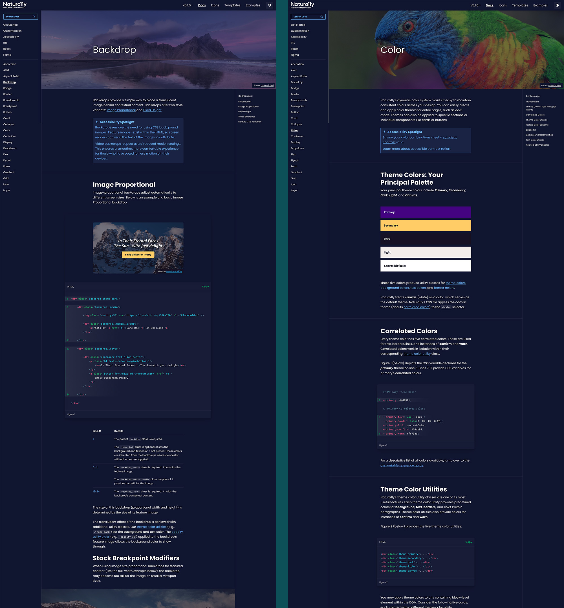
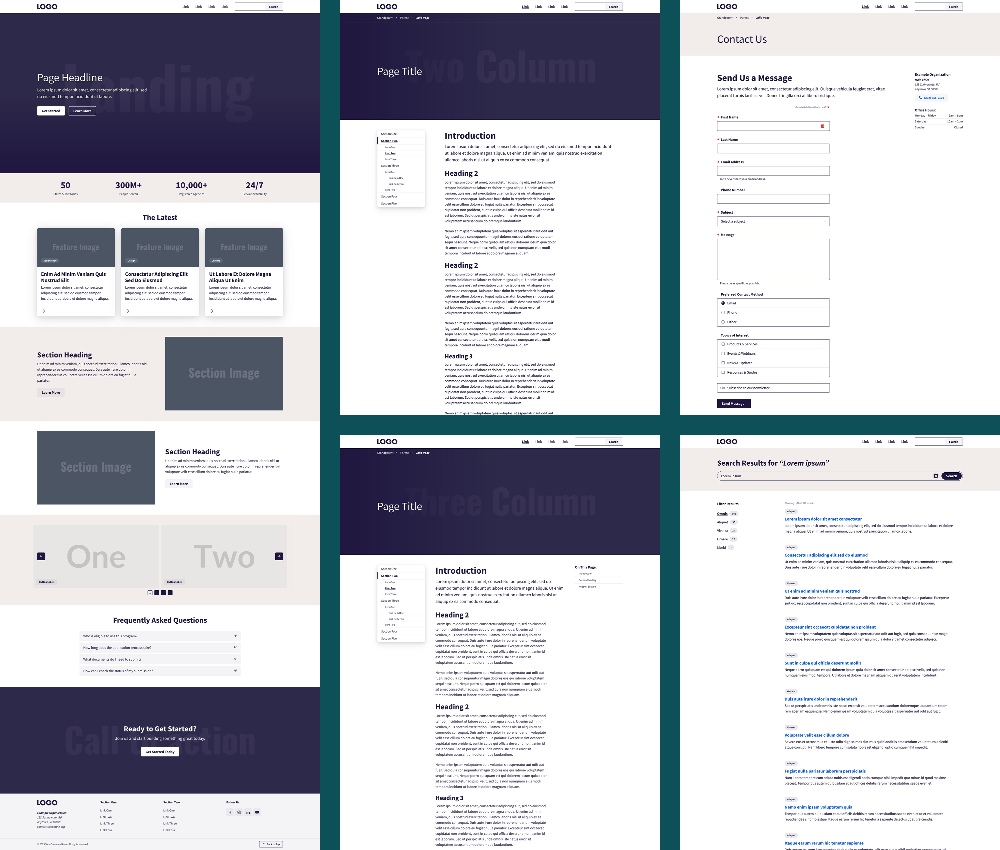
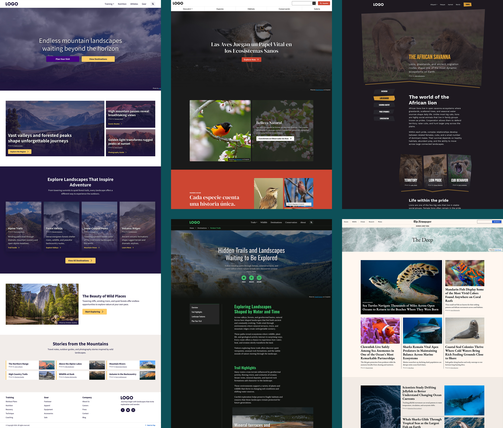
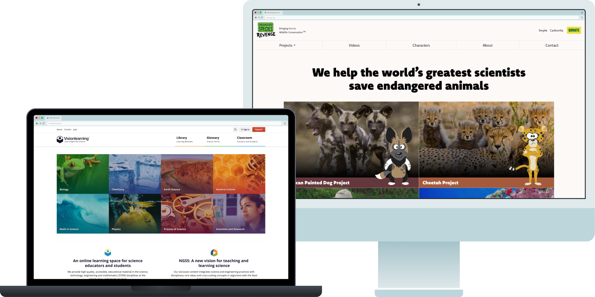

import LightboxImage from '../../components/LightboxImage.astro';
import designSystemArchitecture from '../../images/natura11y/design-system-architecture.jpg';
import colorSystem from '../../images/natura11y/natura11y-figma-color-system.png';

<CaseStudyOverview caseStudy={frontmatter.caseStudy}>

## Challenge

Natura11y began as a series of small experiments I created while taking front-end programming tutorials. I wanted the work to remain useful after each exercise, so I started saving the pieces and exploring how they could fit together.

At work, I often found other frameworks restrictive when building interfaces with specific design requirements. Front-end tools and development environments were also becoming more complex. I wanted a foundation I could understand, control, and simplify as my knowledge grew.

## Solution

As that collection developed, I decided to build my own framework, with accessibility guiding its design. I began using early versions in client projects through Avidano Digital, refining the system as I learned more about UX and front-end development.

Natura11y expanded into an ecosystem connecting reusable components, Figma libraries, icons, and production code. I designed it to support different visual identities while sharing interface patterns and accessibility behavior. Documentation became an important part of the work, explaining how components should be used and making those decisions available alongside the code.

## Result

Natura11y is now an open-source ecosystem that I maintain and use in client work, including Visionlearning’s latest redesign and the ongoing redesign of Cheetah Conservation Fund’s website. It gives me established patterns to build on while leaving room for each project’s requirements.

I designed and developed the original core before generative AI became part of my workflow. Today, I use AI to help maintain and update the system, drawing on its working components, documentation, and the design decisions I’ve made along the way.

</CaseStudyOverview>

<TextBlock>

## Ecosystem architecture

As Natura11y expanded, I reorganized it into a monorepo that keeps its framework, React components, icons, documentation, and testing connected. I can now make a decision once and carry it across the entire ecosystem, reducing duplicated work and preventing its different parts from falling out of sync.

</TextBlock>

<FigureSingle width='medium' caption="Natura11y ecosystem architecture">

<LightboxImage
  src={designSystemArchitecture}
  alt="Diagram of the Natura11y monorepo connecting its Astro documentation and Storybook apps with Core, Icons, and React packages distributed through NPM and CDNs."
  caption="Natura11y ecosystem architecture"
/>

</FigureSingle>

<TextBlock>

### Codebase

Natura11y’s codebase is designed to be minimal and easy to maintain. Core serves as the shared foundation for the ecosystem, with Sass organized by component, utility, and feature, and focused vanilla JavaScript classes handling interactive behavior. React uses the same styles and imports only the Core utilities it needs, rather than recreating them in a separate implementation.

</TextBlock>

<TextBlock>

### Components (vanilla and React)

I designed HTML and React components around the same Core styles and accessibility patterns. React manages its own state and interactions while reusing Core utilities. Storybook brings both implementations together for development and testing.

</TextBlock>

<FigureSideBySide>

<FigureSingle caption="Flyout component in Storybook" isContained={false} margin='margin-y-0'>

</FigureSingle>

<FigureSingle caption="Form component in Storybook" isContained={false} margin='margin-y-0'>

</FigureSingle>

</FigureSideBySide>

<Divider />

<TextBlock>

## A color system built around relationships

I designed Natura11y’s color system around five themes: Primary, Secondary, Dark, Light, and Canvas. Each theme pairs its background with related text, border, link, confirmation, and warning colors. Applying a theme to a page, section, or component keeps those relationships together.

Themes can be changed without changing a component’s structure. Themes can also be nested, so a light card can sit within a dark section and retain its own color relationships. Custom palettes still need contrast checks; the system provides a consistent way to define and apply them.

</TextBlock>

<FigureSingle width='medium' caption="Natura11y’s principal palette and correlated colors in the Figma library.">

<LightboxImage
  src={colorSystem}
  alt="Natura11y Color overview in Figma, showing the five principal theme colors and their related text, border, link, confirmation, and warning colors."
  caption="Natura11y’s principal palette and correlated colors in the Figma library."
/>

</FigureSingle>

<TextBlock>

Those relationships also let the same interface adapt to light and dark mode. In the [Oceanic Pulse example](https://natura11y.github.io/root/packages/core/dist/html/examples/oceanic-pulse-newsroom/), backgrounds, text, borders, and links change together with the viewer’s system preference, while the layout stays the same.

</TextBlock>

<FigureSideBySide stackOnMobile={true}>

<FigureSingle caption="Light mode" isContained={false} margin='margin-y-0'>

</FigureSingle>

<FigureSingle caption="Dark mode" isContained={false} margin='margin-y-0'>

</FigureSingle>

</FigureSideBySide>

<Divider />

<TextBlock>

## Icon library

Natura11y includes its own icon library. The icon package is versioned alongside the source repository and contains the original vectors, also included in the Figma libraries. This allows designers and developers to easily add, modify, or update icons while ensuring design consistency across projects.

</TextBlock>

<FigureSingle>

    
</FigureSingle>

<Divider />

<TextBlock>

## Figma UI kits

I created separate lo-fi and hi-fi Figma libraries that support different stages of a project. The lo-fi kit provides reusable patterns for exploring content, hierarchy, and flow. The hi-fi kit can then be customized into a project’s own design system, with its typography, colors, and component details.

</TextBlock>

<FigureSideBySide>

<FigureSingle caption="Lo-fi Figma UI Kit" isContained={false} margin='margin-y-0'>

</FigureSingle>

<FigureSingle caption="Hi-fi Figma UI Kit" isContained={false} margin='margin-y-0'>

</FigureSingle>

</FigureSideBySide>

<TextBlock>

Keeping the lo-fi kit separate lets me reuse it across projects and update it independently of their visual identities. It remains a shared tool for early design work, while each project’s hi-fi system develops around its specific needs.

The hi-fi kit’s foundation variables correspond to Natura11y’s CSS variables. Theme modes represent the color system without requiring duplicate component variants, giving designers and developers a shared set of values to work from.

</TextBlock>

<Divider />

<TextBlock>

## A foundation for custom design systems

Natura11y can become a project’s own design system. Colors, typography, spacing, and component details can be customized through CSS variables, while the hi-fi Figma library provides a corresponding design foundation.

A project stylesheet loads after Core and defines its own visual identity. The shared components and interaction patterns remain available, giving each project a starting point that can be extended around its needs.

</TextBlock>

<ThemeWrapper>
<TextBlock>

## Public documentation

I built the documentation with Astro and MDX, pairing working examples with implementation and accessibility guidance.

Nature photography, selected from Unsplash with photographer credits, gives the documentation a warm, welcoming feel. Choosing those images was one of the most enjoyable parts of the project.

</TextBlock>

<FigureSingle>

    
</FigureSingle>
</ThemeWrapper>

<TextBlock>

## Templates and examples

Templates offer unbranded, full-page layouts for common page types, providing accessible structure and best practices out of the box. Examples, in contrast, are small, branded comps designed to inspire; they show how Natura11y can be styled for different brands or aesthetics. Together, templates serve as blueprints while examples illustrate how styling works within Natura11y.

</TextBlock>

<ThemeWrapper>
<FigureSingle caption="Template pages for common interface patterns">

    
</FigureSingle>

<FigureSingle caption="Interactive examples showing Natura11y components in use">

    
</FigureSingle>
</ThemeWrapper>

<TextBlock>

## Preparing for an agentic future

I’ve been preparing Natura11y for AI-assisted work by making its design decisions explicit. Figma component descriptions explain intended use, accessibility, and responsive behavior. Variables point to Core’s CSS names, and documented rules establish which source to follow when design and code differ. Alongside working examples, this gives AI tools context to build with the system and gives me a reference for reviewing their output.

</TextBlock>

<FigureSingle width='narrow' caption="Figma component guidance distinguishes visual layout variants from responsive behavior in Core.">

</FigureSingle>

<TextBlock>

I describe this work in more detail in [Moving the Natura11y design system into an AI-ready monorepo](/drawing-board/moving-the-natura11y-design-system-into-an-ai-ready-monorepo).

</TextBlock>

<TextBlock>

## In the wild

Natura11y is not just a personal framework or design exercise. I use it on real client projects to move from early design ideas to accessible, production-ready interfaces with a shared foundation for design and code.

</TextBlock>

<FigureSingle>

    
</FigureSingle>

<TextBlock>

## Reflection

Natura11y did not begin as a complete design ecosystem. It grew through years of client work, experimentation, and iteration. As accessibility and design systems became part of my daily practice, Natura11y gave me a way to deepen those skills while building a reusable foundation shaped by the needs of real projects.

</TextBlock>

<ProjectLinkButton linkUrl='https://gonatura11y.com/' title='Explore the Natura11y documentation' />
