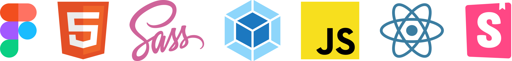
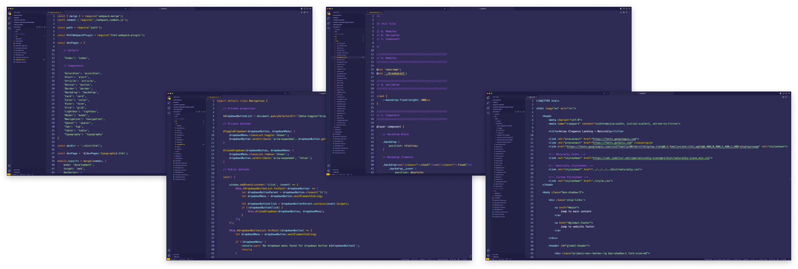
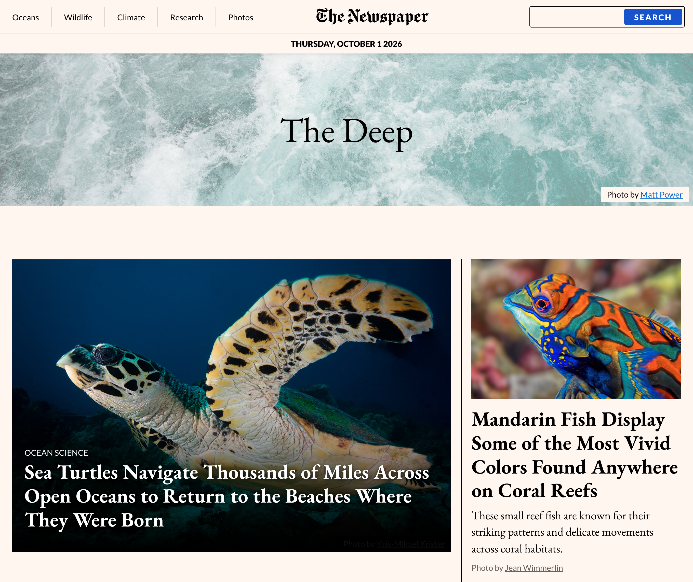
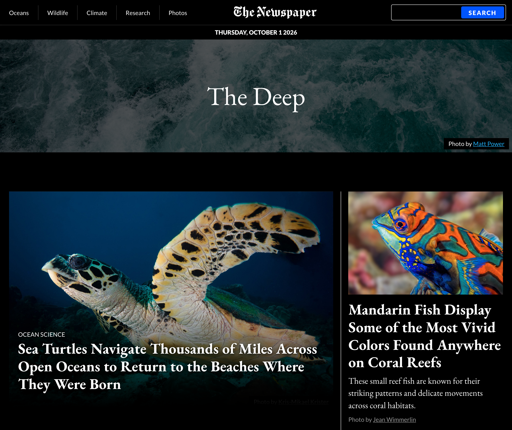
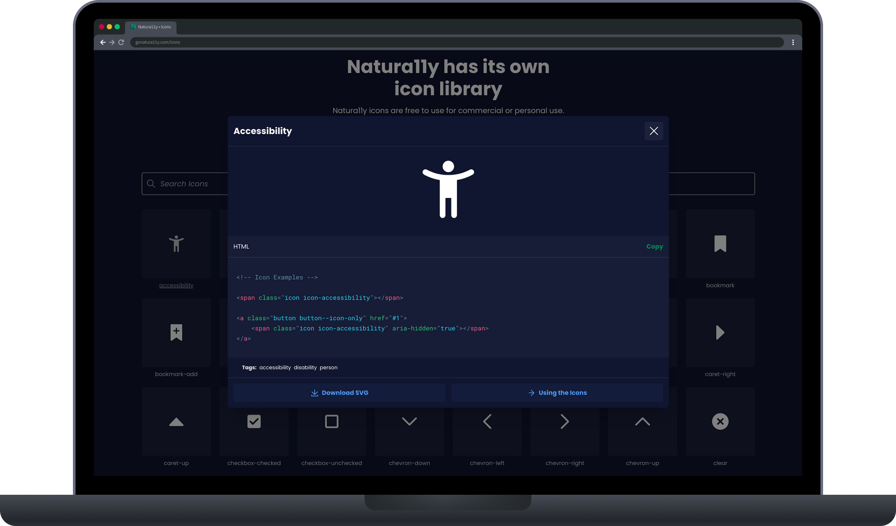
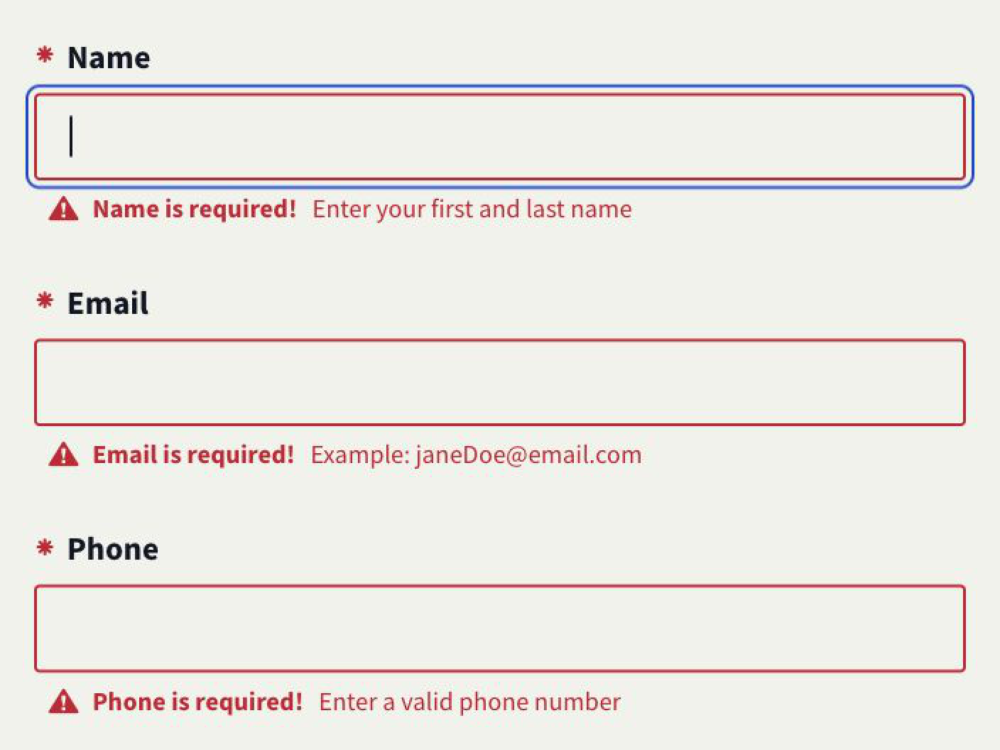
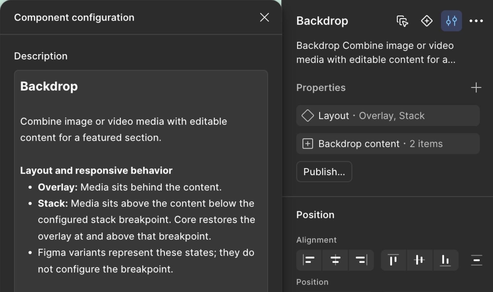

import { Image } from 'astro:assets';
import LightboxImage from '../../components/LightboxImage.astro';
import CaseStudyScreens from '../../components/CaseStudyScreens/index.astro';
import backdropDocumentation from '../../images/natura11y/screens/natura11y-screen-documentation-backdrop.webp';
import colorDocumentation from '../../images/natura11y/screens/natura11y-screen-documentation-color.webp';
import landingTemplate from '../../images/natura11y/screens/natura11y-screen-template-landing.webp';
import twoColumnTemplate from '../../images/natura11y/screens/natura11y-screen-template-two-column.webp';
import contactFormTemplate from '../../images/natura11y/screens/natura11y-screen-template-contact-form.webp';
import threeColumnTemplate from '../../images/natura11y/screens/natura11y-screen-template-three-column.webp';
import searchResultsTemplate from '../../images/natura11y/screens/natura11y-screen-template-search-results.webp';
import peakPerformanceExample from '../../images/natura11y/screens/natura11y-screen-example-peak-performance.webp';
import avianEleganceExample from '../../images/natura11y/screens/natura11y-screen-example-avian-elegance.webp';
import majesticLionExample from '../../images/natura11y/screens/natura11y-screen-example-majestic-lion.webp';
import verdantTrailsExample from '../../images/natura11y/screens/natura11y-screen-example-verdant-trails.webp';
import oceanicPulseExample from '../../images/natura11y/screens/natura11y-screen-example-oceanic-pulse.webp';
import designSystemArchitecture from '../../images/natura11y/design-system-architecture.jpg';
import colorSystem from '../../images/natura11y/natura11y-figma-color-system.png';
import typeScaleVisualizer from '../../images/natura11y/natura11y-type-scale-visualizer.png';
import inTheWild from '../../images/natura11y/natura11y-in-the-wild.png';

<CaseStudyOverview caseStudy={frontmatter.caseStudy}>

## Why Natura11y?

The Natura11y Design Ecosystem is an open-source toolkit. It helps you design, build, and maintain inclusive user interfaces.

Natura11y began as a collection of artifacts from front-end development tutorials. At the time, I was working at NYC OTI and becoming more interested in front-end development and digital accessibility. I spent much of my time learning HTML, CSS, and JavaScript through online tutorials. I began applying lessons from these exercises to my own system.

Eventually, I had a large enough library, and Natura11y was born.

I created Natura11y to explore my own approach to building and customizing inclusive interfaces.
I saw an opportunity to combine my interests in accessibility and front-end development. On top of that, I felt that I was creating something with lasting value.

## Design ecosystem

Natura11y brings together the tools I use to design, build, test, and document interfaces. Its design libraries, styles, icons, and interactive components connect design decisions to working code. I call it a design ecosystem because these parts support one another and stay connected as the system grows.

<FigureSingle isContained={false} margin='margin-top-4 margin-bottom-0'>

</FigureSingle>

</CaseStudyOverview>

<TextBlock>

## Ecosystem architecture

As Natura11y grew, I set it up as a monorepo. This keeps its framework, React components, icons, documentation, and testing all linked. I can now make one decision and apply it throughout the entire ecosystem. This cuts down on duplicated work and keeps all parts in sync.

</TextBlock>

<FigureSingle width='medium' caption="Natura11y ecosystem architecture">

<LightboxImage
  src={designSystemArchitecture}
  alt="Diagram of the Natura11y monorepo connecting its Astro documentation and Storybook apps with Core, Icons, and React packages distributed through NPM and CDNs."
  caption="Natura11y ecosystem architecture"
/>

</FigureSingle>

<TextBlock>

### Codebase

I aimed to keep the codebase minimal and maintainable. I've seen the effects that technical debt can have on an organization's ability to progress. Have you ever watched a team struggle for 45 minutes to add an icon to an existing system? I have, and it's not fun.

</TextBlock>

<FigureSingle>

</FigureSingle>

<TextBlock>

### Components (vanilla and React)

I designed HTML and React components around the same Core styles and accessibility patterns. React manages its own state and interactions while reusing Core utilities. Storybook brings both implementations together for development and testing.

</TextBlock>

<FigureSideBySide>

<FigureSingle caption="Flyout component in Storybook" isContained={false} margin='margin-y-0'>

</FigureSingle>

<FigureSingle caption="Form component in Storybook" isContained={false} margin='margin-y-0'>

</FigureSingle>

</FigureSideBySide>

<Divider />

<TextBlock>

## A color system built around relationships

I designed Natura11y’s color system around five themes: Primary, Secondary, Dark, Light, and Canvas. Each theme pairs its background with related text, border, link, confirmation, and warning colors. Applying a theme to a page, section, or component keeps those relationships together.

Themes can be changed without changing a component’s structure. Themes can also be nested, so a light card can sit within a dark section and retain its own color relationships. Custom palettes still need contrast checks; the system provides a consistent way to define and apply them.

</TextBlock>

<FigureSingle width='medium' caption="Natura11y’s principal palette and correlated colors in the Figma library.">

<LightboxImage
  src={colorSystem}
  alt="Natura11y Color overview in Figma, showing the five principal theme colors and their related text, border, link, confirmation, and warning colors."
  caption="Natura11y’s principal palette and correlated colors in the Figma library."
/>

</FigureSingle>

<TextBlock>

Those relationships also let the same interface adapt to light and dark mode. In the <LinkOpenNew LinkUrl="https://natura11y.github.io/root/packages/core/dist/html/examples/oceanic-pulse-newsroom/" LinkText="Oceanic Pulse example" />, backgrounds, text, borders, and links change together with the viewer’s system preference, while the layout stays the same.

</TextBlock>

<FigureSideBySide stackOnMobile={true}>

<FigureSingle caption="Light mode" isContained={false} margin='margin-y-0'>

</FigureSingle>

<FigureSingle caption="Dark mode" isContained={false} margin='margin-y-0'>

</FigureSingle>

</FigureSideBySide>

<Divider />

<TextBlock>

## A type scale with two variables

I designed Natura11y’s type scale around two variables: the smallest font size and a multiplier that sets each step up. Changing these values adjusts headings and body text together. Both can change at any breakpoint, so the scale can adapt to the available space without setting each font size separately.

The <LinkOpenNew LinkUrl="https://gonatura11y.com/type-scale/" LinkText="Type Scale Visualizer" /> lets you try different combinations and see the resulting sizes.

</TextBlock>

<FigureSingle width='medium' caption="The Type Scale Visualizer shows the heading and body sizes generated by two variables.">

<Image
  src={typeScaleVisualizer}
  alt="Natura11y’s Type Scale Visualizer in a browser in dark mode, with base font size set to 16 pixels and type scale set to 1.2. Heading and body-text samples show the resulting sizes in pixels and rem."
  quality={90}
/>

</FigureSingle>

<Divider />

<TextBlock>

## Icon library

Natura11y includes its own icon library. The icon package is versioned alongside the source repository and contains the original vectors, also included in the Figma libraries. This allows designers and developers to easily add, modify, or update icons while ensuring design consistency across projects.

</TextBlock>

<FigureSingle>

    
</FigureSingle>

<Divider />

<TextBlock>

## Forms with clear focus and feedback

I designed Natura11y’s form controls around consistent labels, help text, and visible keyboard focus. Required fields are marked before someone starts filling out a form. When information is missing, validation adds a warning icon and a specific message beside the field. Focus moves to the first field that needs attention, helping people find where to begin.

The <LinkOpenNew LinkUrl="https://gonatura11y.com/docs/form/" LinkText="form documentation" /> includes working examples of text fields, selection controls, file uploads, and validation.

</TextBlock>

<FigureSingle width='narrow' caption="Required-field feedback alongside a visible focus indicator on the Name field.">

</FigureSingle>

<Divider />

<TextBlock>

## Figma UI kits

I created separate lo-fi and hi-fi Figma libraries that support different stages of a project. The lo-fi kit provides reusable patterns for exploring content, hierarchy, and flow. The hi-fi kit can then be customized into a project’s own design system, with its typography, colors, and component details.

</TextBlock>

<FigureSideBySide>

<FigureSingle caption="Lo-fi Figma UI Kit" isContained={false} margin='margin-y-0'>

</FigureSingle>

<FigureSingle caption="Hi-fi Figma UI Kit" isContained={false} margin='margin-y-0'>

</FigureSingle>

</FigureSideBySide>

<TextBlock>

Keeping the lo-fi kit separate lets me reuse it across projects and update it independently of their visual identities. It remains a shared tool for early design work, while each project’s hi-fi system develops around its specific needs.

The hi-fi kit’s foundation variables correspond to Natura11y’s CSS variables. Theme modes represent the color system without requiring duplicate component variants, giving designers and developers a shared set of values to work from.

</TextBlock>

<Divider />

<ThemeWrapper>
<TextBlock>

## Public documentation

I built the documentation with Astro and MDX, pairing working examples with implementation and accessibility guidance.

Nature photography, selected from Unsplash with photographer credits, gives the documentation a warm, welcoming feel. Choosing those images was one of the most enjoyable parts of the project.

</TextBlock>

<CaseStudyScreens
  columns={2}
  lightbox={true}
  showLabels={false}
  screens={[
    { src: backdropDocumentation, label: 'Backdrop documentation', alt: 'Natura11y Backdrop documentation with photography, accessibility guidance, working examples, and HTML code.' },
    { src: colorDocumentation, label: 'Color documentation', alt: 'Natura11y Color documentation showing theme palettes, correlated colors, usage examples, and code.' }
  ]}
  caption="Natura11y’s Backdrop and Color documentation."
/>
</ThemeWrapper>

<TextBlock>

## Templates and examples

Templates offer unbranded, full-page layouts for common page types, providing accessible structure and best practices out of the box. Examples are small, branded designs that show how Natura11y can be styled for different visual identities.

</TextBlock>

<ThemeWrapper>
<CaseStudyScreens
  columns={3}
  lightbox={true}
  showLabels={false}
  screens={[
    { src: landingTemplate, label: 'Landing page template', alt: 'Natura11y landing page template with a hero, statistics, cards, alternating content sections, and frequently asked questions.' },
    { src: twoColumnTemplate, label: 'Two-column template', alt: 'Natura11y two-column page template with nested navigation beside the main content.' },
    { src: contactFormTemplate, label: 'Contact form template', alt: 'Natura11y contact page template with labeled form fields, contact preferences, and organization details.' },
    { src: threeColumnTemplate, label: 'Three-column template', alt: 'Natura11y three-column page template with nested navigation, main content, and on-page links.' },
    { src: searchResultsTemplate, label: 'Search results template', alt: 'Natura11y search results template with a search field, filters, result descriptions, and pagination.' }
  ]}
  caption="Template pages for common interface patterns."
/>

<CaseStudyScreens
  columns={3}
  lightbox={true}
  showLabels={false}
  screens={[
    { src: peakPerformanceExample, label: 'Peak Performance example', alt: 'Peak Performance example with mountain photography, purple and yellow colors, destination cards, and travel stories.' },
    { src: avianEleganceExample, label: 'Avian Elegance example', alt: 'Avian Elegance example with bird photography, Spanish text, serif headings, and orange accents.' },
    { src: majesticLionExample, label: 'Majestic Lion example', alt: 'Majestic Lion example with a dark background, gold accents, angled image borders, and lion photography.' },
    { src: verdantTrailsExample, label: 'Verdant Trails example', alt: 'Verdant Trails example with a dark background, green accents, landscape photography, and sidebar navigation.' },
    { src: oceanicPulseExample, label: 'Oceanic Pulse example', alt: 'Oceanic Pulse example with a newspaper-style layout, serif headlines, and marine wildlife stories.' }
  ]}
  caption="Interactive examples showing Natura11y components in use."
/>
</ThemeWrapper>

<TextBlock>

## Preparing for an agentic future

I’ve been preparing Natura11y for AI-assisted work by making its design decisions explicit. Figma component descriptions explain intended use, accessibility, and responsive behavior. Variables point to Core’s CSS names, and documented rules establish which source to follow when design and code differ. Alongside working examples, this gives AI tools context to build with the system and gives me a reference for reviewing their output.

</TextBlock>

<FigureSingle width='narrow' caption="Figma component guidance distinguishes visual layout variants from responsive behavior in Core.">

</FigureSingle>

<TextBlock>

I describe this work in more detail in [Moving the Natura11y design system into an AI-ready monorepo](/drawing-board/moving-the-natura11y-design-system-into-an-ai-ready-monorepo).

</TextBlock>

<TextBlock>

## In the wild

Natura11y has been part of my work for several years, across projects of different sizes. I used it for Visionlearning and, more recently, Endangered Species Revenge, and I’m using it as the starting point for Cheetah Conservation Fund’s new design system. It also supports The Narrative Authority, Avidano Digital, and this portfolio.

</TextBlock>

<FigureSingle>

<Image src={inTheWild} quality={90} alt="Six browser windows showing Cheetah Conservation Fund’s design preview, Visionlearning, Endangered Species Revenge, The Narrative Authority, Avidano Digital, and this portfolio." />
    
</FigureSingle>

<TextBlock>

## Reflection

Building Natura11y has deepened my understanding of accessibility and the relationship between design and code. Maintaining it means working through the details behind each component, then keeping its implementation, Figma library, and documentation aligned. That work continues alongside the projects that use it.

</TextBlock>

  <Button
    href="https://gonatura11y.com/"
    title="Explore the Natura11y documentation"
    outline
    utilities="text-color-link font-size-sm"
    iconEndHandle="open-new"
    target="_blank"
    rel="noreferrer"
  />

