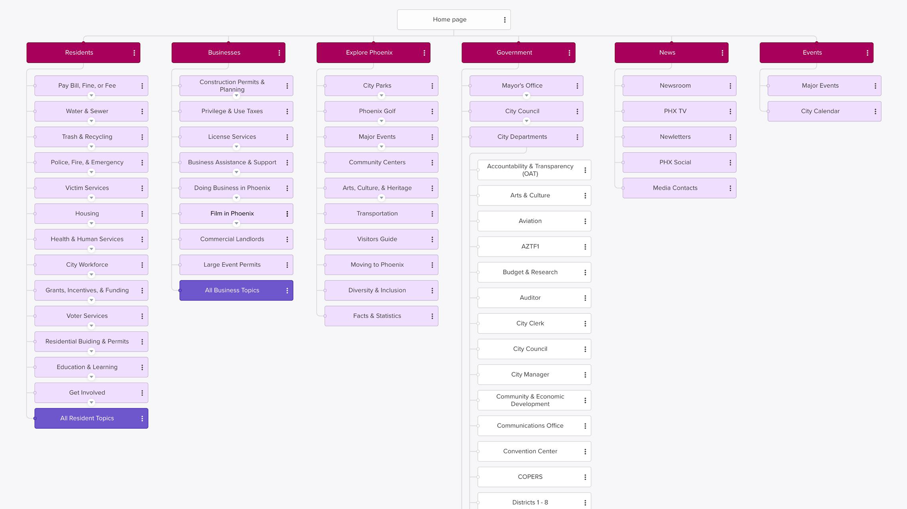
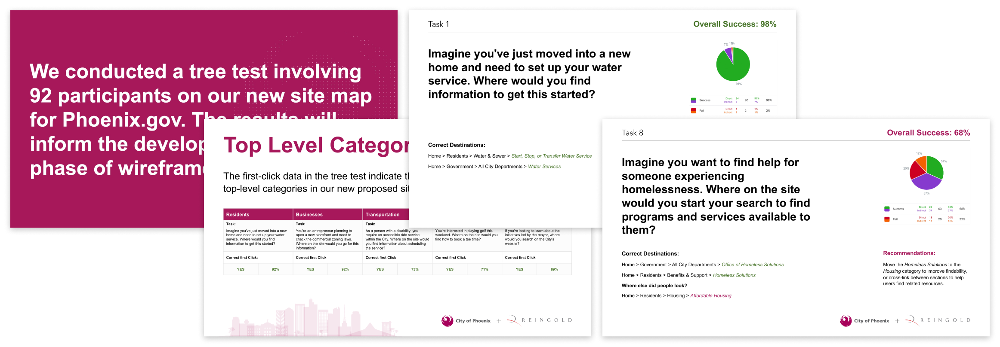
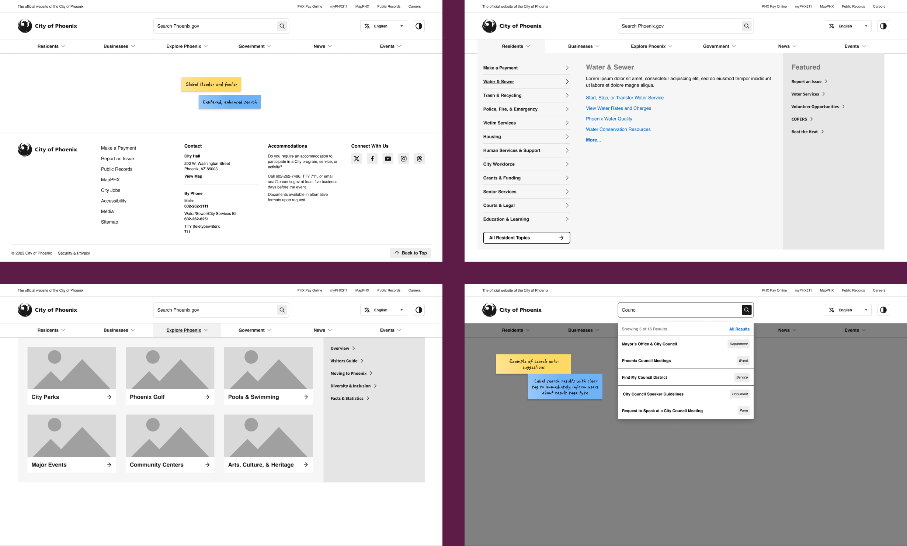
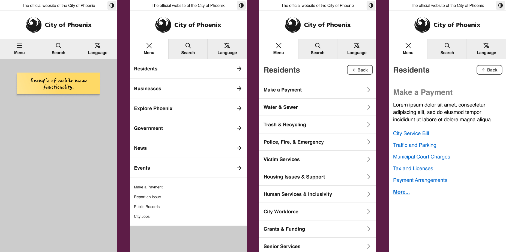
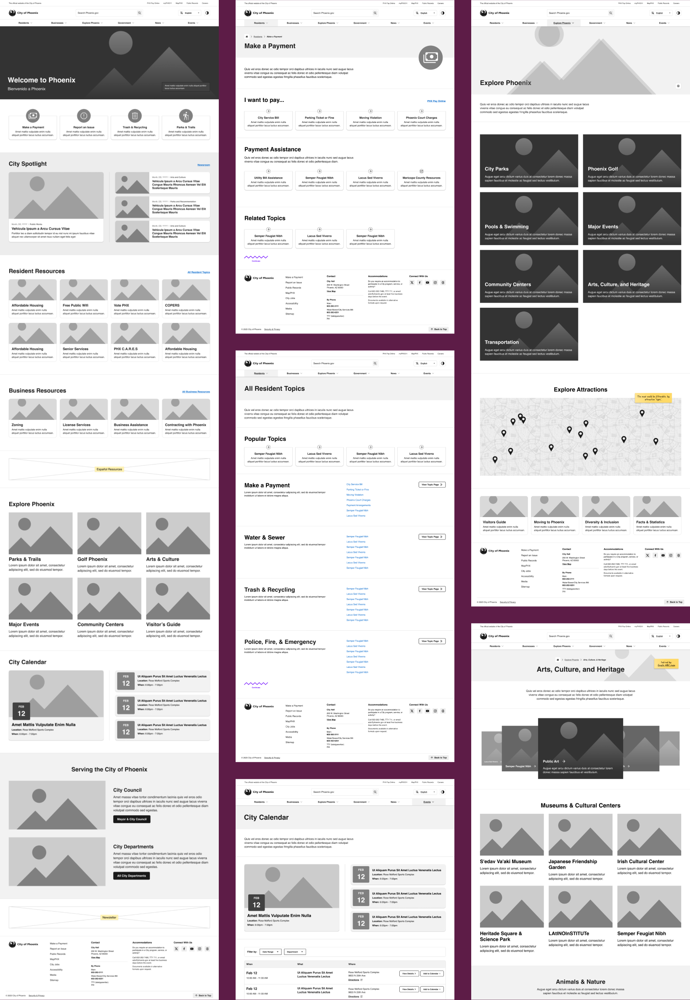
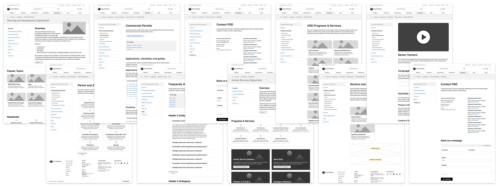

<CaseStudyOverview caseStudy={frontmatter.caseStudy}>

## Challenge

Phoenix is America’s fifth-largest city, with more than 1.5 million residents. Its official website, Phoenix.gov, was cluttered and hard to navigate, with dense content organized around individual departments. Search often returned irrelevant or outdated information. Visitors needed clear paths to services and information without having to understand the city’s internal structure.

## Solution

We organized the site around how residents and businesses look for services. Services and topics had their own paths, independent of the departments responsible for them, so people could find what they needed without first choosing an office. I guided the information architecture and developed shared navigation and page patterns to make that approach consistent throughout the site.

We refined those patterns through iterative wireframing and review with stakeholders, gaining buy-in along the way. The wireframes worked through how people would move between services and related information, including when they entered through a department page. Those patterns became the beginning of the design system and helped the visual design team move faster.

## Results

The redesigned site launched on March 24, 2025, three months ahead of schedule. The project reported:

</CaseStudyOverview>

<TextBlock>

## Organizing the site around services

Peer website analysis, stakeholder interviews, and user research informed our approach. We used personas and user stories to describe tasks people needed to complete, including finding social services and disability-related support. The stories covered specific needs, such as finding rental assistance or a swimming pool with accessible accommodations. They helped us keep those needs in view as we organized the content.

We rebuilt the citywide sitemap alongside individual department sitemaps across more than 40 departments. Services and topics had their own paths, so people could look for what they needed without first choosing an office. The department sitemaps also needed to work for people already inside a section. Connecting those local structures to the wider site was a substantial part of the information architecture work.

</TextBlock>

<FigureSingle caption={"The proposed sitemap provided paths to resident and business services alongside department information."}>

</FigureSingle>

<TextBlock>

## Testing where people looked

We tested the proposed sitemap with 92 residents using Optimal Workshop. Tree testing helped us see whether people could find information within the proposed structure. We used those findings, together with a content audit and SEO analysis, to refine the sitemap.

One task asked participants to find help for someone experiencing homelessness. Overall success was 68%, and some people looked under Housing. The report recommended moving Homeless Solutions into that category or linking the sections so people could find related support.

</TextBlock>

<FigureSingle caption={"Tree-testing findings included a recommendation to make homelessness support easier to find through Housing."}>

</FigureSingle>

<ThemeWrapper>

<TextBlock>

## Working through navigation in wireframes

I started with the global header and footer because they would be available throughout the site. People might arrive directly at a department or service page, so the navigation needed to help them understand where to go next from any entry point.

I developed the wireframes through repeated review and refinement with stakeholders. We used Miro to bring the sitemap, navigation states, and key pages together, making their relationships visible during review. This was the most extensive wireframing effort I had undertaken, allowing us to work through the navigation and page structure before moving into visual design.

</TextBlock>

<FigureSingle caption={"The shared header, footer, and menus provided access to services throughout the site."}>

</FigureSingle>

<TextBlock>

The desktop wireframes also addressed search. Suggestions appeared as someone typed, with labels identifying the type of result, such as a service, document, or form. Those distinctions were intended to help people understand a result before opening it.

Mobile prototypes showed how the same navigation could work on a smaller screen. Menu, Search, and Language remained separate controls, while the menu let people move through service categories one level at a time.

</TextBlock>

<FigureSingle caption={"The mobile prototype showed how people could move through navigation levels to reach a service."}>

</FigureSingle>

</ThemeWrapper>

<TextBlock>

## Connecting services and related information

Service pages needed to help people take the next step and find other relevant information. The Make a Payment wireframe, for example, brought payment options, payment assistance, and related topics together. It gave someone arriving at that page a useful starting point within the wider site. The All Resident Topics page offered another route into these services, grouping links under headings such as Water & Sewer and Trash & Recycling.

</TextBlock>

<ThemeWrapper>

<FigureSingle caption={"The Make a Payment wireframe grouped payment options with assistance and related information."}>

</FigureSingle>

</ThemeWrapper>

<TextBlock>

## Making department pages familiar

Departments had different content, but shared page patterns gave them a consistent way to present it. Working with content strategists and department stakeholders, I developed layouts for landing pages and deeper service information. Side navigation kept related pages available as people moved through a section.

A permitting page needed space for applications and checklists; a Human Services page needed to bring programs and support into view. The shared structure accommodated these differences while keeping navigation familiar.

These patterns became the beginning of the design system. We also allowed room in the layouts for longer Spanish-language text, so translated content could fit without disrupting the page structure.

</TextBlock>

<FigureSingle caption={"Department pages used familiar navigation and content patterns across different services."}>

</FigureSingle>

<TextBlock>

## The launch

City of Phoenix preview of the redesigned Phoenix.gov, shared ahead of its March 24, 2025 launch.

</TextBlock>

<FigureSingle width="medium">

<iframe
  class="aspect-ratio-16x9 border-radius-3"
  src="https://www.youtube-nocookie.com/embed/bNropFe0m0M?playsinline=1&rel=0"
  title="Upcoming phoenix.gov sneak peek — City of Phoenix"
  loading="lazy"
  referrerPolicy="strict-origin-when-cross-origin"
  allow="encrypted-media; picture-in-picture; fullscreen"
  allowFullScreen
  style={{ border: 0, minHeight: '200px' }}
></iframe>

</FigureSingle>

<TextBlock>

## Looking back

Team Reingold transformed Phoenix.gov into a modern, accessible, and user-friendly platform. Leading the user experience strategy for the official website of one of America's largest cities was exciting and humbling.

The investment in wireframing paid off in the design process. The high-fidelity designs closely followed the low-fidelity work because we had already resolved much of the structure and navigation. That helped the team move faster through visual design.

The project gave me valuable experience conducting research, organizing large amounts of information, and collaborating with stakeholders across more than forty city departments. It allowed me to build on lessons I learned in New York while expanding my experience working in municipal government.

I'm grateful for the opportunity to help shape a digital service used by more than 1.5 million residents.

</TextBlock>
