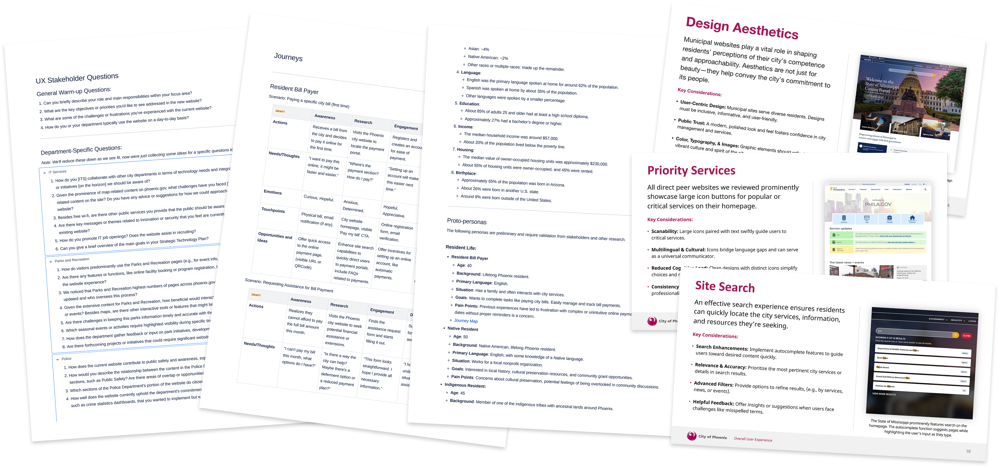
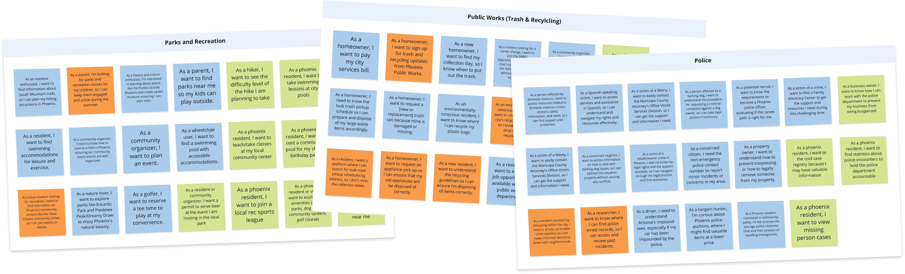
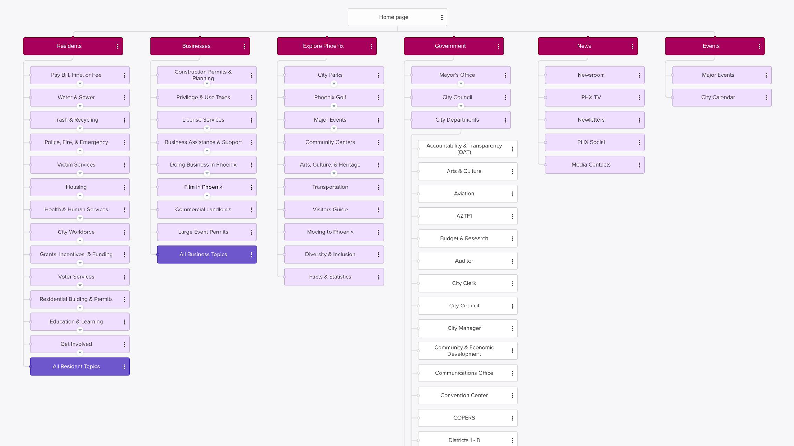
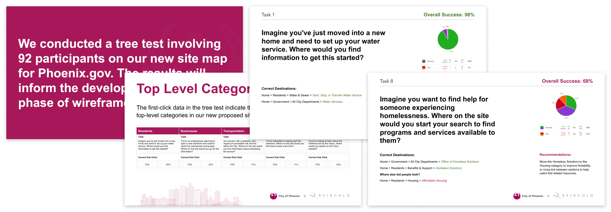
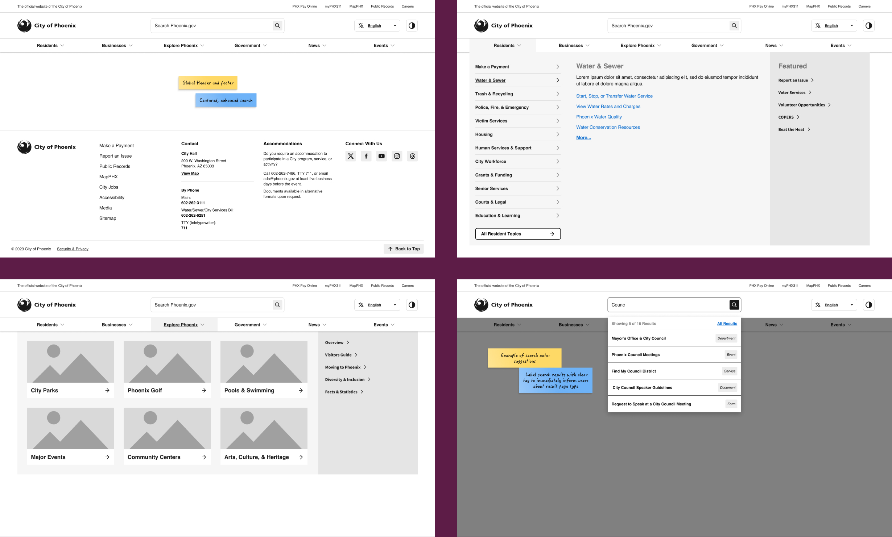
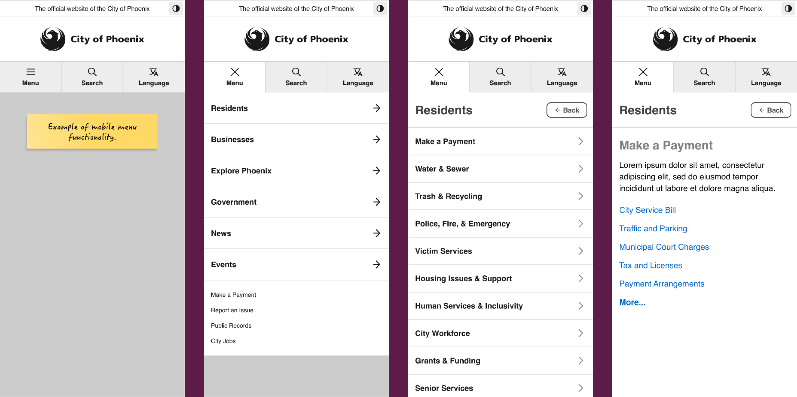
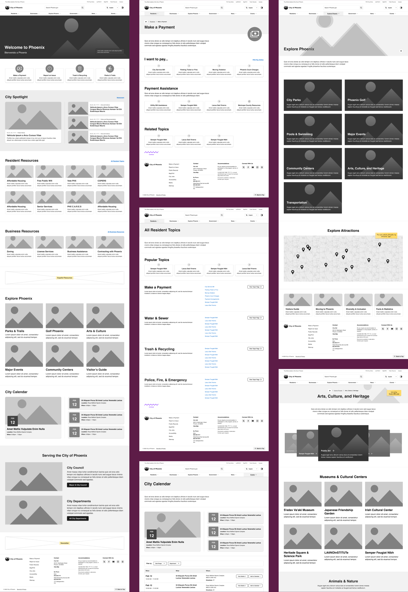
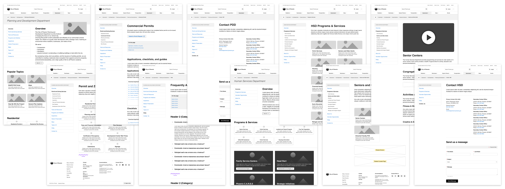

<CaseStudyOverview caseStudy={frontmatter.caseStudy}>

## Challenge

Phoenix is America’s fifth-largest city, with more than 1.5 million residents. Its official website, Phoenix.gov, was hard to navigate and lacked wayfinding. Pages were cluttered and organized around individual city departments, which wasn’t intuitive and required visitors to understand the city’s internal structure. Search often returned irrelevant or outdated information.

The website itself was hard to maintain for first city staff, with more than 5,500 pages across more than 40 departments.

## Solution

Reingold and the City of Phoenix had a shared vision for the redesign: *one city, one site*. This meant providing a more intuitive and consistent experience for visitors, while empowering city staff to maintain that consistency overtime.

The new site was built on Adobe Experience Manager, which allowed departments to intuitively manage their own content. AEM gave us the ability to create an accessible design system with shared  UI patterns, templates, and advanced search features.

The redesign focused on consolidating content and elevating essential city services. We paid special attention to homelessness assistance, disability resources, and services in Spanish.

I led the overall UX strategy, information architecture, and stakeholder alignment, collaborating with content strategists, designers, developers, and city staff.

## Results

The redesigned site launched on March 24, 2025, three months ahead of schedule. The project reported:

</CaseStudyOverview>

<TextBlock>

## Discovery before design

There's a lot at stake when redesigning a city website. People rely on Phoenix.gov to find essential services. We established the project's direction by identifying the questions we needed to answer and choosing research methods to address them.

Our discovery and validation work included:

- Peer analysis of seven government websites
- Stakeholder interviews tailored to individual departments
- Content audits, analytics, and search-intent analysis
- User stories, personas and journey maps
- Tree testing of the proposed sitemap

</TextBlock>

{/* Graphic PHX-01 — review tracked in context/case-study-graphics.md. */}

<FigureSingle caption={"Stakeholder questions, draft journey maps, proto-personas, and peer analysis informed the research and planning."}>

</FigureSingle>

<TextBlock>

### Creating and validating user stories

Collaborating with the content strategists, we wrote **a ton** of user stories. This helped us align on who we were designing for, and what they needed from the site. We used AI to speed things up and validated them with city staff. We grouped user stories by department to keep them organized. This also made overlapping responsibilities visible. For example, paying a city services bill appeared under both Public Works and Water Services.

</TextBlock>

{/* Graphic PHX-02 — review tracked in context/case-study-graphics.md. */}

<FigureSingle caption={"User stories made specific service needs visible across departments"}>

</FigureSingle>

<TextBlock>

### What we learned

Peer sites put common tasks front and center. Our audit found related information scattered across departments, outdated pages, and unclear content ownership. We needed clearer paths to services and a plan for keeping information current. The user stories helped us prioritize what the new site needed to support.

</TextBlock>

<Divider />

<TextBlock>

## Creating the sitemaps

We rebuilt the citywide sitemap alongside individual sitemaps for more than 40 departments. People could browse by service or topic, or go directly to a department if they knew which one they needed. Each department’s section also needed clear navigation of its own, since visitors wouldn’t always arrive through the homepage.

</TextBlock>

<FigureSingle caption={"The proposed sitemap provided paths to resident and business services alongside department information."}>

</FigureSingle>

<TextBlock>

### Tree testing

We used tree testing in Optimal Workshop to evaluate the proposed sitemap with 92 participants. Across 13 tasks, we examined where people started and whether they found what they needed without backtracking. The top-level categories worked well overall, but some labels and links between sections needed refinement. We used these findings alongside the content audit and SEO analysis to refine the sitemap.

</TextBlock>

<FigureSingle caption={"Tree-testing findings included a recommendation to make homelessness support easier to find through Housing."}>

</FigureSingle>

<TextBlock>

One task asked participants to find help for someone experiencing homelessness. Overall success was 68%, and some people looked under Housing. The report recommended moving Homeless Solutions into that category or linking the sections so people could find related support.

</TextBlock>

<ThemeWrapper>

<TextBlock>

## Connecting the sitemap to the global navigation

With the sitemap in place, we created initial wireframes of the header and footer to explore the navigation system. This helped us check whether the sitemap made sense in practice and where the structure needed adjustment.

</TextBlock>

<FigureSingle caption={"The shared header, footer, and menus provided access to services throughout the site."}>

</FigureSingle>

<TextBlock>

The desktop wireframes also addressed search. Suggestions appeared as someone typed, with labels identifying the type of result, such as a service, document, or form. Those distinctions were intended to help people understand a result before opening it.

On mobile, I kept Menu, Search, and Language as separate controls. The mobile menu let people move through service categories one level at a time. The prototypes showed how those routes could work on a smaller screen while keeping search and language access available.

</TextBlock>

<FigureSingle caption={"The mobile prototype showed how people could move through navigation levels to reach a service."}>

</FigureSingle>

</ThemeWrapper>

<TextBlock>

## Connecting services and related information

Service pages needed to help people take the next step and find other relevant information. The Make a Payment wireframe, for example, brought payment options, payment assistance, and related topics together. It gave someone arriving at that page a useful starting point within the wider site. The All Resident Topics page offered another route into these services, grouping links under headings such as Water & Sewer and Trash & Recycling.

</TextBlock>

<ThemeWrapper>

<FigureSingle caption={"The Make a Payment wireframe grouped payment options with assistance and related information."}>

</FigureSingle>

</ThemeWrapper>

<TextBlock>

## Making department pages familiar

The user stories also covered the people maintaining Phoenix.gov. Authors wanted reusable templates so they would not have to work out the structure of common pages each time.

Working with content strategists and department stakeholders, I developed shared layouts for landing pages and deeper service information. Departments had different content, but a familiar page structure gave authors a starting point and kept related pages available through side navigation.

A permitting page needed space for applications and checklists; a Human Services page needed to bring programs and support into view. The shared structure accommodated these differences while keeping navigation familiar.

These patterns became the beginning of the design system. We also allowed room in the layouts for longer Spanish-language text, so translated content could fit without disrupting the page structure.

</TextBlock>

<FigureSingle caption={"Department pages used familiar navigation and content patterns across different services."}>

</FigureSingle>

<TextBlock>

## The launch

City of Phoenix preview of the redesigned Phoenix.gov, shared ahead of its March 24, 2025 launch.

</TextBlock>

<FigureSingle width="medium">

<iframe
  class="aspect-ratio-16x9 border-radius-3"
  src="https://www.youtube-nocookie.com/embed/bNropFe0m0M?playsinline=1&rel=0"
  title="Upcoming phoenix.gov sneak peek — City of Phoenix"
  loading="lazy"
  referrerPolicy="strict-origin-when-cross-origin"
  allow="encrypted-media; picture-in-picture; fullscreen"
  allowFullScreen
  style={{ border: 0, minHeight: '200px' }}
></iframe>

</FigureSingle>

<TextBlock>

## Looking back

Team Reingold transformed Phoenix.gov into a modern, accessible, and user-friendly platform. Leading the user experience strategy for the official website of one of America's largest cities was exciting and humbling.

The investment in wireframing paid off in the design process. The high-fidelity designs closely followed the low-fidelity work because we had already resolved much of the structure and navigation. That helped the team move faster through visual design.

The project gave me valuable experience conducting research, organizing large amounts of information, and collaborating with stakeholders across more than forty city departments. It allowed me to build on lessons I learned in New York while expanding my experience working in municipal government.

I'm grateful for the opportunity to help shape a digital service used by more than 1.5 million residents.

</TextBlock>
