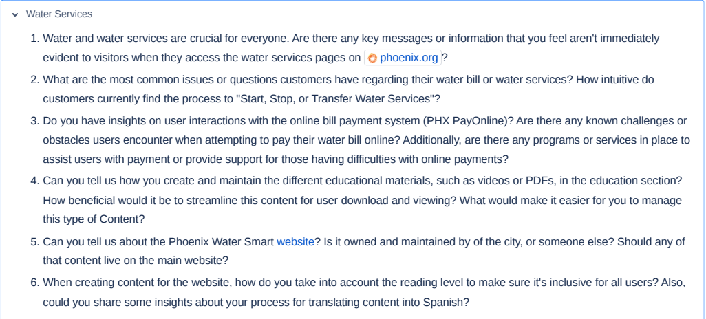
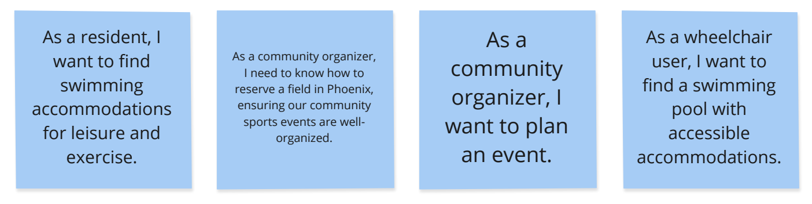
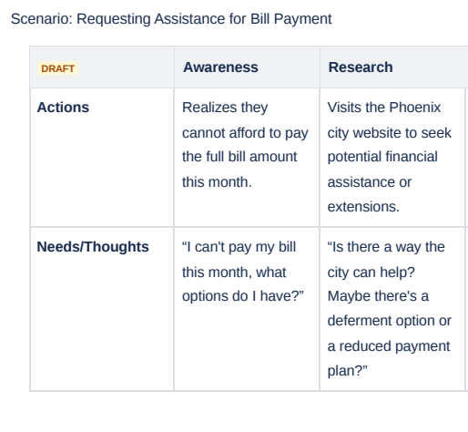

<CaseStudyOverview caseStudy={frontmatter.caseStudy}>

## Challenge

Phoenix is America’s fifth-largest city, with more than 1.5 million residents. Its official website, Phoenix.gov, was cluttered and hard to navigate, with dense content organized around individual departments. Search often returned irrelevant or outdated information. Visitors needed clear paths to services and information without having to understand the city’s internal structure.

## Solution

We organized the site around how residents and businesses look for services, with paths to services and topics that did not require choosing a department. I guided the information architecture and developed shared navigation and page patterns to keep that approach consistent across the site.

Through iterative wireframing and stakeholder review, we refined how people would move between services and related information, including from department pages. This work gained stakeholder buy-in, established the beginnings of the design system, and helped the visual design team move faster.

## Results

The redesigned site launched on March 24, 2025, three months ahead of schedule. The project reported:

</CaseStudyOverview>

<TextBlock>

## Understanding service needs

I led the creation of much of the discovery material, with contributions and review from the team. Our discovery and validation work included:

- Stakeholder interviews tailored to individual departments
- Peer analysis of seven government websites
- Content audits, analytics, and search-intent analysis
- User stories and content prioritization
- Preliminary personas and draft journey maps
- Tree testing of the proposed sitemap

I developed department-specific stakeholder interview questions to understand the services each department provided and where people might have difficulty using the website.

For Water Services, the questions covered starting or transferring service, online bill payments, and assistance for people struggling to pay. They also asked how the department maintained educational content and handled reading level and Spanish translation.

</TextBlock>

<FigureSingle width="medium" caption={"The Water Services interview guide connected service questions with content and language needs. Excerpt from the stakeholder-question document, page 4."}>

</FigureSingle>

<TextBlock>

## Turning user stories into content priorities

I wrote many of the user stories, working with content strategists who also contributed to them. The stories helped define the content strategy by describing what someone needed to do and why. They covered needs such as finding rental assistance, paying a city services bill, and locating a swimming pool with accessible accommodations.

The team analyzed existing content and search intent, collected the stories in Airtable, and grouped them into broader themes, or epics. We prioritized those themes by user value, giving the content and design work a shared set of needs to address.

</TextBlock>

<FigureSingle caption={"User stories made specific service needs visible, including finding an accessible swimming pool. Selected stories from the user-story document, page 3."}>

</FigureSingle>

<TextBlock>

Preliminary personas and draft journey maps explored different circumstances, including housing insecurity, disability access, and language needs. The journeys worked through the steps involved in a task, such as finding help with a bill, to consider where support or clearer information might be needed.

## Organizing the site around services

The user stories made overlapping responsibilities visible. Paying a city services bill appeared under both Public Works and Water Services. Someone seeking that service should not have to decide which department owns it before finding a way to pay.

I also compared seven government websites, examining navigation, search, access to popular services, accessibility, and content clarity. The sitemap strategy brought those comparisons together with stakeholder insights, analytics, and search intent. It proposed direct routes to essential services while retaining access to city departments.

We rebuilt the citywide sitemap alongside individual department sitemaps across more than 40 departments. Services and topics had their own paths, while department navigation remained available for people who already knew where to look. The department sitemaps also needed to work for people entering those sections directly. Connecting local department structures to the wider site was a substantial part of my information architecture work.

</TextBlock>

<FigureSingle caption={"The proposed sitemap provided paths to resident and business services alongside department information."}>

</FigureSingle>

<TextBlock>

## Testing where people looked

We tested the proposed sitemap with 92 participants using Optimal Workshop. Across 13 tasks, we examined where people started, whether they reached a suitable destination, and whether they found it directly or backtracked. We used those findings, together with a content audit and SEO analysis, to refine the sitemap.

One task asked participants to find help for someone experiencing homelessness. Overall success was 68%, and some people looked under Housing. The report recommended moving Homeless Solutions into that category or linking the sections so people could find related support.

</TextBlock>

<FigureSingle caption={"Tree-testing findings included a recommendation to make homelessness support easier to find through Housing."}>

</FigureSingle>

<ThemeWrapper>

<TextBlock>

## Working through navigation in wireframes

I started with the global header and footer because they would be available throughout the site. People might arrive directly at a department or service page, so the navigation needed to help them understand where to go next from any entry point.

I developed the wireframes through repeated review and refinement with stakeholders. We used Miro to bring the sitemap, navigation states, and key pages together, making their relationships visible during review. This was the most extensive wireframing effort I had undertaken, allowing us to work through the navigation and page structure before moving into visual design.

</TextBlock>

<FigureSingle caption={"The shared header, footer, and menus provided access to services throughout the site."}>

</FigureSingle>

<TextBlock>

The desktop wireframes also addressed search. Suggestions appeared as someone typed, with labels identifying the type of result, such as a service, document, or form. Those distinctions were intended to help people understand a result before opening it.

On mobile, I kept Menu, Search, and Language as separate controls. The mobile menu let people move through service categories one level at a time. The prototypes showed how those routes could work on a smaller screen while keeping search and language access available.

</TextBlock>

<FigureSingle caption={"The mobile prototype showed how people could move through navigation levels to reach a service."}>

</FigureSingle>

</ThemeWrapper>

<TextBlock>

## Keeping payment assistance close to payment options

Paying a bill and finding help with a bill are closely related needs. The stakeholder questions addressed payment difficulties, the Human Services user stories included utility assistance, and the draft bill-payer journey explored seeking financial support.

</TextBlock>

<FigureSingle width="narrow" caption={"The draft journey explored the need to find payment assistance. The thoughts shown are modeled scenarios. Excerpt from the journey document, page 1."}>

</FigureSingle>

<TextBlock>

I designed the Make a Payment wireframe to bring payment options, assistance, and related topics together. Someone arriving at that page could see routes for both making a payment and finding support. The design focused on access to services and information; the underlying account and payment systems were outside this scope.

The All Resident Topics page offered another route into these services, grouping links under headings such as Water & Sewer and Trash & Recycling.

</TextBlock>

<ThemeWrapper>

<FigureSingle caption={"The Make a Payment wireframe grouped payment options with assistance and related information."}>

</FigureSingle>

</ThemeWrapper>

<TextBlock>

## Making department pages familiar

The user stories also covered the people maintaining Phoenix.gov. Authors wanted reusable templates so they would not have to work out the structure of common pages each time.

Working with content strategists and department stakeholders, I developed shared layouts for landing pages and deeper service information. Departments had different content, but a familiar page structure gave authors a starting point and kept related pages available through side navigation.

A permitting page needed space for applications and checklists; a Human Services page needed to bring programs and support into view. The shared structure accommodated these differences while keeping navigation familiar.

These patterns became the beginning of the design system. We also allowed room in the layouts for longer Spanish-language text, so translated content could fit without disrupting the page structure.

</TextBlock>

<FigureSingle caption={"Department pages used familiar navigation and content patterns across different services."}>

</FigureSingle>

<TextBlock>

## The launch

City of Phoenix preview of the redesigned Phoenix.gov, shared ahead of its March 24, 2025 launch.

</TextBlock>

<FigureSingle width="medium">

<iframe
  class="aspect-ratio-16x9 border-radius-3"
  src="https://www.youtube-nocookie.com/embed/bNropFe0m0M?playsinline=1&rel=0"
  title="Upcoming phoenix.gov sneak peek — City of Phoenix"
  loading="lazy"
  referrerPolicy="strict-origin-when-cross-origin"
  allow="encrypted-media; picture-in-picture; fullscreen"
  allowFullScreen
  style={{ border: 0, minHeight: '200px' }}
></iframe>

</FigureSingle>

<TextBlock>

## Looking back

Team Reingold transformed Phoenix.gov into a modern, accessible, and user-friendly platform. Leading the user experience strategy for the official website of one of America's largest cities was exciting and humbling.

The investment in wireframing paid off in the design process. The high-fidelity designs closely followed the low-fidelity work because we had already resolved much of the structure and navigation. That helped the team move faster through visual design.

The project gave me valuable experience conducting research, organizing large amounts of information, and collaborating with stakeholders across more than forty city departments. It allowed me to build on lessons I learned in New York while expanding my experience working in municipal government.

I'm grateful for the opportunity to help shape a digital service used by more than 1.5 million residents.

</TextBlock>
