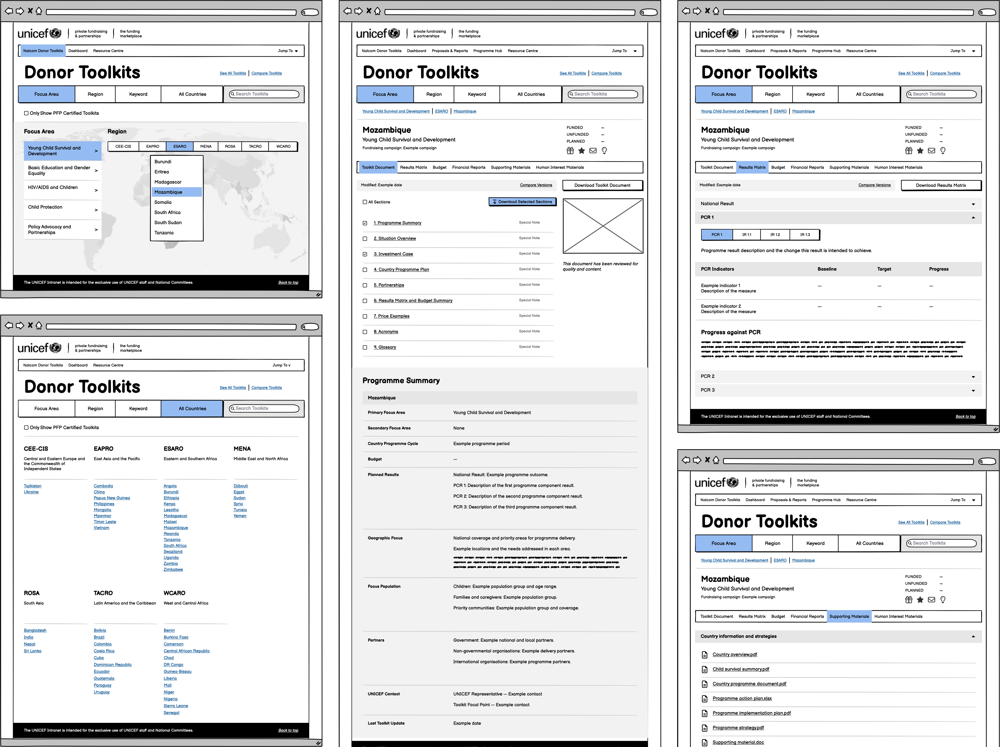
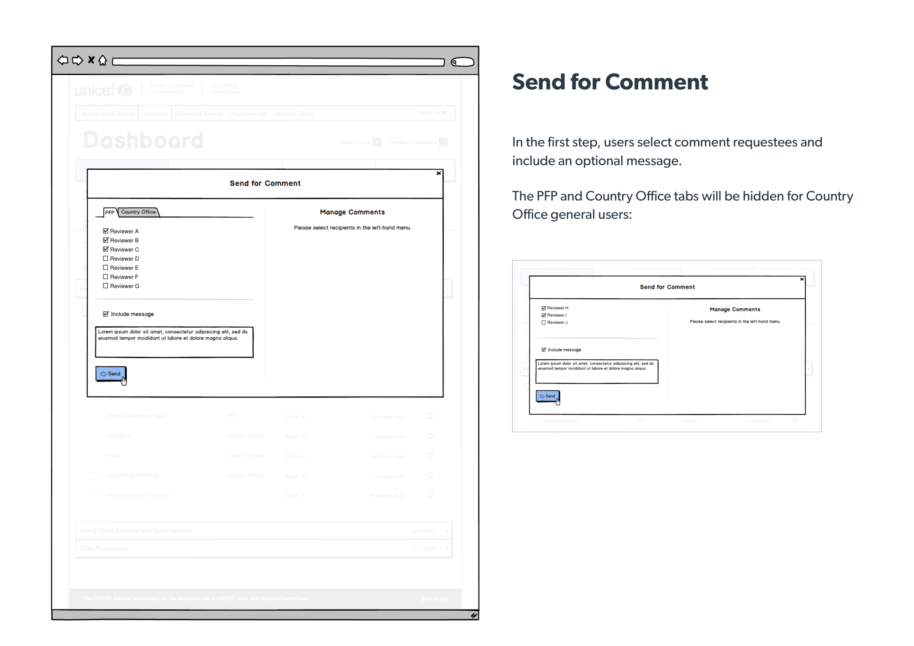
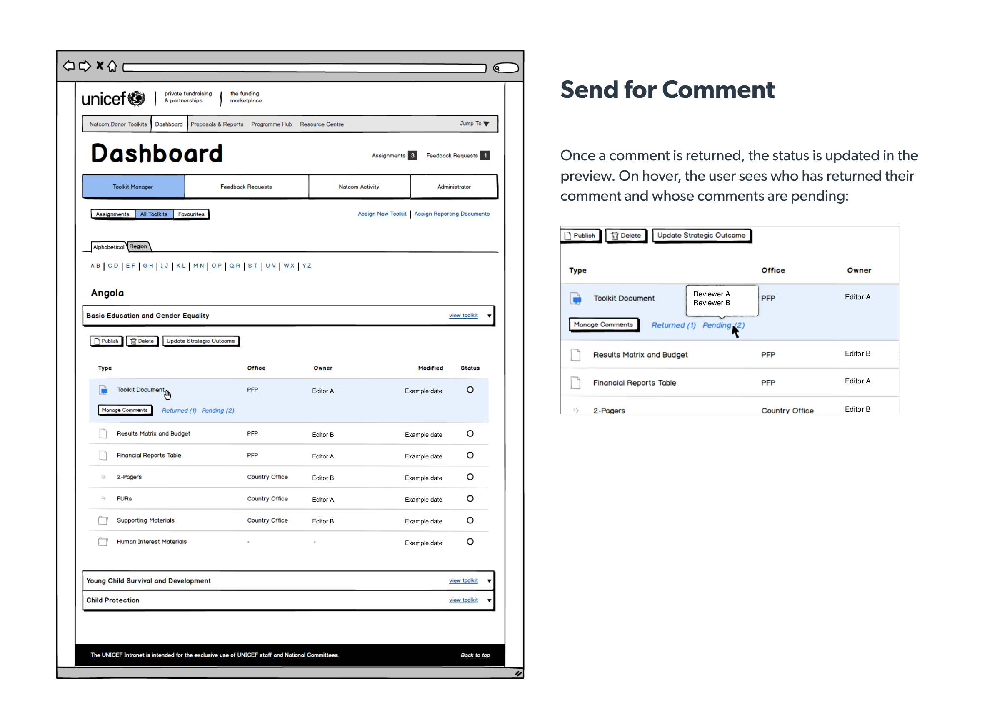
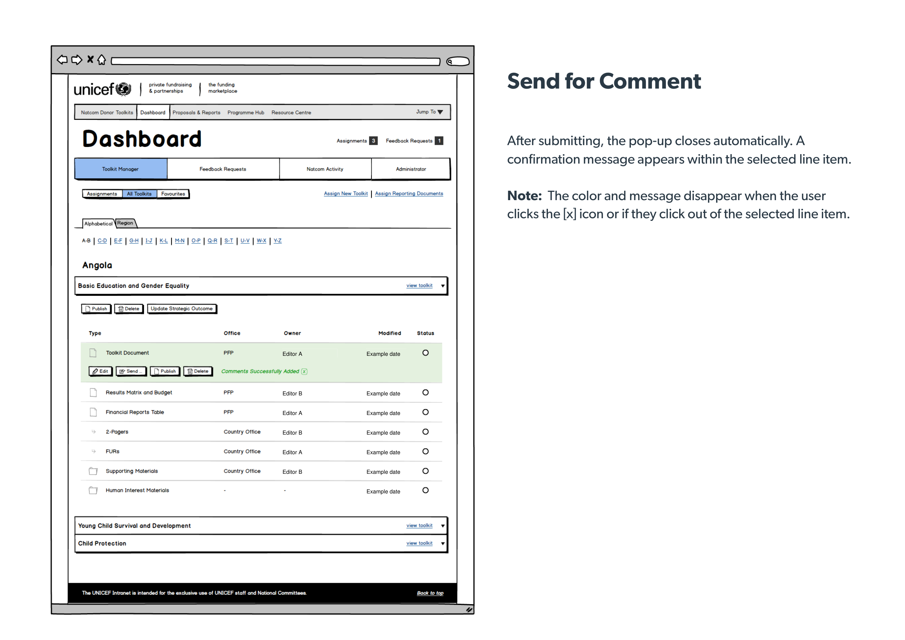
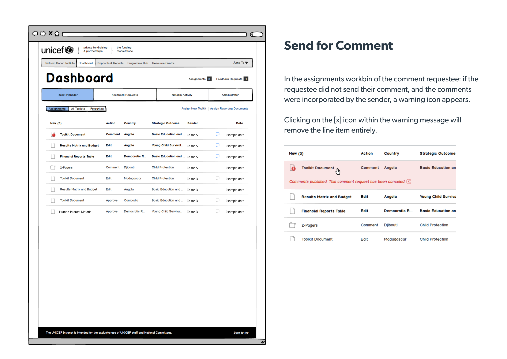
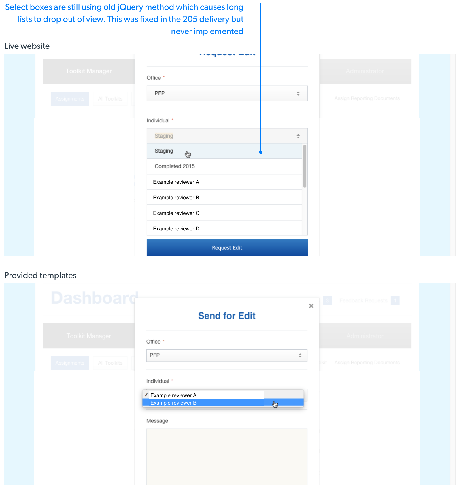

<CaseStudyOverview caseStudy={frontmatter.caseStudy}>

## Challenge

UNICEF's Private Fundraising and Partnerships division needed a centralized platform to help Country Offices manage fundraising materials, donor communications, reporting, and content. The system had to support complex workflows, multiple user roles, and large volumes of information while remaining intuitive for teams working across more than 80 countries.

## Solution

As the sole UX and front-end designer on the project, I worked with UNICEF staff, project leadership, and Quark developers to design the Funding Marketplace over multiple phases.

The platform brought together tools for browsing fundraising materials and managing their production. I designed the information architecture, wireframes, and interfaces, built the front-end templates, and reviewed their implementation with the development team.

## Results
The Funding Marketplace gave National Committees and Country Offices a centralized place to find donor toolkits, compare programme information, and manage content collaboratively. The dashboard made assignments, document status, and review actions visible within the workflow. Later releases refined these interactions as the system developed.

</CaseStudyOverview>

<TextBlock>

## Phase 1: Donor Toolkits

The first phase focused on creating a centralized repository for donor toolkits. Each toolkit brought together programme information, budgets, financial reports, and supporting materials used to discuss funding opportunities.

</TextBlock>

<FigureSingle caption="Browsing and toolkit layouts, reconstructed from the original designs.">

</FigureSingle>

<ThemeWrapper>

<TextBlock>

Users could browse materials by strategic outcome, region, keyword, or country, making it easier to discover and compare fundraising opportunities across UNICEF's global network.

I used shared tabs within each toolkit to connect the programme document with its results matrix, financial reports, and supporting materials.

</TextBlock>

<FigureSingle>

</FigureSingle>
</ThemeWrapper>

<TextBlock>

## Phase 2: Country Office Dashboard

As the platform evolved, UNICEF required administrative tools that would allow Country Offices and National Committees to manage content, reporting, approvals, and collaboration workflows.

</TextBlock>

<TextBlock>

### Dublin workshop

At a multi-day workshop in Dublin, I worked with UNICEF stakeholders, project team members, and Quark developers to map the screens and responsibilities for the Country Office Dashboard. We worked through how content would move between offices and which actions each role needed to create, review, and publish it.

</TextBlock>

<FigureSingle caption="Whiteboards from the Dublin workshop.">

</FigureSingle>

<TextBlock>

### Wireframes

I used wireframes to work through assignments, toolkit documents, and supporting materials. Each content type needed its own controls while remaining part of a consistent dashboard.

During later refinements, I removed unnecessary subpages and brought available actions into the selected table row. The options depended on the user's role, the document's state, and whether editing, comments, or approval had been requested.

</TextBlock>

<FigureSingle caption="Wireframes and user flow documentation.">

</FigureSingle>

<TextBlock>

### Reviewing content across offices

The comment workflow needed to show who had been asked to review a document and whose response was still pending. I designed the sequence for choosing reviewers, tracking their responses, and incorporating comments into the document.

The wireframes also covered less straightforward situations. If the sender incorporated comments before every reviewer responded, the remaining reviewer's assignment displayed a warning. Confirmation messages appeared within the selected row, keeping the feedback close to the document being managed.

</TextBlock>

<FigureSideBySide stackOnMobile={true}>
<FigureSingle isContained={false} margin="" caption="Choosing reviewers and documenting the controls available to each role.">

</FigureSingle>
<FigureSingle isContained={false} margin="" caption="Tracking returned comments and pending responses.">

</FigureSingle>
<FigureSingle isContained={false} margin="" caption="Confirming the action within the selected document row.">

</FigureSingle>
<FigureSingle isContained={false} margin="" caption="Handling an outstanding review after comments have been incorporated.">

</FigureSingle>
</FigureSideBySide>

<ThemeWrapper>
<FigureSingle>

</FigureSingle>
</ThemeWrapper>

<TextBlock>

### Working with developers

I supplied HTML, CSS, and JavaScript templates and worked with Quark developers during implementation. I compared the implemented screens with those templates and documented differences in layout and behavior.

For example, a dropdown's longer lists extended beyond the visible page. My review compared the live behavior with the supplied template, giving developers a specific reference for how the control was expected to work.

</TextBlock>

<FigureSingle width="narrow" caption="Implementation review comparing the live dropdown with the supplied template. Names have been anonymized.">

</FigureSingle>

<TextBlock>

## Looking back

Being part of UNICEF's Funding Marketplace marked a turning point in my career. This was my first large-scale systems design project and my first opportunity to collaborate with stakeholders and developers internationally.

I'm proud of what we accomplished together. The project taught me to think beyond individual screens and consider how roles, content, and publishing fit together. It led me to start Avidano Digital, where I continue to collaborate with mission-driven organizations.

</TextBlock>
