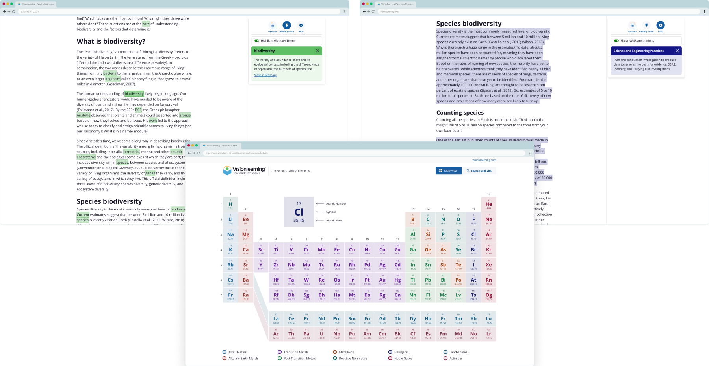

<CaseStudyOverview caseStudy={frontmatter.caseStudy}>

## Challenge

Visionlearning provides free bilingual STEM learning resources for students and educators worldwide. Its outdated, non-responsive website had become increasingly difficult to maintain and constrained the organization's ability to introduce new educational content and learning experiences. The platform's growing library of lessons, modules, and resources made navigation and content discovery challenging.

## Solution
Over a multi-year engagement, I led the user experience design and front-end development of the Visionlearning platform, creating a modern, accessible foundation for future educational content and learning tools. The new experience improved navigation, content organization, and discoverability across a growing library of STEM resources while supporting English and Spanish content equally. The redesign also established a flexible framework for interactive educational experiences and future content growth.

## Results

The comprehensive rebrand and redesign created a more intuitive learning environment that reduces cognitive load for students tackling complex STEM topics. The new platform features innovative reading toggles for glossary terms and Next Generation Science Standards, custom scientific illustrations, and a complete design system that continues to support ongoing feature development.

</CaseStudyOverview>

<TextBlock>

## Logo redesign

I redesigned the logo to symbolize both a student engrossed in learning and an observant eye, reflecting Visionlearning's commitment to insightful and engaging STEM education.

</TextBlock>

<FigureSingle width="medium" caption="The Visionlearning logo">

    
</FigureSingle>

<ThemeWrapper>
<FigureSingle>

    
</FigureSingle>
</ThemeWrapper>

<TextBlock>

## Mobile learning experience

Glossary highlights, a fully interactive Periodic Table of Elements, and teacher tools make STEM content accessible for students and help educators connect lessons to science standards.

</TextBlock>

<FigureSingle width='medium'>

    
</FigureSingle>

<TextBlock>

## Interactive learning features

Glossary highlights, a fully interactive Periodic Table of Elements, and teacher tools make STEM content accessible for students and help educators connect lessons to science standards.

</TextBlock>

<FigureSingle>

</FigureSingle>

<ThemeWrapper>
<TextBlock>

## Custom scientific illustrations

I created extensive custom scientific illustrations using Adobe Illustrator and Photoshop to clarify complex topics. The complexity ranged from simple chemical formulas to detailed visualizations of plant and animal cell anatomy, with style adapted to each illustration's context and educational purpose.

</TextBlock>

<FigureSingle caption="Custom scientific illustrations created to support learning and comprehension'">

![A collection of scientific illustrations covering biology and chemistry concepts. The images include labeled animal and plant cells, the Miller-Urey experiment on the origin of life, a diagram showing the evolution of eukaryotic cells through endosymbiosis, laboratory experiments with flasks and bacterial cultures, the four levels of protein structure, a comparison of RNA and DNA, and the periodic table of elements. The illustrations use bright colors, clear labeling, and simplified visual forms to explain complex scientific concepts.](../../images/visionlearning/visionlearning-scientific-illustrations.jpg)
    
</FigureSingle>

</ThemeWrapper>

<ClientPerspective clientPerspective={frontmatter.caseStudy.clientPerspective} />

<TextBlock>

## Looking back

Projects like Visionlearning are rare. Few opportunities allow me to combine so many of my interests in a single project: design, user experience, front-end development, and digital illustration.

This project gave me a deep appreciation for science education, Next Generation Science Standards, and the challenge of making complex topics easier to understand. I'm grateful for the opportunity to contribute to a resource that helps students, educators, and lifelong learners better understand science.

</TextBlock>
