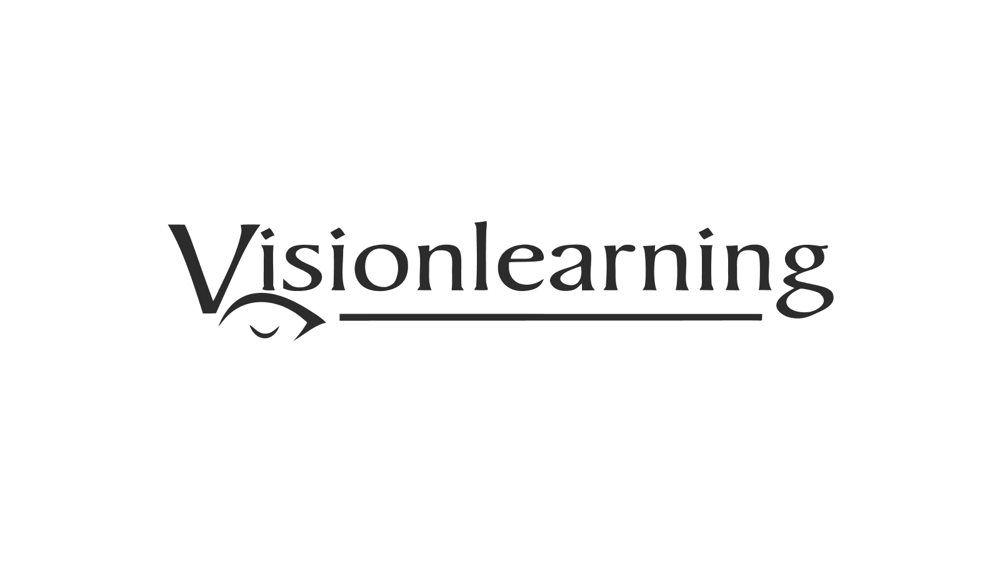
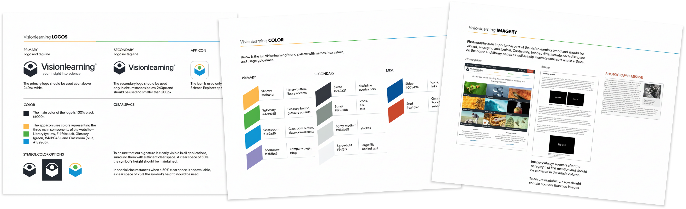

import CaseStudyScreens from '../../components/CaseStudyScreens.astro';
import siteMap from '../../images/visionlearning/wireframes/site-map.png';
import homeWireframe from '../../images/visionlearning/wireframes/homepage.png';
import disciplineWireframe from '../../images/visionlearning/wireframes/discipline.png';
import readingWireframe from '../../images/visionlearning/wireframes/reading.png';
import quizWireframe from '../../images/visionlearning/wireframes/quiz.png';
import resultsWireframe from '../../images/visionlearning/wireframes/quiz-results.png';
import glossaryWireframe from '../../images/visionlearning/wireframes/glossary.png';
import moduleAdmin from '../../images/visionlearning/wireframes/admin-module.png';
import readingAdmin from '../../images/visionlearning/wireframes/admin-reading.png';
import quizAdmin from '../../images/visionlearning/wireframes/admin-quiz-question.png';
import resourcesAdmin from '../../images/visionlearning/wireframes/admin-resources.png';
import redesign2017 from '../../images/visionlearning/visionlearning-2017-redesign.png';

import AnimatedImage from '../../components/AnimatedImage.astro';
import LightboxImage from '../../components/LightboxImage.astro';
import glossaryDemo from '../../images/visionlearning/visionlearning-glossary-demo.png';
import ngssDemo from '../../images/visionlearning/visionlearning-ngss-demo.png';
import periodicTableDemo from '../../images/visionlearning/visionlearning-periodic-table-demo.png';

<CaseStudyOverview caseStudy={frontmatter.caseStudy}>

## Challenge

Visionlearning is a free, bilingual STEM learning platform for teachers and students worldwide. When they approached me in 2012, their website felt outdated and did not work on mobile devices. The site had become difficult to maintain, limiting their ability to introduce new educational content and learning experiences.

While they had a large body of valuable educational material, it was hard to understand what was available and who it was for.

## Solution

Through Avidano Digital, I worked with Visionlearning to create a new visual identity that reflects their mission.

We organized the website architecture and content management workflow around three distinct areas: Library, Glossary, and Classroom. We redesigned the site with a mobile-first approach, paying particular attention to how the layouts accommodated Spanish content.

This multi-year engagement included regular releases and enhancements to the platform. For the latest iteration, we moved the front end onto Natura11y, an accessible design system, to build custom learning experiences and interactions aligned with the Next Generation Science Standards (NGSS).

I also created scientific illustrations, improved support for mathematical equations, and worked with the developer to design the module authoring experience.

## Results

The new website supports learning in English and Spanish on desktop and mobile. Visionlearning also has a more efficient workflow for creating and updating learning modules. A follow-up audit documented clearer course organization, more visible registration, and a more consistent interface.

</CaseStudyOverview>

<TextBlock>

## Logo and brand guidelines

The engagement began with the logo redesign. I created a mark to suggest both a student engrossed in learning and an observant eye. It gave Visionlearning a recognizable identity that I carried through the website's typography, color, and page layouts.

</TextBlock>

<FigureSideBySide>

<FigureSingle caption="The Old Visionlearning Logo" isContained={false} margin='margin-y-0'>

</FigureSingle>

<FigureSingle caption="The New Visionlearning Logo" isContained={false} margin='margin-y-0'>

</FigureSingle>

</FigureSideBySide>

<TextBlock>

Janet Guertin developed the brand guidelines, with creative direction from me. The guide covered logo use, typography, color, imagery, and scientific illustration, connecting the identity to the website’s navigation, reading layouts, and quiz states.

</TextBlock>

<FigureSingle width="wide" caption="Excerpts from the 2015 brand guidelines.">

</FigureSingle>

<Divider />

<TextBlock>

## Planning the website

I worked with the backend developer to map how modules, quizzes, glossary entries, and shared media would be managed, recording publishing decisions and open questions.

</TextBlock>

<FigureSingle width="narrow" caption="Working outline with development notes.">

<LightboxImage
  src={siteMap}
  alt="Visionlearning map connecting Library, Glossary, and Classroom with disciplines, modules, shared figures, glossary entries, courses, and users. Module editing branches into Module Info, Reading, Quiz, and Resources. Notes identify publishing decisions and open questions for development."
  caption="Content map"
/>

</FigureSingle>

<ThemeWrapper>
<TextBlock>

## Designing the learning experience

I created wireframes to work through how people would find content and move through a learning module. Shared navigation connects the main areas of the site, while a consistent module layout carries through reading, answering questions, and reviewing feedback.

</TextBlock>

<CaseStudyScreens
  screens={[
    { src: homeWireframe, label: 'Homepage', alt: 'Homepage wireframe with a purpose statement, discipline grid, and introductions to learning resources.' },
    { src: disciplineWireframe, label: 'Browsing a discipline', alt: 'Earth Science wireframe with discipline navigation, an introduction, and grouped module links.' },
    { src: glossaryWireframe, label: 'Glossary', alt: 'Glossary wireframe with alphabetical browsing and an expanded definition inside the list of terms.' },
    { src: readingWireframe, label: 'Reading', alt: 'Module reading wireframe with the title, byline, Reading, Quiz, and Resources tabs, an open library sidebar, key concepts, figures, and a comprehension checkpoint.' },
    { src: quizWireframe, label: 'Quiz', alt: 'Quiz wireframe retaining the module navigation and sidebar, with lettered circles identifying the multiple-choice answers.' },
    { src: resultsWireframe, label: 'Quiz results', alt: 'Quiz results wireframe with a score summary, selected answers, correct and incorrect states, and answer explanations.' }
  ]}
  caption="Public-site wireframes connect browsing, reading, and reviewing quiz results."
/>
</ThemeWrapper>

<TextBlock>

## Authoring workflow

I designed administration wireframes for managing disciplines and modules, with tabs for Module Info, Reading, Quiz, and Resources. Authors could organize readings, audio, and supporting materials. The quiz editor kept questions, correct answers, and explanations for each choice together, connecting authoring to the feedback learners receive.

</TextBlock>

<CaseStudyScreens
  columns={2}
  ratio="0.9"
  screens={[
    { src: moduleAdmin, label: 'Module information', alt: 'Module authoring wireframe with Module Info selected and publishing status, discipline and category, authors, a feature quote, and metadata fields.' },
    { src: readingAdmin, label: 'Reading content', alt: 'Reading editor wireframe with English and Spanish audio, a pre-reader, and structured content sections.' },
    { src: quizAdmin, label: 'Questions and answer feedback', alt: 'Quiz question editor with multiple answer choices, a correct-answer control, and a feedback field for each choice.' },
    { src: resourcesAdmin, label: 'Supporting resources', alt: 'Resources editor wireframe with controls to add and rearrange resource groups.' }
  ]}
  caption="Administration wireframes connect the content structure to the fields and controls authors need."
/>

<Divider />

<TextBlock>

## Refining the designs through feedback

Kim Krause Berg of Creative Vision Web Consulting conducted usability research and audits. The findings highlighted confusion about the site’s purpose, lesson organization, and Classroom, plus barriers to registration and mobile use.

The research combined:

- Task-based usability testing and participant comments.
- Expert review of navigation, content, mobile behavior, and accessibility.
- A follow-up audit checking the redesign against the earlier recommendations.

</TextBlock>

<FigureSingle width="wide" caption="The 2017 website: homepage, Library, module reading, and Glossary.">
  <LightboxImage
    src={redesign2017}
    alt="Four 2017 Visionlearning screens: the homepage with discipline tiles, the Library with modules grouped by discipline, the Origins of Life I reading page, and the Glossary with an expanded definition."
    caption="Visionlearning — 2017 redesign"
  />
</FigureSingle>

<TextBlock>

We clarified the homepage message, reorganized courses, and made registration more visible. The follow-up audit documented improvements in these areas and interface consistency; getting-started guidance, accessibility, and performance remained priorities.

</TextBlock>

<ThemeWrapper>
<TextBlock>

## The latest redesign

The latest redesign focused on Next Generation Science Standards (NGSS) alignment and accessibility. Supporting those changes meant updating the site's aging JavaScript and CSS. I moved the front end onto Natura11y, the accessible design system I developed.

Working with the backend developer, I added teaching information alongside module readings. We also improved equation and image accessibility, cleaned up hundreds of supporting images, and made selected graphics bilingual.

</TextBlock>

<FigureSingle width="wide" caption="The latest redesign connects the homepage and discipline browsing with the module reading experience.">

</FigureSingle>
</ThemeWrapper>

<TextBlock>

### Mobile experience

On mobile, module contents and reading tools collapse into tabs to leave room for the lesson. The Spanish screens show how navigation, quizzes, and glossary entries adapt to smaller screens.

</TextBlock>

<FigureSingle width="medium" caption="Spanish-language mobile screens showing the homepage, a module quiz, and a glossary entry.">

</FigureSingle>

<Divider />

<TextBlock>

## Building tools around the reading

The client requested glossary highlighting and NGSS annotations within the learning modules. I designed the interfaces and wrote the front-end behavior.

Readers can turn on glossary highlighting to open definitions beside the lesson. Educators can use NGSS mode to see the standards associated with a passage. Only one mode is active at a time, keeping the two kinds of highlighting distinct.

</TextBlock>

<FigureSideBySide stackOnMobile>

<FigureSingle isContained={false} margin="margin-y-0" caption="Glossary highlighting opens definitions beside the lesson. The animation shows highlighting turning on and off and a reader opening a definition.">

<AnimatedImage
  src={glossaryDemo}
  animatedSrc="/media/visionlearning/visionlearning-glossary-demo.webp"
  animatedType="image/webp"
  class="display-block width-100"
  alt="Glossary highlighting enabled with the definition of bacteria open beside the module reading."
  widths={[540, 720, 1200, 1902]}
  sizes="(min-width: 1600px) 700px, (min-width: 768px) 45vw, 90vw"
  loading="lazy"
/>

</FigureSingle>

<FigureSingle isContained={false} margin="margin-y-0" caption="NGSS annotations connect passages to science standards. The animation shows annotations turning on and off and the standard linked to a selected passage.">

<AnimatedImage
  src={ngssDemo}
  animatedSrc="/media/visionlearning/visionlearning-ngss-demo.webp"
  animatedType="image/webp"
  autoplay={false}
  class="display-block width-100"
  alt="NGSS annotations enabled with a highlighted passage and its Science and Engineering Practices standard open beside the reading."
  widths={[540, 720, 1200, 1902]}
  sizes="(min-width: 1600px) 700px, (min-width: 768px) 45vw, 90vw"
  loading="lazy"
/>

</FigureSingle>

</FigureSideBySide>

<ThemeWrapper>
<TextBlock>

## Explaining science through imagery

I created scientific illustrations in Illustrator and Photoshop, including cell anatomy, molecular structures, and experimental setups. Some were drawn from scratch; others combined selected imagery with labels and diagrams to explain the science within the reading.

</TextBlock>

<FigureSingle width="wide" caption="Scientific illustrations showing cell anatomy, molecular structures, and experiments.">

</FigureSingle>
</ThemeWrapper>

<TextBlock>

### Adapting graphics to the lesson

The periodic-table lessons required a connected set of graphics. I adapted the table to emphasize element families, electron blocks, and patterns such as atomic radius, with supporting diagrams explaining electron structure and notation.

Each view directs attention to a different relationship: a highlighted family remains visible within the full table, while changes in circle size make relative atomic size easier to compare. The series includes English and Spanish versions.

</TextBlock>

<FigureSingle width="wide" caption="Periodic-table graphics adapted for different lessons, including element families, electron blocks, atomic radius, and electron structure.">

</FigureSingle>

<TextBlock>

### Exploring the periodic table

I also designed and built an interactive periodic table. Readers can open an element's details while keeping the table in view, or use Search and List to find and filter elements. The demonstration shows keyboard navigation, Carbon's details, and a search filtered to noble gases.

</TextBlock>

<FigureSingle width="wide">

<AnimatedImage
  src={periodicTableDemo}
  animatedSrc="/media/visionlearning/visionlearning-periodic-table-demo.webp"
  animatedType="image/webp"
  class="display-block width-100"
  alt="Interactive periodic table demonstration showing keyboard navigation, Carbon's details, and Search and List filtered to noble gases."
  widths={[640, 960, 1320, 1600, 2000]}
  sizes="(min-width: 1400px) 90vw, 95vw"
  loading="lazy"
/>

</FigureSingle>

<Divider />

<TextBlock>

## Looking back

The long-term partnership let me see how the work was used and revisit it through later redesigns. As the organization's needs grew, I could refine the reading experience, respond to specific teaching needs, and build tools to support new uses of the content.

Projects like Visionlearning are rare. Few opportunities allow me to combine so many of my interests in a single project: design, user experience, front-end development, and digital illustration.

This project gave me a deep appreciation for science education, Next Generation Science Standards, and the challenge of making complex topics easier to understand. I'm grateful for the opportunity to contribute to a resource that helps students, educators, and lifelong learners better understand science.

</TextBlock>
