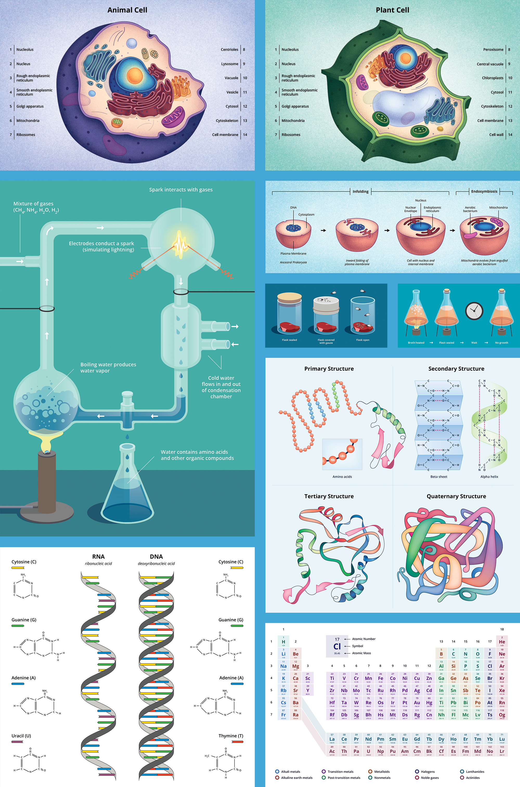
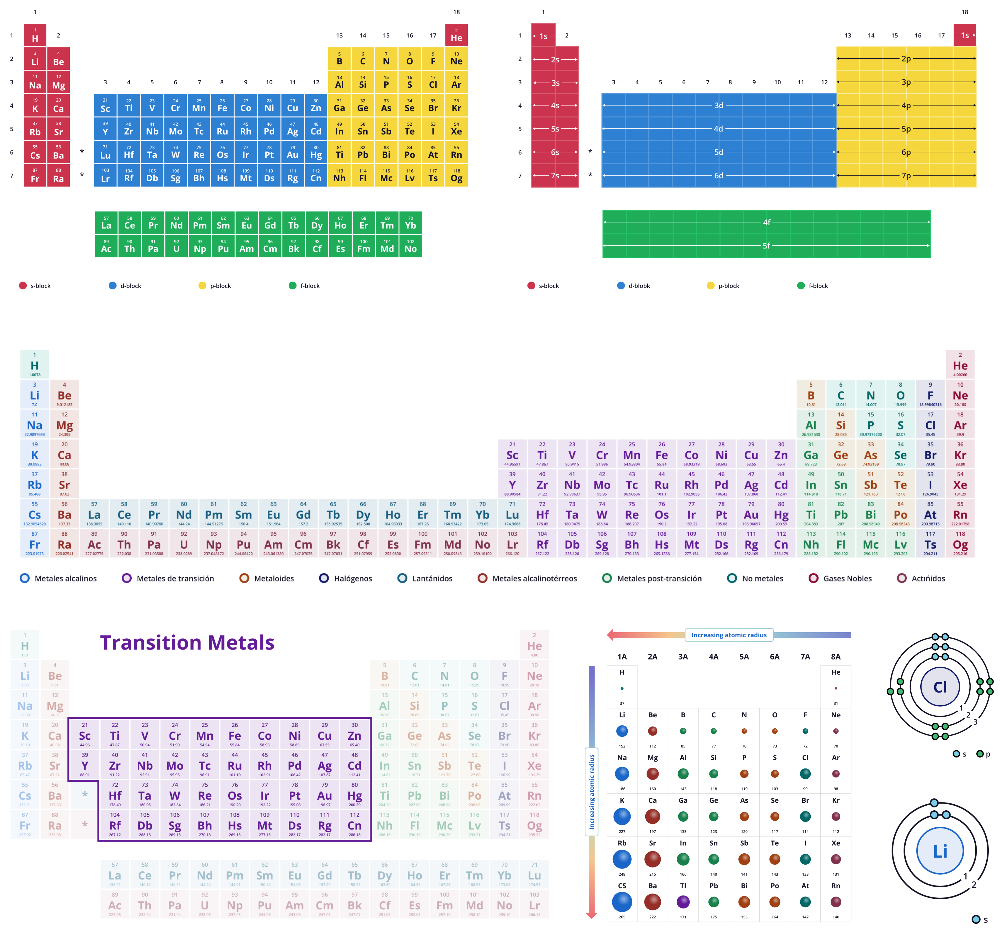

import CaseStudyScreens from '../../components/CaseStudyScreens.astro';
import siteMap from '../../images/visionlearning/wireframes/site-map.png';
import homeWireframe from '../../images/visionlearning/wireframes/homepage.png';
import disciplineWireframe from '../../images/visionlearning/wireframes/discipline.png';
import readingWireframe from '../../images/visionlearning/wireframes/reading.png';
import quizWireframe from '../../images/visionlearning/wireframes/quiz.png';
import resultsWireframe from '../../images/visionlearning/wireframes/quiz-results.png';
import glossaryWireframe from '../../images/visionlearning/wireframes/glossary.png';
import moduleAdmin from '../../images/visionlearning/wireframes/admin-module.png';
import readingAdmin from '../../images/visionlearning/wireframes/admin-reading.png';
import quizAdmin from '../../images/visionlearning/wireframes/admin-quiz-question.png';
import resourcesAdmin from '../../images/visionlearning/wireframes/admin-resources.png';
import home2016 from '../../images/visionlearning/visionlearning-home-2016.jpg';
import home2017 from '../../images/visionlearning/visionlearning-home-2017.png';

import AnimatedImage from '../../components/AnimatedImage.astro';
import LightboxImage from '../../components/LightboxImage.astro';
import interactiveTools from '../../images/visionlearning/visionlearning-interactive-learning-tools.png';

{/* First-pass rewrite on visionlearning-case-study. Legacy state: 5220624. Source and figure records: context/case-studies.md. */}

<CaseStudyOverview caseStudy={frontmatter.caseStudy}>

## Challenge

Visionlearning provides free bilingual STEM learning resources for students and educators worldwide. Its outdated, non-responsive website had become increasingly difficult to maintain and constrained the organization’s ability to introduce new educational content and learning experiences. While they had a large body of science content, it was hard to understand what was available, who it was for, and where to start.

## Solution

Over a multi-year engagement, I led UX design and front-end development to help students and educators find and use Visionlearning’s science resources in English and Spanish. The work began with its visual identity and continued through navigation and reading layouts, interactive tools, scientific illustration, and support for module authors.

## Results

The platform supports English and Spanish learning resources through responsive reading layouts, glossary and NGSS highlighting, interactive tools, and scientific illustrations. The 2016 follow-up audit documented improvements in course organization, registration visibility, and interface consistency. Continued design work addressed the needs of readers, teachers, and module authors across later releases.

</CaseStudyOverview>

<TextBlock>

## Logo and brand guidelines

The engagement began with the logo redesign. I created a mark to suggest both a student engrossed in learning and an observant eye. It gave Visionlearning a recognizable identity that I carried through the website's typography, color, and page layouts.

We also developed comprehensive brand guidelines covering logo use, typography, color, imagery, and scientific illustration. The guidelines connected that identity to the website’s navigation, reading layouts, and quiz states, giving the team shared guidance as the platform evolved.

</TextBlock>

{/* Graphic VL-01. */}

<FigureSingle width="medium" caption={"The Visionlearning logo"}>

</FigureSingle>

<Divider />

<TextBlock>

## Mapping the website and its content

We organized Visionlearning around Library, Glossary, and Classroom, giving each area a distinct purpose. The Library brought together learning modules, interactive animations, and research videos. Modules could be searched or browsed by discipline, while the Glossary provided a direct route to scientific definitions.

The map also considers how that content would be managed. A module brings together reading, figures, quiz questions, and supporting resources. Glossary entries and shared media have their own editing paths because they can appear in more than one module.

I worked directly with the backend developer on these relationships. The annotations record decisions about publishing and maintaining content, alongside questions we still needed to resolve.

</TextBlock>

<FigureSingle width="medium" caption="Site structure and content management, connecting the public website with the tools used to maintain it.">

<LightboxImage
  src={siteMap}
  alt="Visionlearning map connecting Library, Glossary, and Classroom with disciplines, modules, shared figures, glossary entries, courses, and users. Module editing branches into Module Info, Reading, Quiz, and Resources. Notes identify publishing decisions and open questions for development."
  caption="Visionlearning site structure and content management"
/>

</FigureSingle>

<TextBlock>

## Turning the structure into page layouts

I used wireframes to work through the public website and the administration tools. On the public side, the homepage introduced the available subjects, discipline pages organized the modules, and the shared navigation kept Library, Glossary, and Classroom available throughout the site.

The glossary needed to work as a reference in its own right. An accordion let readers expand a definition within the list, with pronunciation and related-module links alongside the term.

</TextBlock>

<ThemeWrapper>
<CaseStudyScreens
  screens={[
    { src: homeWireframe, label: 'Homepage', alt: 'Homepage wireframe with a purpose statement, discipline grid, and introductions to learning resources.' },
    { src: disciplineWireframe, label: 'Browsing a discipline', alt: 'Earth Science wireframe with discipline navigation, an introduction, and grouped module links.' },
    { src: glossaryWireframe, label: 'Glossary', alt: 'Glossary wireframe with alphabetical browsing and an expanded definition inside the list of terms.' }
  ]}
  caption="Public-site wireframes showing the routes into learning content and reference material."
/>
</ThemeWrapper>

<TextBlock>

### Keeping the module connected

Within a module, Reading, Quiz, and Resources sit beneath the title and byline. The page keeps its identity as someone moves between those tasks, and the open sidebar provides a route back to the surrounding library.

The reading layout makes room for key concepts, a table of contents, and scientific figures. Quiz screens carry that same structure through answering questions and reviewing results. The results page shows the overall score, the selected answers, and explanations beside individual responses, including the correct answer when a reader gets one wrong.

</TextBlock>

<CaseStudyScreens
  ratio="0.56"
  screens={[
    { src: readingWireframe, label: 'Reading', alt: 'Module reading wireframe with the title, byline, Reading, Quiz, and Resources tabs, an open library sidebar, key concepts, figures, and a comprehension checkpoint.' },
    { src: quizWireframe, label: 'Quiz', alt: 'Quiz wireframe retaining the module navigation and sidebar, with lettered circles identifying the multiple-choice answers.' },
    { src: resultsWireframe, label: 'Quiz results', alt: 'Quiz results wireframe with a score summary, selected answers, correct and incorrect states, and answer explanations.' }
  ]}
  caption="The module layout carries through reading, answering questions, and reviewing feedback."
/>

<Divider />

<TextBlock>

## Designing the authoring workflow

Those learning experiences also needed a practical way to create and maintain the content. I designed administration wireframes for organizing disciplines and modules, then editing each module through Module Info, Reading, Quiz, and Resources.

The reading editor accommodates structured sections, figures, English and Spanish audio, references, and further reading. Resource groups can be added and rearranged as a module develops.

The quiz editor connects directly to the feedback shown to readers. Authors can mark the correct answer and write a separate explanation for each answer choice. Keeping the explanations with the question makes them part of authoring the quiz.

</TextBlock>

<ThemeWrapper>
<CaseStudyScreens
  columns={2}
  ratio="0.9"
  screens={[
    { src: moduleAdmin, label: 'Module information', alt: 'Module authoring wireframe with Module Info selected and publishing status, discipline and category, authors, a feature quote, and metadata fields.' },
    { src: readingAdmin, label: 'Reading content', alt: 'Reading editor wireframe with English and Spanish audio, a pre-reader, and structured content sections.' },
    { src: quizAdmin, label: 'Questions and answer feedback', alt: 'Quiz question editor with multiple answer choices, a correct-answer control, and a feedback field for each choice.' },
    { src: resourcesAdmin, label: 'Supporting resources', alt: 'Resources editor wireframe with controls to add and rearrange resource groups.' }
  ]}
  caption="Administration wireframes connect the content structure to the fields and controls authors need."
/>
</ThemeWrapper>

<TextBlock>

## Refining the designs through feedback

The work continued through multiple redesigns over more than a decade. I presented and refined layouts as the organization’s needs evolved, using research findings to guide subsequent changes.

Kim Krause Berg of Creative Vision Web Consulting conducted usability research and audits. The 2015 testing found that people could struggle to understand what Visionlearning offered, where to begin, and how to use Classroom. Participants asked for clearer lesson organization and instructions; registration and mobile use also presented barriers.

The research combined:

- Task-based usability testing and participant comments.
- Expert review of navigation, content, mobile behavior, and accessibility.
- A follow-up audit checking the redesign against the earlier recommendations.

We added a clear purpose statement to the homepage, refined course organization, and made registration more visible. The 2016 follow-up confirmed the purpose statement and documented improvements in course organization, registration visibility, and interface consistency. Getting-started guidance, accessibility, and performance still needed work.

</TextBlock>

<CaseStudyScreens
  columns={2}
  ratio="0.85"
  screens={[
    { src: home2016, label: '2016 homepage design', alt: 'Archived homepage design introducing Visionlearning and organizing science content by discipline.' },
    { src: home2017, label: '2017 homepage design', alt: 'Archived homepage design with the statement Free, award-winning resources for teaching and learning science, a discipline grid, NGSS information, and featured learning content.' }
  ]}
  caption="Homepage design iterations preserved in the 2016 and 2017 archive folders."
/>

<TextBlock>

## Bringing the later interface together

The later designs retain Library, Glossary, and Classroom as the main routes into the platform. The homepage pairs visual subject browsing with descriptions of what each area offers. Within a module, the reading column brings together text, scientific figures, and comprehension checkpoints, with contents and reading tools beside it.

I designed the layouts and built the front end, working with the backend developer to connect the interface to the content. Scientific imagery was part of that work throughout: it introduced subjects, supported explanations, and gave readers something concrete to examine alongside the text.

</TextBlock>

<ThemeWrapper>

<FigureSingle width="wide" caption="Later homepage, discipline browsing, and module layouts bring the content structure, visual design, and scientific imagery together.">

</FigureSingle>

</ThemeWrapper>

<TextBlock>

### Keeping learning tools available on mobile

I designed and built responsive templates for English and Spanish content. The layouts needed to accommodate long readings, scientific figures, quizzes, and reference tools within the same experience.

On larger screens, a module's contents and reading tools sit beside the text. On mobile, those tools move into collapsible tabs so they remain available without permanently occupying the reading area. The Spanish screens below show how navigation, quizzes, and glossary entries carry into the mobile layout.

</TextBlock>

<FigureSingle width="medium" caption="Spanish-language mobile screens showing the homepage, a module quiz, and a glossary entry.">

</FigureSingle>

<TextBlock>

## Building tools around the reading

The client requested glossary highlighting and annotations connecting the content to the Next Generation Science Standards (NGSS). I designed the interfaces and wrote the front-end behavior for these different reading and teaching tasks.

With glossary highlighting enabled, readers can select a term and see its definition without leaving the module. The NGSS mode highlights passages connected to science standards and displays the relevant information for educators. Only one highlighting mode is active at a time, keeping the two kinds of annotation distinct.

The annotated Earth Structure source connects passages to practices such as analyzing data and constructing explanations. The NGSS interface makes that teaching context available beside the reading.

### Exploring the periodic table

I also designed and built an interactive periodic table. Readers can select an element to open its details while keeping the table available as a reference. The table view preserves the relationships between elements; Search and List provides another way to find and filter them.

The demonstration below shows keyboard navigation, Carbon's details, and a search filtered to noble gases.

</TextBlock>

<FigureSingle>

<AnimatedImage
  src={interactiveTools}
  animatedSrc="/media/visionlearning/visionlearning-interactive-learning-tools.webp"
  animatedType="image/webp"
  class="display-block width-100"
  alt="Glossary highlighting and NGSS annotations, with a periodic-table demonstration in the center browser: navigating by keyboard, opening Carbon's details, and filtering Search and List to show noble gases."
  widths={[720, 1200, 1800]}
  sizes="(min-width: 1600px) 1440px, 90vw"
  loading="lazy"
/>

<em>Glossary and NGSS annotations support the reading, while the interactive periodic table lets people explore element details. <LinkOpenNew LinkUrl="https://www.visionlearning.com/library/animations/periodic-table/" LinkText="Explore the interactive periodic table" utilities="link" /></em>

</FigureSingle>

<ThemeWrapper>
<TextBlock>

## Explaining science through imagery

I created scientific illustrations in Adobe Illustrator and Photoshop, ranging from small supporting diagrams to detailed cell anatomy, molecular structures, and experimental setups. The figures needed to work within the reading layouts as well as explain the science.

Plant and animal cell illustrations use labels and a consistent visual treatment to identify structures. Other figures show relationships or sequences, such as the stages of an experiment or the differences between RNA and DNA.

Some visuals were entirely custom. Others combined carefully selected, high-resolution imagery with labels and scientific concepts. I adapted the approach to what each module needed to explain; the collection below represents part of a much larger body of work across the site.

</TextBlock>

<FigureSingle width="wide" caption="Scientific illustrations showing cell anatomy, molecular structures, and experiments.">

</FigureSingle>

</ThemeWrapper>

<TextBlock>

### Adapting graphics to the lesson

The periodic-table lessons required a connected set of graphics. I adapted the table to emphasize element families, electron blocks, and patterns such as atomic radius, with supporting diagrams explaining electron structure and notation.

Each view directs attention to a different relationship: a highlighted family remains visible within the full table, while changes in circle size make relative atomic size easier to compare. The series includes English and Spanish versions.

</TextBlock>

<FigureSingle width="wide" caption="Periodic-table graphics adapted for different lessons, including element families, electron blocks, atomic radius, and electron structure.">

</FigureSingle>

<Divider />

<TextBlock>

## Carrying the work into Natura11y

In later redesigns, I built the public-site front end on Natura11y, the design system I created. Shared components supported the page layouts and interface behavior, while Visionlearning’s reading tools and scientific content addressed the needs of this particular platform.

The backend developer subsequently adopted Natura11y for the teacher-facing CMS interface. That extended the same design system into another part of the platform, maintained by another developer.

Visionlearning is one of the client projects where I put Natura11y into practice. The next case study explains how that work sits within the broader design ecosystem, including its components, design libraries, and documentation.

[Read the Natura11y case study](/case-studies/natura11y)

</TextBlock>

<TextBlock>

## Looking back

The long-term partnership let me see how the work was used and revisit it through later redesigns. As the organization's needs grew, I could refine the reading experience, respond to specific teaching needs, and build tools to support new uses of the content.

Projects like Visionlearning are rare. Few opportunities allow me to combine so many of my interests in a single project: design, user experience, front-end development, and digital illustration.

This project gave me a deep appreciation for science education, Next Generation Science Standards, and the challenge of making complex topics easier to understand. I'm grateful for the opportunity to contribute to a resource that helps students, educators, and lifelong learners better understand science.

</TextBlock>
