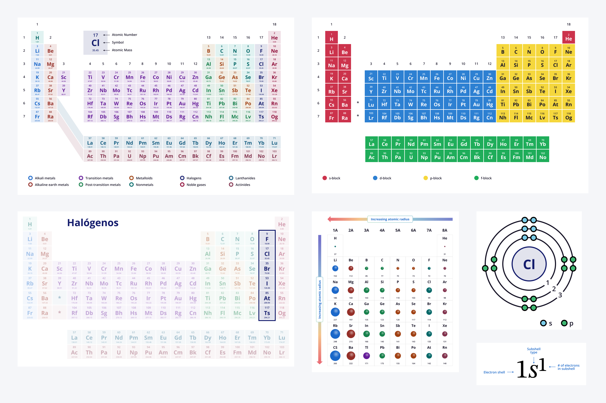
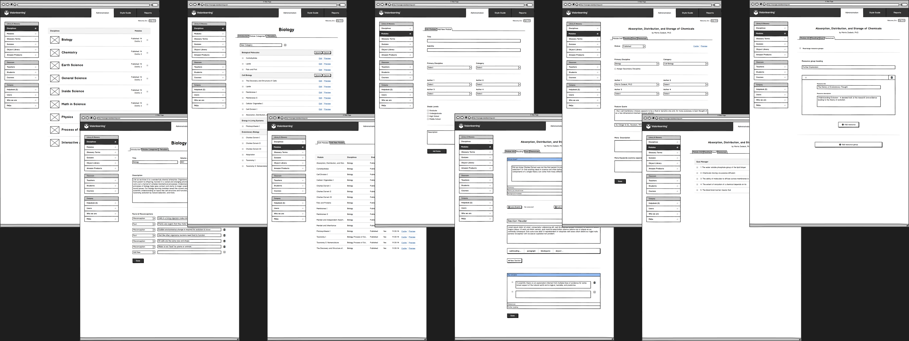
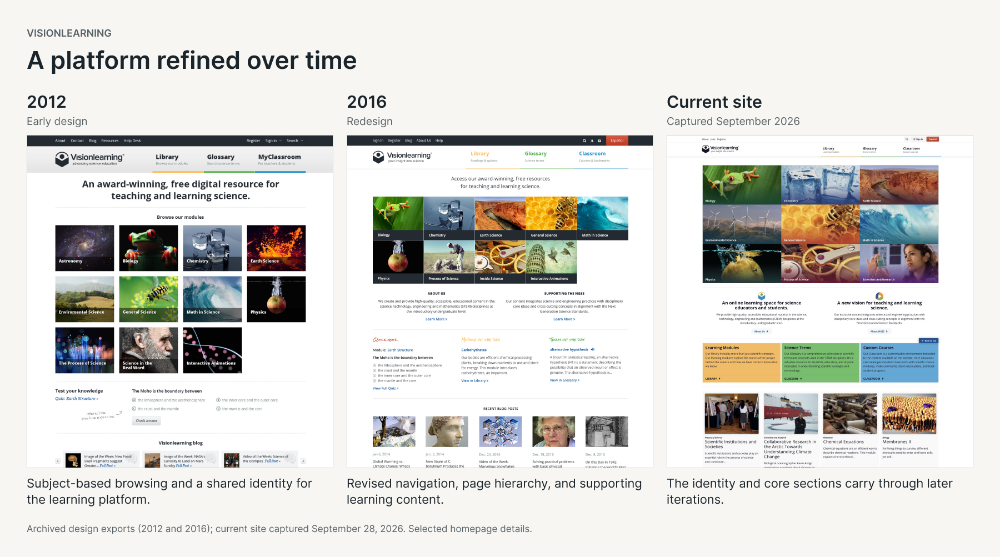

import AnimatedImage from '../../components/AnimatedImage.astro';
import LightboxImage from '../../components/LightboxImage.astro';
import administrationContentMap from '../../images/visionlearning/visionlearning-administration-content-map.png';
import interactiveTools from '../../images/visionlearning/visionlearning-interactive-learning-tools.png';

{/* Current Confluence copy: 23429129. Graphic decisions: context/case-study-graphics.md. */}

<CaseStudyOverview caseStudy={frontmatter.caseStudy}>

## Challenge

Visionlearning provides free bilingual STEM learning resources for students and educators worldwide. Its outdated, non-responsive website had become increasingly difficult to maintain and constrained the organization’s ability to introduce new educational content and learning experiences. While they had a large body of science content, it was hard to understand what was available, who it was for, and where to start.

## Solution

Over a multi-year engagement, I led UX design and front-end development to help students and educators find and use Visionlearning’s science resources in English and Spanish. The work began with its visual identity and continued through navigation and reading layouts, interactive tools, scientific illustration, and support for module authors.

## Results

The platform supports English and Spanish learning resources through responsive reading layouts, glossary and NGSS highlighting, interactive tools, and scientific illustrations. The 2016 follow-up audit documented improvements in course organization, registration visibility, and interface consistency. Continued design work addressed the needs of readers, teachers, and module authors across later releases.

</CaseStudyOverview>

<TextBlock>

## Logo and brand guidelines

The engagement began with the logo redesign. I created a mark to suggest both a student engrossed in learning and an observant eye. It gave Visionlearning a recognizable identity that I carried through the website's typography, color, and page layouts.

We also developed comprehensive brand guidelines covering logo use, typography, color, imagery, and scientific illustration. The guidelines connected that identity to the website’s navigation, reading layouts, and quiz states, giving the team shared guidance as the platform evolved.

</TextBlock>

{/* Graphic VL-01. */}

<FigureSingle width="medium" caption={"The Visionlearning logo"}>

</FigureSingle>

<TextBlock>

## Giving the library a clear structure

Within the Library, we grouped content into Learning Modules, Interactive Animations, and Research Videos. These labels made the type of resource visible before someone opened it.

Learning Modules made up most of the content. We organized them by discipline, including biology, chemistry, earth science, and physics, with browsing available from both the homepage and Library. Search provided another route for someone who already had a topic in mind.

Short descriptions in the main navigation explained the purpose of Library, Glossary, and Classroom. Someone arriving at a module or glossary entry could see what else the platform offered without returning to the homepage.

</TextBlock>

<ThemeWrapper>
{/* Graphic VL-02. */}

<FigureSingle width="wide" caption={"The homepage, Library, and learning pages share navigation and page patterns."}>

</FigureSingle>

</ThemeWrapper>

<TextBlock>

## Acting on user feedback

As the platform evolved, Kim Krause Berg of Creative Vision Web Consulting conducted usability research and audits. The 2015 testing showed that people could struggle to understand what Visionlearning offered, where to begin, and how to use Classroom. Participants asked for clearer lesson organization and instructions; registration and mobile use also presented barriers.

The research combined:

- Task-based usability testing and participant comments.
- Expert review of navigation, content, mobile behavior, and accessibility.
- A follow-up audit checking the redesign against the earlier recommendations.

I used those findings to guide the design work. We added a clear purpose statement to the homepage, refined course organization, and made registration more visible. These changes addressed the first questions a visitor needed answered: what can I learn here, where should I go, and how do I get started?

The 2016 follow-up confirmed the homepage purpose statement and documented improvements in course organization, registration visibility, and interface consistency. Getting-started guidance, accessibility, and performance still needed work, giving the next design round specific problems to address.

</TextBlock>

<TextBlock>

## Keeping learning tools available on mobile

I designed and built responsive templates for English and Spanish content. The layouts needed to accommodate long readings, scientific figures, quizzes, and reference tools within the same experience.

On larger screens, a module's contents and reading tools sit beside the text. On mobile, those tools move into collapsible tabs so they remain available without permanently occupying the reading area. The Spanish screens below show how navigation, quizzes, and glossary entries carry into the mobile layout.

</TextBlock>

{/* Graphic VL-04. */}

<FigureSingle width="medium" caption={"Spanish-language mobile screens showing the homepage, a module quiz, and a glossary entry."}>

</FigureSingle>

<TextBlock>

## Interactive learning tools

The client requested two tools for the learning modules: glossary highlighting for looking up science terms, and annotations connecting the content to the Next Generation Science Standards (NGSS). I designed the interfaces and wrote the front-end behavior for these different reading and teaching tasks.

With glossary highlighting enabled, readers can select a term and see its definition without leaving the module. The NGSS mode highlights passages connected to science standards and displays the relevant information for educators. Both are optional, and only one highlighting mode is active at a time, keeping the two kinds of annotation distinct.

In the annotated Earth Structure source, comments connect passages to practices such as analyzing data and constructing explanations. That teaching context is what the NGSS interface makes available beside the reading.

I also designed and built an interactive periodic table. Readers can select an element to open its details, keeping the table itself available as a reference. The interface includes a table view and a search-and-list view, offering different ways to explore the same information.

The table view preserves the relationships between elements, while the detail view provides room for an individual element's properties. Search gives readers a direct route when they already know which element they need.

</TextBlock>

{/* Graphic VL-05. */}

<FigureSingle>

<AnimatedImage
  src={interactiveTools}
  animatedSrc="/media/visionlearning/visionlearning-interactive-learning-tools.webp"
  animatedType="image/webp"
  class="display-block width-100"
  alt="Glossary highlighting and NGSS annotations, with a periodic-table demonstration in the center browser: navigating by keyboard, opening Carbon's details, and filtering Search and List to show noble gases."
  widths={[720, 1200, 1800]}
  sizes="(min-width: 1600px) 1440px, 90vw"
  loading="lazy"
/>

<em>Glossary and NGSS annotations support the reading, while the interactive periodic table lets people explore element details. <LinkOpenNew LinkUrl="https://www.visionlearning.com/library/animations/periodic-table/" LinkText="Explore the interactive periodic table" utilities="link" /></em>

</FigureSingle>

<ThemeWrapper>
<TextBlock>

## Custom scientific illustrations

I created scientific illustrations in Adobe Illustrator and Photoshop to explain ideas that are difficult to describe through text alone. The work ranged from small supporting diagrams to detailed plant and animal cells, molecular structures, and experimental setups.

The plant and animal cell illustrations, for example, use labels and a consistent visual treatment to identify structures within each cell. Other figures show relationships or sequences, such as the stages of an experiment or the differences between RNA and DNA.

Some visuals were entirely custom. Others combined carefully selected, high-resolution imagery with labels and scientific concepts. I adapted the approach to what each module needed to explain; the collection below represents part of a much larger body of visual work across the site.

</TextBlock>

{/* Graphic VL-06. */}

<FigureSingle width="wide" caption={"Scientific illustrations showing cell anatomy, molecular structures, and experiments."}>

![A collection of scientific illustrations covering biology and chemistry concepts. The images include labeled animal and plant cells, the Miller-Urey experiment on the origin of life, a diagram showing the evolution of eukaryotic cells through endosymbiosis, laboratory experiments with flasks and bacterial cultures, the four levels of protein structure, a comparison of RNA and DNA, and the periodic table of elements. The illustrations use bright colors, clear labeling, and simplified visual forms to explain complex scientific concepts.](../../images/visionlearning/visionlearning-scientific-illustrations.jpg)

</FigureSingle>

<TextBlock>

### Adapting graphics to the lesson

The periodic-table lessons required a connected set of graphics. I adapted the table to emphasize element families, electron blocks, and patterns such as atomic radius, with supporting diagrams explaining electron structure and notation.

Each view directs attention to a different relationship: a highlighted family remains visible within the full table, while changes in circle size make relative atomic size easier to compare. The series includes English and Spanish versions.

</TextBlock>

{/* Graphic VL-07 — existing draft visual; review before replacing. */}

<FigureSingle width="wide" caption={"Periodic-table graphics adapted for different lessons, including element families, electron blocks, atomic radius, and electron structure."}>

</FigureSingle>

</ThemeWrapper>

<TextBlock>

## Supporting the people authoring modules

I also supported the backend experience for authoring learning modules. The content map connects disciplines and modules with glossary entries and shared media. It gives figures, tables, and animations a dedicated place for maintenance, while the annotations record questions to resolve with the developer.

</TextBlock>

{/* Graphic VL-08 — existing draft visual; review before replacing. */}

<FigureSingle width="narrow" caption={"Working content map for the administration experience. Annotations capture decisions and questions for development."}>

<LightboxImage
  src={administrationContentMap}
  alt="Working administration content map showing the Library, Glossary, Classroom, and supporting areas. The Library separates modules from shared media; module editing includes Module Info, Reading, Quiz, and Resources. Annotations identify maintenance decisions and open questions."
  caption="Visionlearning administration content map"
/>

</FigureSingle>

<TextBlock>

The wireframes organize module editing into Module Info, Reading, Quiz, and Resources. The reading editor provides structured sections alongside English and Spanish audio, references, and further reading. Authors can also add and rearrange resource groups as a module develops.

For quizzes, authors can mark the correct answer and write a separate explanation for each answer choice. That puts the explanation in the same workflow as the question and answers.

</TextBlock>

{/* Graphic VL-09 — existing draft visual; review before replacing. */}

<FigureSingle width="wide" caption={"Authoring wireframes showing how the content structure becomes screens for organizing and building learning modules."}>

</FigureSingle>

<TextBlock>

In later work, the backend developer adopted Natura11y for the teacher-facing CMS interface, extending the design system used on the public website.

</TextBlock>

<TextBlock>

## Looking back

The long-term partnership let me see how the work was used and revisit it through later redesigns. As the organization's needs grew, I could refine the reading experience, respond to specific teaching needs, and build tools to support new uses of the content.

</TextBlock>

{/* Graphic VL-10 — existing draft visual; review before replacing. */}

<FigureSingle width="wide" caption={"Homepage evolution across the engagement. The 2012 and 2016 images are archived design exports; the current site was captured on September 28, 2026."}>

</FigureSingle>

<TextBlock>

Projects like Visionlearning are rare. Few opportunities allow me to combine so many of my interests in a single project: design, user experience, front-end development, and digital illustration.

This project gave me a deep appreciation for science education, Next Generation Science Standards, and the challenge of making complex topics easier to understand. I'm grateful for the opportunity to contribute to a resource that helps students, educators, and lifelong learners better understand science.

</TextBlock>
