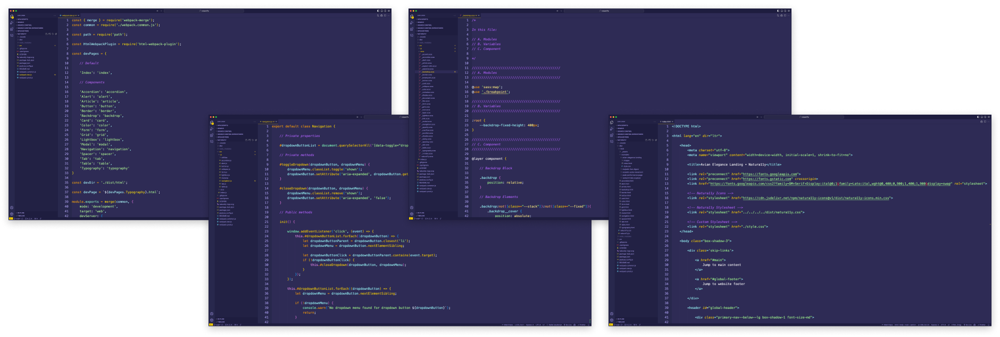
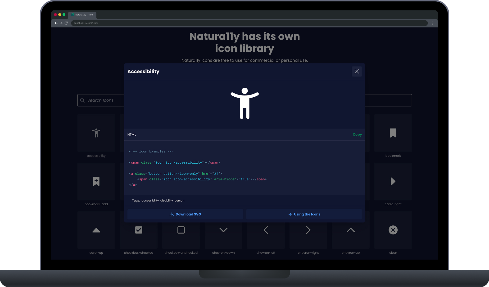
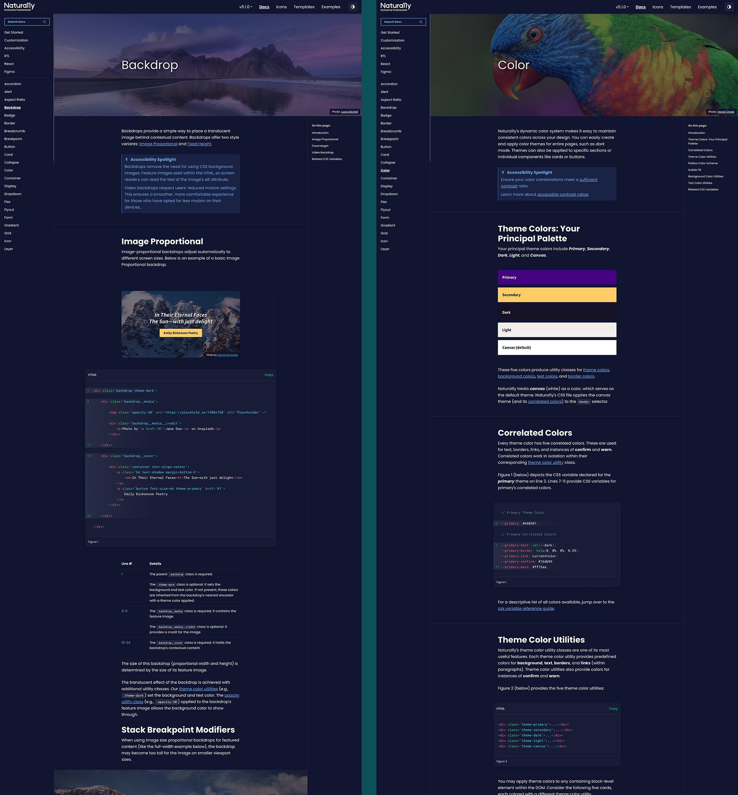
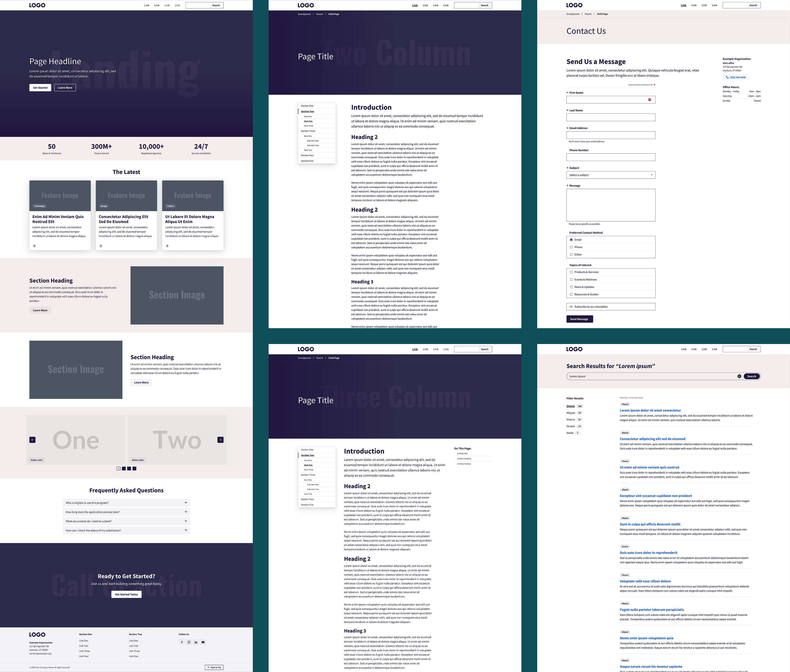
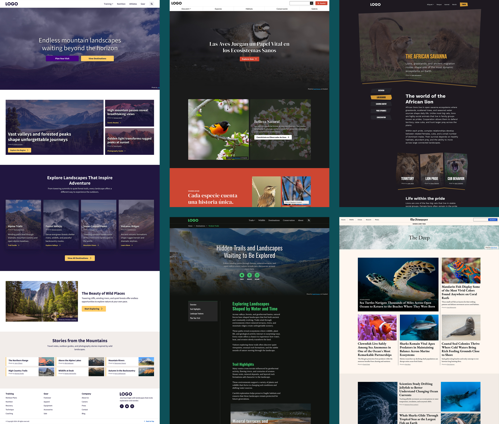
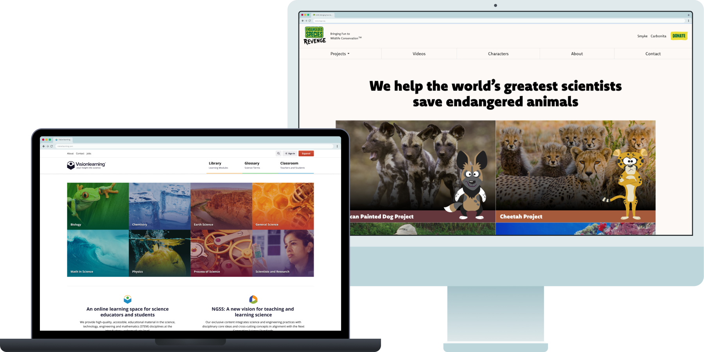

import LightboxImage from '../../../components/LightboxImage.astro';
import designSystemArchitecture from '../../../images/natura11y/design-system-architecture.jpg';

<CaseStudyOverview caseStudy={frontmatter.caseStudy}>

## Challenge

My client projects needed accessible interfaces that could accommodate specialized workflows and different brands. Existing frameworks helped me get started, but their restrictions made customization and maintenance harder as projects grew. I needed shared components I could improve over time and carry across projects without rebuilding their foundations.

## Solution

I created Natura11y as a shared design ecosystem, connecting Figma libraries with accessible components and working documentation. HTML and React implementations use the same Core styles and accessibility patterns, so a team can choose its implementation approach while keeping the interface consistent.

I maintain the design assets alongside the code, examples, and releases. Teams can use the existing components, extend them for specialized interactions, or build a branded design system on that foundation.

## Results

Natura11y gives my projects a reusable foundation for accessible interfaces, with connected design assets, implementation patterns, and documentation. I have used it in production for Visionlearning and other client work. Visionlearning's backend developer also adopted it for the teacher-facing CMS interface, extending the system beyond the public website I built.

</CaseStudyOverview>

<TextBlock>

## Keeping changes consistent across the system

As Natura11y expanded, maintaining its packages separately made consistency harder to manage. I reorganized the code into a monorepo connecting Core, React, Icons, documentation, and Storybook. A component change and its working examples can now be developed and checked in the same workspace.

That structure makes maintenance part of the design work. When I change a pattern, I can follow the decision through its implementation and guidance, reducing the separate places that need attention.

</TextBlock>

<FigureSingle width='medium' caption="Natura11y ecosystem architecture">

<LightboxImage
  src={designSystemArchitecture}
  alt="Diagram of the Natura11y monorepo connecting its Astro documentation and Storybook apps with Core, Icons, and React packages distributed through NPM and CDNs."
  caption="Natura11y ecosystem architecture"
/>

</FigureSingle>

<TextBlock>

### Codebase

Core holds the shared styles and vanilla JavaScript behavior. React reuses the Core styles and imports the utilities it needs. Keeping those foundations shared avoids maintaining another styling implementation for the same component.

</TextBlock>

<FigureSingle>

</FigureSingle>

<TextBlock>

### Shared patterns in HTML and React

I designed the components to keep their visual and accessibility behavior aligned across HTML and React. The HTML implementation pairs semantic markup with vanilla JavaScript. React manages its behavior through props, state, refs, and hooks while using the shared styles and patterns.

The flyout and form examples below show both implementations in Storybook. They make the component states and behavior available for review alongside the code, giving designers and developers a working reference.

</TextBlock>

<FigureSideBySide>

<FigureSingle caption="Flyout component in Storybook" isContained={false} margin='margin-y-0'>

</FigureSingle>

<FigureSingle caption="Form component in Storybook" isContained={false} margin='margin-y-0'>

</FigureSingle>

</FigureSideBySide>

<Divider />

<TextBlock>

## Icon library

The icon library carries the same assets into design and implementation. I maintain the original vectors in the repository and include them in the Figma libraries, keeping icon changes connected to the rest of the system.

</TextBlock>

<FigureSingle>

</FigureSingle>

<Divider />

<TextBlock>

## Figma UI kits

I created lo-fi and hi-fi Figma kits around the components and layouts available in code. They let designers explore page structure and refine interfaces using the same underlying patterns that developers will implement. The kits also provide a starting point for adapting the system to a project's visual identity.

</TextBlock>

<FigureSideBySide>

<FigureSingle caption="Lo-fi Figma UI Kit" isContained={false} margin='margin-y-0'>

</FigureSingle>

<FigureSingle caption="Hi-fi Figma UI Kit" isContained={false} margin='margin-y-0'>

</FigureSingle>

</FigureSideBySide>

<Divider />

<TextBlock>

## Public documentation

I built the documentation in Astro using Natura11y's own styles for the interface and live examples. It lives in the monorepo with the components it explains, so implementation and guidance can be updated together. Working examples help someone see how a pattern behaves before using it in a project.

</TextBlock>

<ThemeWrapper>
<FigureSingle>

</FigureSingle>
</ThemeWrapper>

<TextBlock>

## Templates and examples

I provide templates for common page structures and branded examples that show how the components can be adapted. The templates give a team a usable starting point; the examples demonstrate how a shared pattern can support different visual identities. Both help people move beyond an isolated component and understand how it fits into an interface.

</TextBlock>

<ThemeWrapper>
<FigureSingle caption="Template pages for common interface patterns">

</FigureSingle>

<FigureSingle caption="Interactive examples showing Natura11y components in use">

</FigureSingle>
</ThemeWrapper>

<TextBlock>

## In the wild

Client projects give me a place to apply the system to real requirements. I use Natura11y for public websites and specialized interfaces, adapting the shared components to each project's content and workflows. Those implementations inform what I refine and maintain in the ecosystem.

</TextBlock>

<FigureSingle>

</FigureSingle>

<TextBlock>

## Reflection

Building Natura11y has made me responsible for what happens after a component is designed: how another person implements it, adapts it, and keeps it working as requirements change. Maintaining the Figma libraries, code, and documentation keeps those questions connected.

The system grew through years of client work. Today, its shared structure also supports my AI-assisted design and development workflow, while I continue to make the decisions about accessibility, component behavior, and the direction of the system.

</TextBlock>

<ProjectLinkButton linkUrl='https://gonatura11y.com/' title='Explore the Natura11y documentation' />
