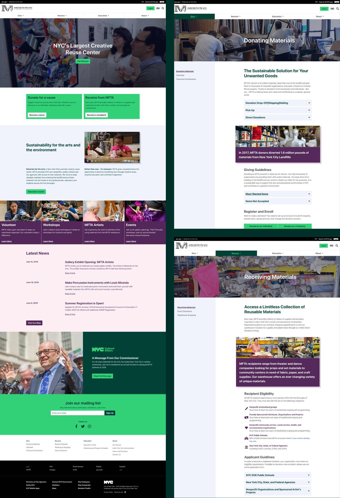
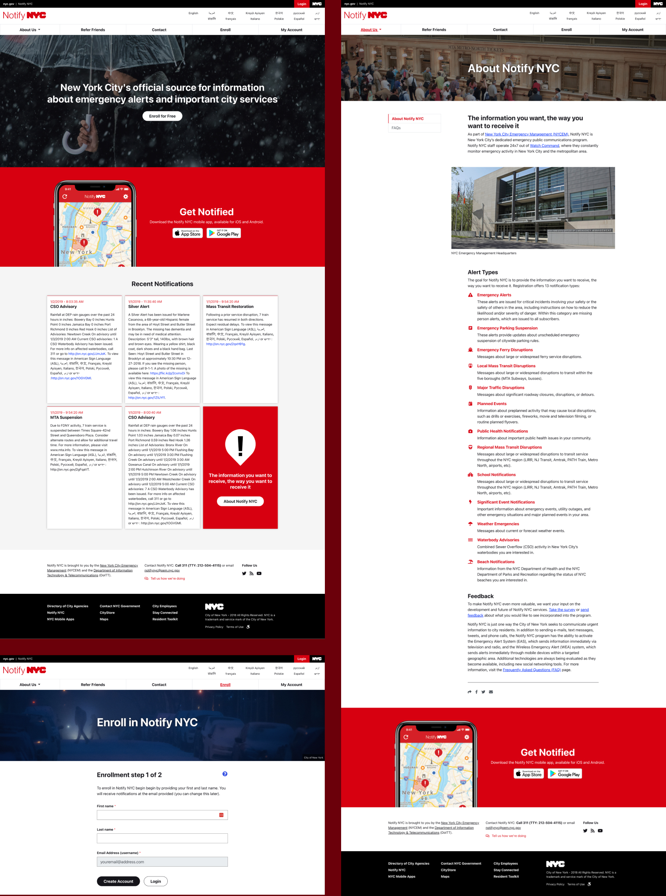
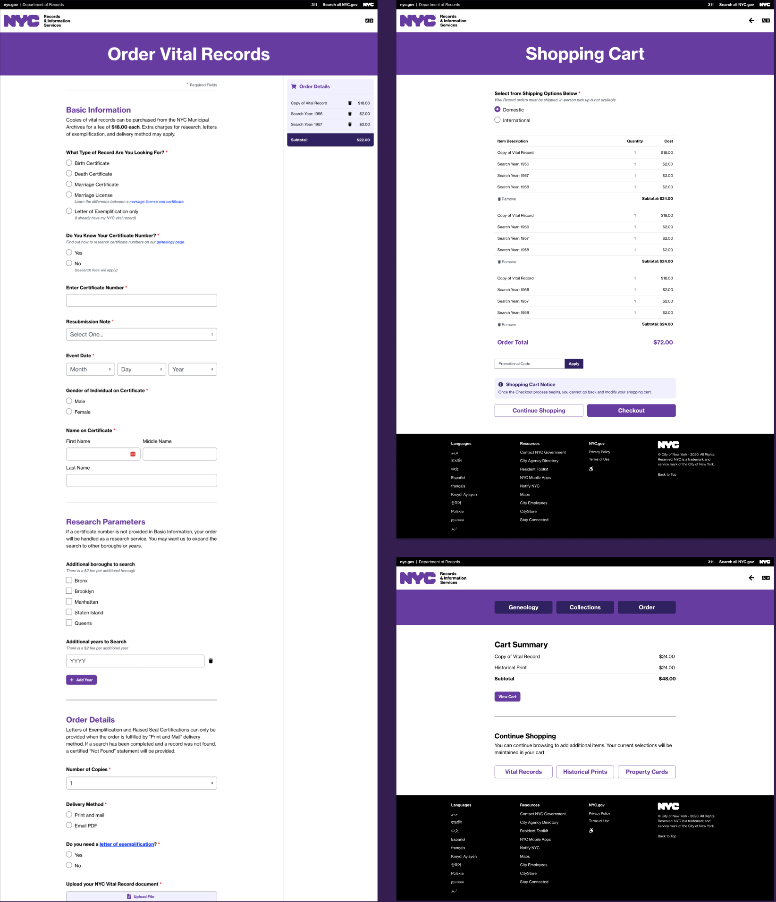
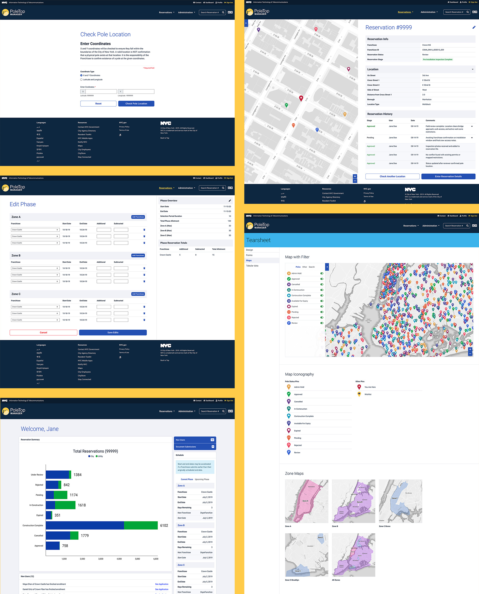

<CaseStudyOverview caseStudy={frontmatter.caseStudy}>

## Challenge

New York City's digital services needed to work for the public and the people operating them. A donation involved donors, staff, and warehouse volunteers; an emergency alert needed both a clear enrollment process and tools for publishing updates. Each agency brought specialized requirements that had to become understandable interfaces.

## Solution

I worked directly with agency staff, project managers, and developers to understand those workflows and design the public and administrative experiences around them. My work ranged from guided forms for ordering historical records to dashboards and maps for managing city infrastructure. I carried designs into front-end implementation and worked with developers on the services behind them.

## Results

The work delivered tools for donation management, emergency communications, records requests, and infrastructure coordination. Materials for the Arts launched its website and donation portal in 2019 after the project had stalled for nearly two years. Across the projects, residents and agency teams gained interfaces designed around the tasks they needed to complete.

</CaseStudyOverview>

<TextBlock>

## Materials for the Arts

Materials for the Arts (MFTA), located in Queens, is NYC's primary creative reuse center. It supports arts and education by giving donated materials to arts nonprofits, public schools, and city agencies across the five boroughs.

</TextBlock>

<TextBlock>

### Connecting the donation process across roles

When I joined the project, development had been stalled for nearly two years. I worked with the project manager and MFTA staff in Queens to document workflows, gather requirements, and identify pain points and opportunities in the manual donation process.

The donation process extended beyond the person offering materials. Staff, warehouse volunteers, and participating organizations also needed to work with the service. I led UX strategy, design, and front-end development for the city-branded website and custom donation portal, designing both the public experience and the tools supporting the operation.

</TextBlock>

<ThemeWrapper backgroundColor='#003129' textColor='#fff'>

<FigureSingle>

</FigureSingle>

<TextBlock>

Launched in 2019, the website and portal gave MFTA a stronger digital presence and made donation management easier for staff, warehouse volunteers, and participating organizations.

</TextBlock>
</ThemeWrapper>

<Divider />

<TextBlock>

## Notify NYC

Notify NYC, operated by New York City Emergency Management (NYCEM), is the city's official emergency communications program. The service provides residents and visitors with critical alerts, service updates, and emergency information.

### Designing enrollment and alert publishing together

I led UX design and front-end development for both sides of the service. Residents needed to enroll for updates, while NYCEM staff needed to manage and publish them. Designing the public website and administrative platform together meant considering the people receiving critical information alongside the people responsible for getting it out.

</TextBlock>

<ThemeWrapper backgroundColor='#6B0009' textColor='#fff'>

<FigureSingle>

</FigureSingle>

<TextBlock>

The platform supported enrollment for the public and alert management for NYCEM staff within the same service.

</TextBlock>
</ThemeWrapper>

<Divider />

<TextBlock>

## NYC DoRIS

The NYC Department of Records and Information Services (DoRIS) preserves the city's historical and government records. Its collection is an important resource for residents, researchers, historians, and the public.

</TextBlock>

<TextBlock>

### Guiding people through a conditional request process

I led UX design for Order Vital Records, an online service that enables residents, researchers, and historians to request historical records and archival materials. Working closely with stakeholders and pairing with a React developer, I helped transform a complex government process into a guided digital experience.

The forms changed based on the user's needs. The interaction guided people through choosing a record type, understanding eligibility, supplying supporting documents, and completing checkout. Those steps turned the requirements of a records request into a sequence people could follow, with the interface and React implementation developed in close collaboration.

</TextBlock>

<ThemeWrapper backgroundColor='#341E50' textColor='#fff'>
<FigureSingle>

</FigureSingle>

<TextBlock>

The new vital records service made a complex request process easier for New Yorkers to understand and complete.

</TextBlock>
</ThemeWrapper>

<Divider />

<TextBlock>

## NYC PoleTop Manager

PoleTop Manager was a GIS-based telecommunications infrastructure management platform developed for the New York City Office of Technology and Innovation.

The system helped city staff and telecommunications franchise partners manage city-owned utility poles, infrastructure reservations, construction activity, and telecommunications deployments across all five boroughs.

I led UX strategy and front-end development, working with OTI stakeholders to understand the specialized requirements. Dashboards, maps, and asset views provided different ways to work with the same infrastructure: reviewing activity, locating a pole, and accessing its information. The interface supported reservations and deployment workflows across thousands of city-owned poles.

</TextBlock>

<ThemeWrapper backgroundColor='#ffcb48'>
<FigureSingle>

</FigureSingle>

<TextBlock>

The platform helped city staff and franchise partners manage telecommunications projects, reservations, and asset information across New York City.

</TextBlock>
</ThemeWrapper>

<TextBlock>

## Looking back

Working across these agencies taught me to look at the whole service. The public interface was one part of an experience that also depended on staff workflows, administrative tools, and the systems supporting them. Understanding those connections helped me turn unfamiliar requirements into interfaces people could use.

The work also shaped my commitment to accessibility and inclusive design. Many of the ideas that later became Natura11y began here, through the practical demands of building public services and working alongside the teams responsible for them.

</TextBlock>
