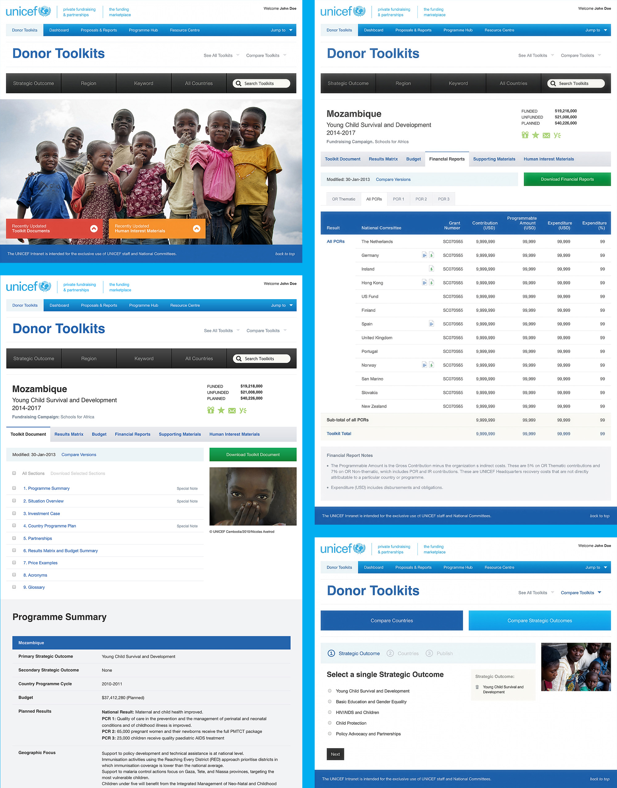
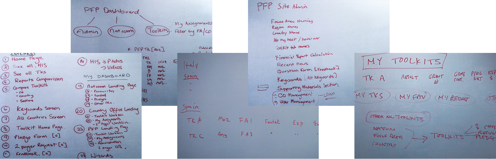
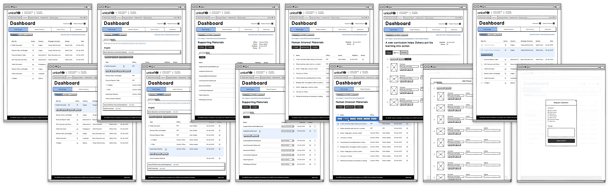
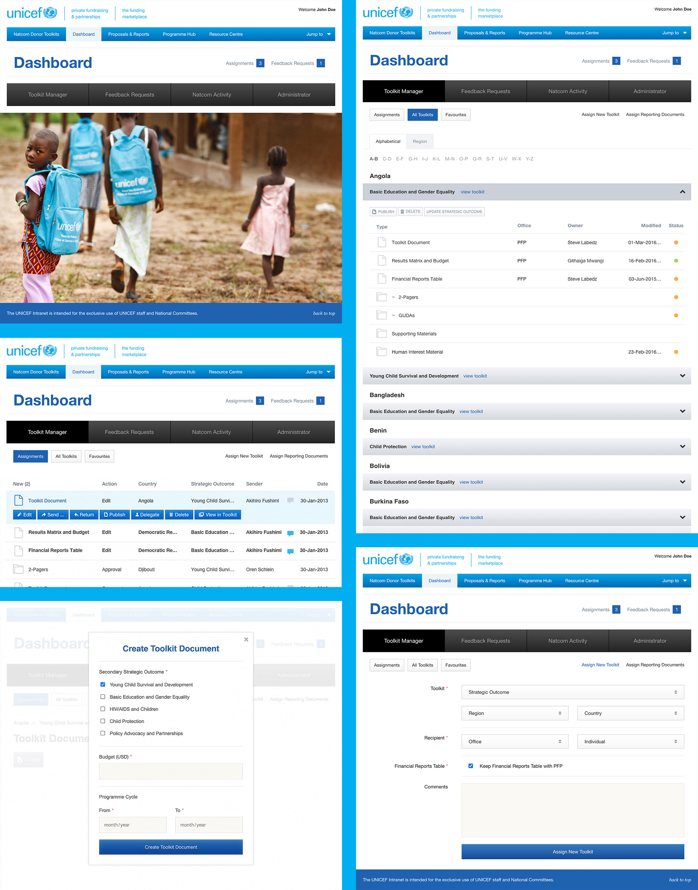

<CaseStudyOverview caseStudy={frontmatter.caseStudy}>

## Challenge

UNICEF's Private Fundraising and Partnerships division needed to bring fundraising materials, donor communications, and reporting into a shared platform. Country Offices and National Committees needed to find relevant resources and manage the content, approvals, and reporting behind them. The system had to accommodate different roles and workflows across a global organization.

## Solution

I designed the platform in phases, beginning with a resource library people could browse by outcome, region, keyword, or country. The next phase extended it with tools for the teams managing those materials. Working with UNICEF stakeholders and Quark developers, I translated workflow discussions into wireframes for content management, approvals, and reporting, then carried the designs into the front end.

## Results

The Funding Marketplace was adopted by more than 80 Country Offices, giving teams a shared platform for donor toolkits, fundraising materials, reporting, and collaboration. The platform supported more than $300 million in toolkit revenue from 2010 to 2016.

</CaseStudyOverview>

<TextBlock>

## Helping teams find the right fundraising resources

The first phase focused on creating a centralized repository for fundraising resources, donor materials, financial reports, and country-specific content.

I organized the library so people could browse by strategic outcome, region, keyword, or country. Those routes supported different starting points: someone looking at a particular country could reach relevant materials, while someone focused on an outcome could explore opportunities across the network.

</TextBlock>

<ThemeWrapper>

<FigureSingle>

</FigureSingle>
</ThemeWrapper>

<TextBlock>

## Extending the platform to the teams managing it

The next phase addressed the work behind the resource library. Country Offices and National Committees needed administrative tools for managing content, reporting, approvals, and collaboration. The design challenge expanded from finding materials to supporting the teams responsible for maintaining and approving them.

</TextBlock>

<TextBlock>

### Understanding workflows with stakeholders and developers

A multi-day workshop in Dublin brought the project team, UNICEF stakeholders, and Quark developers together to map workflows, discuss content management needs, and establish priorities for the dashboard. It gave the people using, designing, and building the platform a shared setting for working through its requirements.

</TextBlock>

<FigureSingle caption="Whiteboards from Dublin workshop">

</FigureSingle>

<TextBlock>

### Turning requirements into interactions

I translated those discussions into wireframes for the dashboard, approval workflows, reporting tools, and content management. The flows connected individual screens so the team could review how someone would move through a task before development began. As the sole UX and front-end designer, I worked across the information architecture, interface design, and implementation as the platform developed.

</TextBlock>

<FigureSingle caption="Wireframes and User Flow Documentation">

</FigureSingle>

<ThemeWrapper>
<FigureSingle>

</FigureSingle>
</ThemeWrapper>

<TextBlock>

## Looking back

This was my first large-scale systems design project and my first opportunity to work with stakeholders and developers internationally. The platform grew from a resource library into an operational tool, requiring me to understand both the materials people needed and the workflows that kept them available.

Working across those phases shaped how I approach complex products: learn the domain with the people who know it, make the workflows visible, and carry that understanding into the interface. The experience helped lead me to start Avidano Digital and continue that close collaboration with organizations and their development teams.

</TextBlock>
