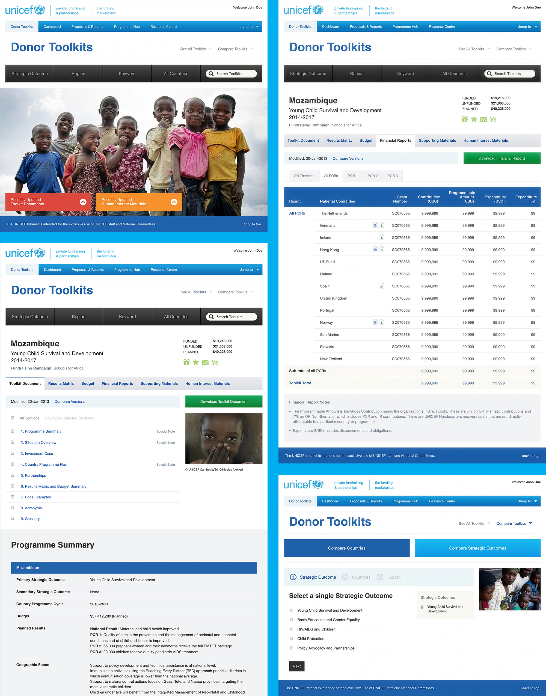
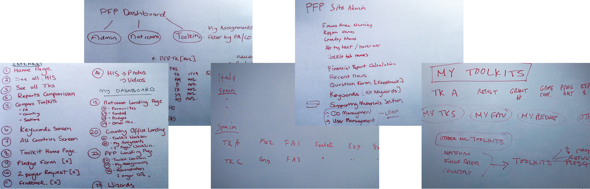
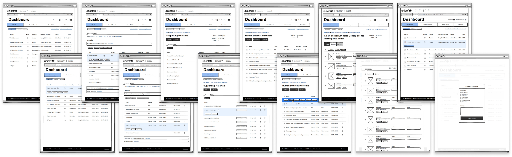
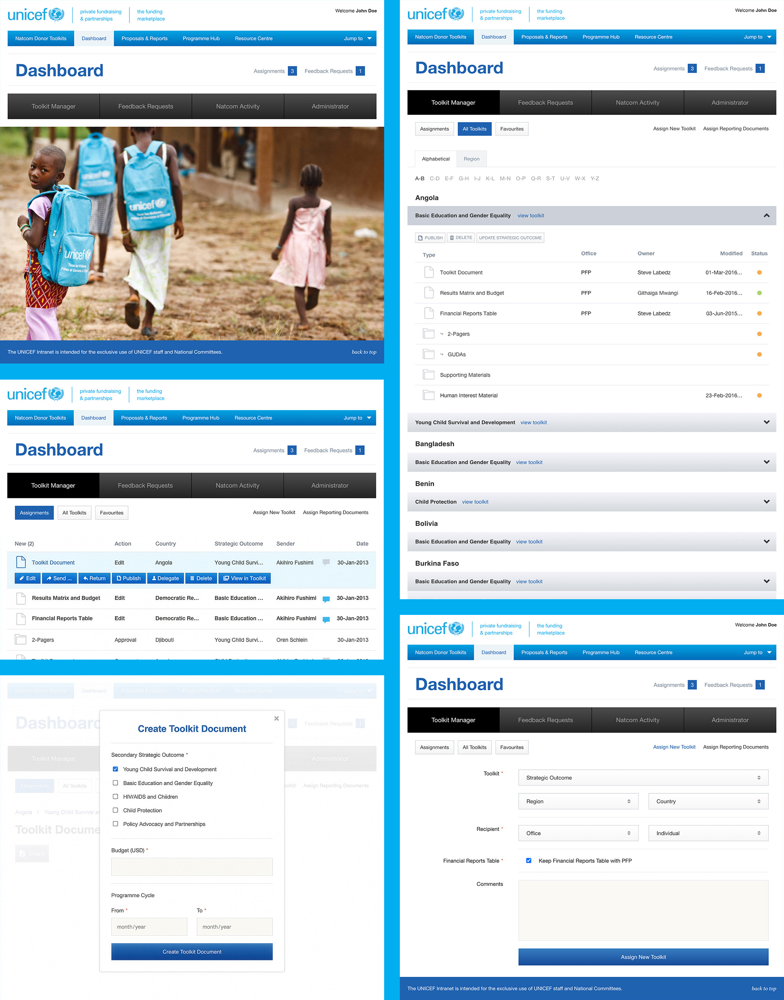

<CaseStudyOverview caseStudy={frontmatter.caseStudy}>

## Challenge

UNICEF’s fundraising teams needed a shared place to find materials and manage the work behind them. Country Offices and National Committees had different content, approval, and reporting needs. The platform had to connect those workflows across a global organization.

## Solution

I designed the platform in phases, beginning with a library people could browse by outcome, region, keyword, or country. Working with UNICEF staff, project leadership, and Quark developers, I extended it with content management, approval workflows, and reporting tools. I translated workshop discussions into wireframes and interface designs, then built the front end.

## Results

The Funding Marketplace was adopted by more than 80 Country Offices. It gave teams a shared platform for donor toolkits, fundraising materials, reporting, and collaboration, and supported more than $300 million in toolkit revenue from 2010 to 2016.

</CaseStudyOverview>

<TextBlock>

## Helping teams find the right fundraising resources

The first phase focused on creating a centralized repository for fundraising resources, donor materials, financial reports, and country-specific content.

I organized the library so people could browse by strategic outcome, region, keyword, or country. Those routes supported different starting points: someone looking at a particular country could reach relevant materials, while someone focused on an outcome could explore opportunities across the network.

</TextBlock>

<ThemeWrapper>

<FigureSingle>

</FigureSingle>
</ThemeWrapper>

<TextBlock>

## Extending the platform to the teams managing it

The next phase addressed the work behind the resource library. Country Offices and National Committees needed administrative tools for managing content, reporting, approvals, and collaboration. The design challenge expanded from finding materials to supporting the teams responsible for maintaining and approving them.

</TextBlock>

<TextBlock>

### Understanding workflows with stakeholders and developers

A multi-day workshop in Dublin brought the project team, UNICEF stakeholders, and Quark developers together to map workflows, discuss content management needs, and establish priorities for the dashboard. It gave the people using, designing, and building the platform a shared setting for working through its requirements.

</TextBlock>

<FigureSingle caption="Whiteboards from Dublin workshop">

</FigureSingle>

<TextBlock>

### Turning requirements into interactions

I translated those discussions into wireframes for the dashboard, approval workflows, reporting tools, and content management. The flows connected individual screens so the team could review how someone would move through a task before development began. As the sole UX and front-end designer, I worked across the information architecture, interface design, and implementation as the platform developed.

</TextBlock>

<FigureSingle caption="Wireframes and User Flow Documentation">

</FigureSingle>

<ThemeWrapper>
<FigureSingle>

</FigureSingle>
</ThemeWrapper>

<TextBlock>

## Looking back

The platform grew from a resource library into an operational tool. That required me to understand both the materials people needed and the workflows that kept those materials available.

The work shaped how I approach an unfamiliar domain: learn it with the people who know it, make the workflows visible, and carry that understanding into the interface. Collaborating with UNICEF staff and Quark developers across several phases gave me experience doing that as part of an international team.

</TextBlock>
