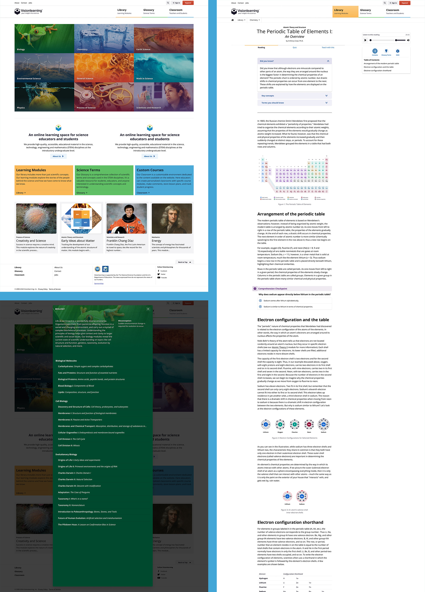
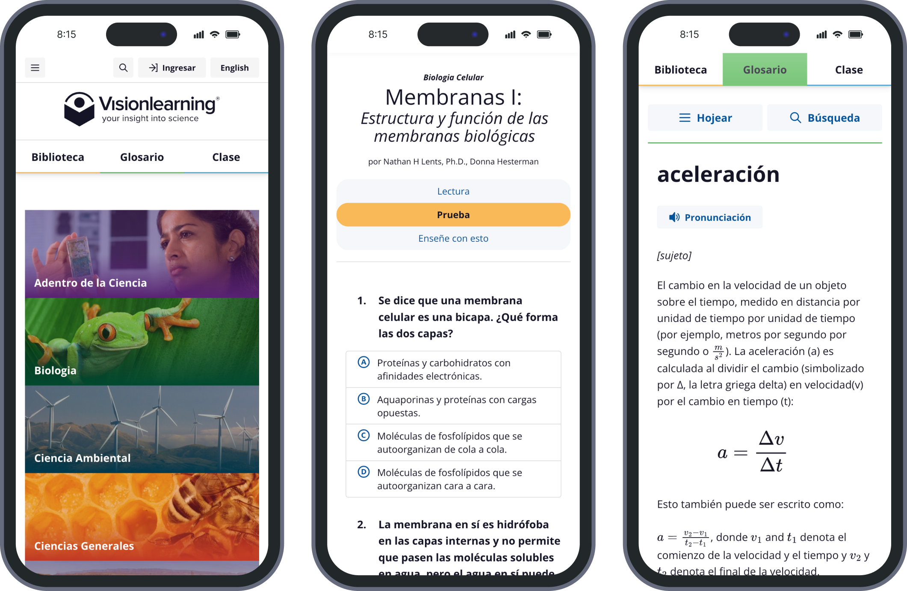

import AnimatedImage from '../../../components/AnimatedImage.astro';
import interactiveTools from '../../../images/visionlearning/visionlearning-interactive-learning-tools.png';

<CaseStudyOverview caseStudy={frontmatter.caseStudy}>

## Challenge

Visionlearning provides free bilingual STEM learning resources for students and educators worldwide. Its outdated, non-responsive website had become increasingly difficult to maintain and constrained the organization’s ability to introduce new educational content and learning experiences. While they had a large body of science content, it was hard to understand what was available, who it was for, and where to start.

## Solution

Over a multi-year engagement, I led the user experience design and front-end development of the Visionlearning platform, creating a modern, accessible foundation for future educational content and learning tools. The new experience improved navigation, content organization, and discoverability across a growing library of STEM resources while supporting English and Spanish content equally. The redesign also established a flexible framework for interactive educational experiences and future content growth.

## Results

Visionlearning's rebrand and redesign created a more intuitive learning environment that reduces cognitive load for students tackling complex STEM topics. The new platform features innovative reading toggles for glossary terms and Next Generation Science Standards, custom scientific illustrations, and a complete design system that continues to support ongoing feature development.

</CaseStudyOverview>

<TextBlock>

## Logo redesign

I redesigned the logo to suggest both a student engrossed in learning and an observant eye. It gave Visionlearning a recognizable identity that I carried through the website's typography, color, and page layouts.

</TextBlock>

<FigureSingle width="medium" caption="The Visionlearning logo">

</FigureSingle>

<TextBlock>

## Giving the library a clear structure

Within the Library, we grouped content into Learning Modules, Interactive Animations, and Research Videos. These labels made the type of resource visible before someone opened it.

Learning Modules made up most of the content. We organized them by discipline, including biology, chemistry, earth science, and physics, with browsing available from both the homepage and Library. Search provided another route for someone who already had a topic in mind.

Short descriptions in the main navigation explained the purpose of Library, Glossary, and Classroom. Someone arriving at a module or glossary entry could see what else the platform offered without returning to the homepage.

</TextBlock>

<ThemeWrapper>
<FigureSingle caption="The homepage, Library, and learning pages share navigation and page patterns.">

</FigureSingle>
</ThemeWrapper>

<TextBlock>

## Keeping learning tools available on mobile

I designed and built responsive templates for English and Spanish content. The layouts needed to accommodate long readings, scientific figures, quizzes, and reference tools within the same experience.

On larger screens, a module's contents and reading tools sit beside the text. On mobile, those tools move into collapsible tabs so they remain available without permanently occupying the reading area. The Spanish screens below show how navigation, quizzes, and glossary entries carry into the mobile layout.

</TextBlock>

<FigureSingle width="medium" caption="Spanish-language mobile screens showing the homepage, a module quiz, and a glossary entry.">

</FigureSingle>

<TextBlock>

## Interactive learning tools

The client requested two tools for the learning modules: glossary highlighting for looking up science terms, and annotations connecting the content to the Next Generation Science Standards (NGSS). I designed the interfaces and wrote the front-end behavior for these different reading and teaching tasks.

With glossary highlighting enabled, readers can select a term and see its definition without leaving the module. The NGSS mode highlights passages connected to science standards and displays the relevant information for educators. Both are optional, and only one highlighting mode is active at a time, keeping the two kinds of annotation distinct.

I also designed and built an interactive periodic table. Readers can select an element to open its details, keeping the table itself available as a reference. The interface includes a table view and a search-and-list view, offering different ways to explore the same information.

The table view preserves the relationships between elements, while the detail view provides room for an individual element's properties. Search gives readers a direct route when they already know which element they need.

</TextBlock>

<FigureSingle>

<AnimatedImage
  src={interactiveTools}
  animatedSrc="/media/visionlearning/visionlearning-interactive-learning-tools.webp"
  animatedType="image/webp"
  class="display-block width-100"
  alt="Glossary highlighting and NGSS annotations, with a periodic-table demonstration in the center browser: navigating by keyboard, opening Carbon's details, and filtering Search and List to show noble gases."
  widths={[720, 1200, 1800]}
  sizes="(min-width: 1600px) 1440px, 90vw"
  loading="lazy"
/>

<em>Glossary and NGSS annotations support the reading, while the interactive periodic table lets people explore element details. <LinkOpenNew LinkUrl="https://www.visionlearning.com/library/animations/periodic-table/" LinkText="Explore the interactive periodic table" utilities="link" /></em>

</FigureSingle>

<ThemeWrapper>
<TextBlock>

## Custom scientific illustrations

I created scientific illustrations in Adobe Illustrator and Photoshop to explain ideas that are difficult to describe through text alone. The work ranged from small supporting diagrams to detailed plant and animal cells, molecular structures, and experimental setups.

The plant and animal cell illustrations, for example, use labels and a consistent visual treatment to identify structures within each cell. Other figures show relationships or sequences, such as the stages of an experiment or the differences between RNA and DNA.

Some visuals were entirely custom. Others combined carefully selected, high-resolution imagery with labels and scientific concepts. I adapted the approach to what each module needed to explain; the collection below represents part of a much larger body of visual work across the site.

</TextBlock>

<FigureSingle caption="Scientific illustrations showing cell anatomy, molecular structures, and experiments.">

![A collection of scientific illustrations covering biology and chemistry concepts. The images include labeled animal and plant cells, the Miller-Urey experiment on the origin of life, a diagram showing the evolution of eukaryotic cells through endosymbiosis, laboratory experiments with flasks and bacterial cultures, the four levels of protein structure, a comparison of RNA and DNA, and the periodic table of elements. The illustrations use bright colors, clear labeling, and simplified visual forms to explain complex scientific concepts.](../../../images/visionlearning/visionlearning-scientific-illustrations.jpg)

</FigureSingle>

</ThemeWrapper>

<TextBlock>

## Looking back

Projects like Visionlearning are rare. Few opportunities allow me to combine so many of my interests in a single project: design, user experience, front-end development, and digital illustration.

The long-term partnership let me see how the work was used and revisit it through later redesigns. As the organization's needs grew, I could refine the reading experience, respond to specific teaching needs, and build tools to support new uses of the content.

The backend developer also adopted Natura11y for the teacher-facing CMS interface, extending its use beyond the public website.

This project gave me a deep appreciation for science education, Next Generation Science Standards, and the challenge of making complex topics easier to understand. I'm grateful for the opportunity to contribute to a resource that helps students, educators, and lifelong learners better understand science.

</TextBlock>
