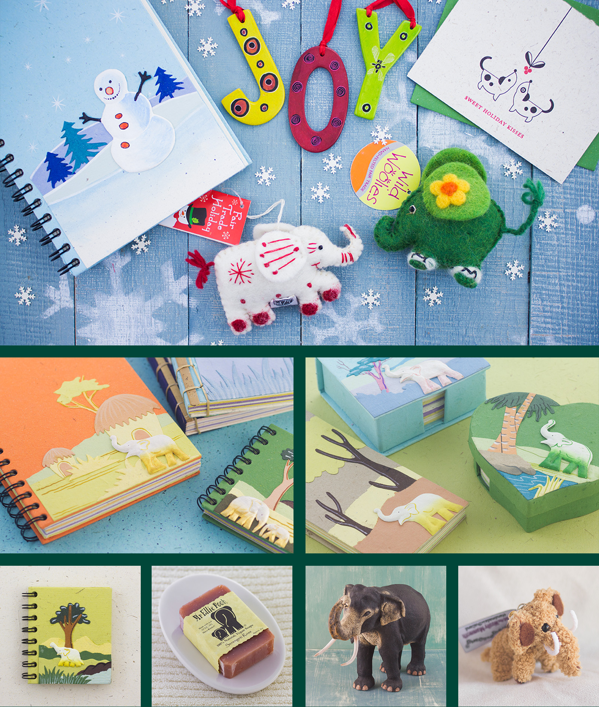

<CaseStudyOverview caseStudy={frontmatter.caseStudy}>

## Challenge

Mr. Ellie Pooh needed an online store that supported both retail and wholesale customers. Its handmade products needed consistent photography, and the website needed to explain the artisans and fair-trade practices behind them.

## Solution

I designed and built a custom Shopify storefront, connecting the shopping experience with product and artisan photography. My wife and I photographed hundreds of products, creating more than 1,000 images. I also traveled to Sri Lanka to document the papermaking process and the people doing the work.

## Results

Mr. Ellie Pooh reported a tenfold increase in sales after launch. The new store supported retail and wholesale purchasing and inventory management, while a consistent catalog and artisan photography gave customers a closer view of the products and how they were made.

</CaseStudyOverview>

<ThemeWrapper>
<FigureSingle>

</FigureSingle>
</ThemeWrapper>

<TextBlock>

## Mobile-first design

I designed the storefront for mobile as well as desktop, adapting product browsing and shopping layouts to smaller screens.

</TextBlock>

<FigureSingle width='medium'>

</FigureSingle>

<TextBlock>

## Promoting fair trade

Mr. Ellie Pooh is a member of the Fair Trade Federation and supports safe, healthy working conditions for papermakers and artisans. To help tell that story, I traveled to the paper factory in Sri Lanka to document the papermaking process.

</TextBlock>

<FigureSingle caption="Documenting the papermaking process at the factory in Kegalle, Sri Lanka">

</FigureSingle>

<TextBlock>

The Papermakers and Artisans section helped shoppers see who made the products and understand how fair trade purchases supported their work.

</TextBlock>

<FigureSingle>

</FigureSingle>

<ThemeWrapper>
<TextBlock>

## Product photography

Product photography was a separate major effort within the project. Over time, my wife and I photographed hundreds of products, creating a consistent style that showed product colors and quality accurately across the catalog.

</TextBlock>

<FigureSingle caption="Product photography for the Mr. Ellie Pooh catalog">

</FigureSingle>
</ThemeWrapper>

<TextBlock>

## Looking back

The project connected the mechanics of selling products with the work of presenting them clearly. The storefront, product photography, and documentation of the artisans all contributed to a more complete view of what customers were buying.

Visiting Sri Lanka gave me firsthand material for that story. Photographing the catalog with my wife was a substantial part of delivering the store, alongside the interface design and Shopify implementation.

</TextBlock>
